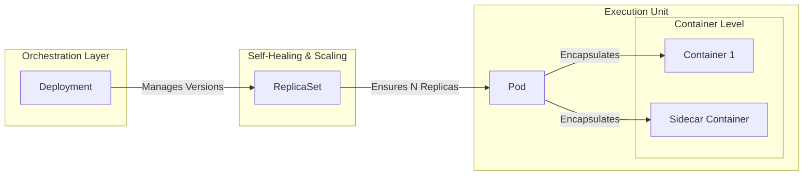
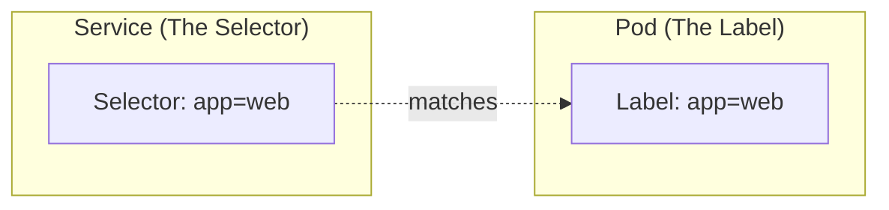
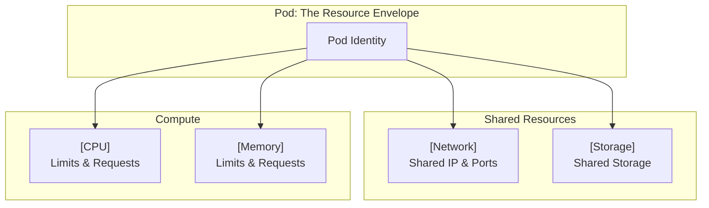
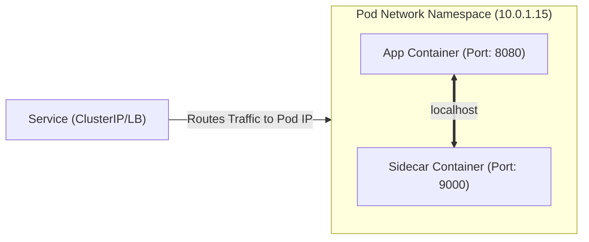
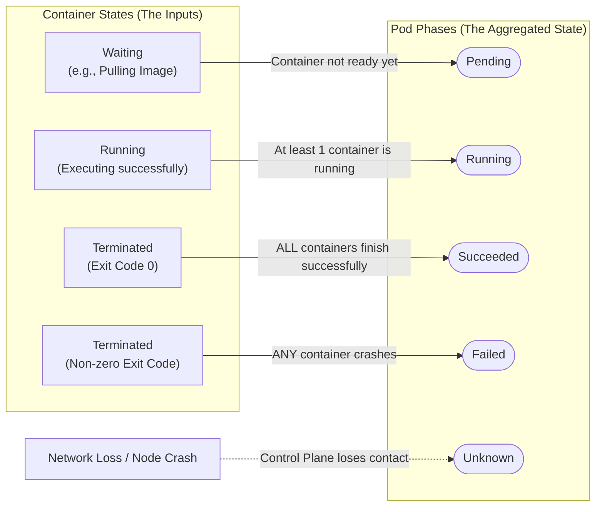
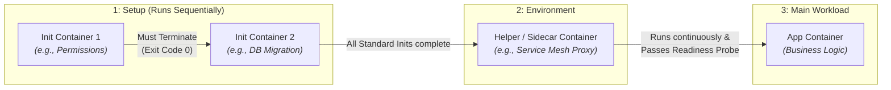
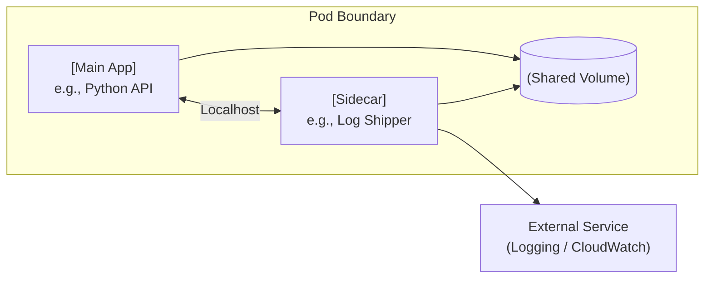
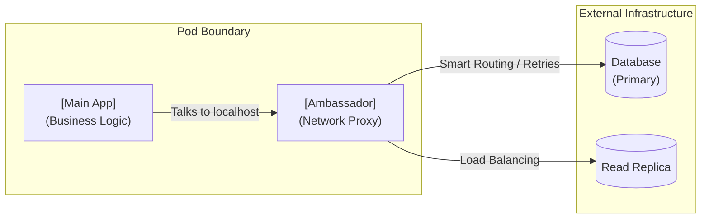
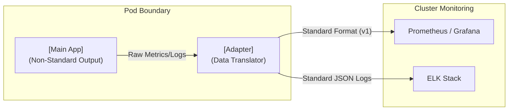

# Kubernetes Pods Basics

## 1. What Is a Pod

A **Pod** is the **smallest deployable unit in Kubernetes**.

Kubernetes **never runs containers directly**. It schedules, manages, and replaces **Pods**, and Pods contain containers.

A Pod represents **one unit of work**.

---

## 2. Simple Mental Model



Kubernetes reasons about **Pods**, not containers.

---
## 3. Core Characteristics of a Pod

* One Pod = one workload identity
* One Pod can run:

  * One container (default and recommended)
  * Multiple containers (tightly coupled only)
* Pods are **ephemeral**
* Pod recreation always means **new IP, new UID**

---

## 4. Pod vs Container

### Container

* Runtime execution unit
* Runs a single process
* Managed by Docker or containerd
* Kubernetes-unaware

### Pod

* Kubernetes scheduling unit
* Wraps one or more containers
* Provides shared network and storage
* Has a single lifecycle

### Comparison

| Aspect  | Container     | Pod                |
| ------- | ------------- | ------------------ |
| Scope   | Runtime       | Kubernetes         |
| Network | Per container | Shared Pod IP      |
| Storage | Isolated      | Shared volumes     |
| Scaling | Manual        | Controller-managed |

Rule:

> You scale Pods. You debug Pods. You replace Pods.

---

## 5. Pod Attributes 

* **CPU**: Requested and limited per container, enforced at Pod level
* **Memory**: Shared pressure domain, OOM affects the Pod
* **Network**: Single IP, shared localhost
* **Storage**: Shared filesystem across containers

### Here  CPU and Memory resources are controlled by `request` and `limits` as shown below
```yaml
apiVersion: v1
kind: Pod
metadata:
  name: resource-demo
spec:
  containers:
  - name: app-container
    image: nginx:latest
    resources:
      requests:
        memory: "128Mi"  # Guaranteed minimum memory
        cpu: "250m"      # Guaranteed minimum CPU (0.25 core)
      limits:
        memory: "256Mi"  # Maximum allowed memory
        cpu: "500m"      # Maximum allowed CPU (0.5 core)
```
### Here network and storage, a `emphimeral resources` are controlled by `service` and `volumes` as shown below


```yaml
# 1. Persistent Volume Claim (Requesting persistent storage)
apiVersion: v1
kind: PersistentVolumeClaim
metadata:
  name: my-pvc
spec:
  accessModes:
    - ReadWriteOnce
  resources:
    requests:
      storage: 1Gi

---

# 2. Service (Network abstraction for the Pod)
apiVersion: v1
kind: Service
metadata:
  name: my-service
spec:
  selector:
    app: my-app
  ports:
    - protocol: TCP
      port: 80
      targetPort: 8080

---

# 3. Pod (Consuming network and storage)
apiVersion: v1
kind: Pod
metadata:
  name: my-app-pod
  labels:
    app: my-app
spec:
  containers:
  - name: app-container
    image: nginx
    ports:
    - containerPort: 8080
    volumeMounts:
    - name: ephemeral-storage  # Ephemeral (e.g., scratch space)
      mountPath: /tmp/cache
    - name: persistent-storage  # Persistent (e.g., database files)
      mountPath: /data/db
  volumes:
  - name: ephemeral-storage
    emptyDir: {}  # Tied to Pod lifecycle
  - name: persistent-storage
    persistentVolumeClaim:
      claimName: my-pvc  # Binds to the PVC above
```

<br>


---

## 6. Pod Networking Model

* One Pod = one IP
* Containers communicate via `localhost`
* Port conflicts must be avoided
* Service targets Pods, not containers


---
## 7. Pod Lifecycle

In Kubernetes, there is a distinction between the status of the **Pod** (the host) and the status of the **Containers** (the processes) running inside it.

---

### Pod Lifecycle (Phases)

* **Pending:** The Pod is accepted by the cluster, but the image is still pulling or the Pod is waiting to be scheduled to a Node.
* **Running:** The Pod is bound to a Node, and at least one container is still running or starting.
* **Succeeded:** All containers in the Pod have finished their job successfully (Exit Code 0) and will not restart.
* **Failed:** All containers have terminated, and at least one container failed (Non-zero Exit Code).
* **Unknown:** The state cannot be determined (usually due to a network error between the Master and the Node).

---

### Container Lifecycle (States)

1. **Waiting:** The container is not running yet (e.g., pulling the image or waiting for a "PostStart" hook).
2. **Running:** The container is executing without issues.
3. **Terminated:** The container has stopped running, either because it finished its task or because it crashed.
*

---


---
## 8. Types of Containers in a Pod

### 1. Init Containers

* Run **before** app containers
* Execute sequentially
* Must complete successfully

> **Use cases** : DB migrations , Config generation, Permission setup

### 2. App Containers

* Main workload
* Long-running
* Business logic

### 3. Helper Containers (Sidecars)

* Support app container
* Same lifecycle as app
* Examples: logging, proxy, metrics

### Startup Order



---

## 9. Single-Container Pods

### Definition

One Pod running exactly one container.

> **When to Use** : Microservices, APIs, Batch workers, CronJobs

### Benefits

* Lowest complexity
* Clean scaling
* Clear ownership

### Example

```yaml
apiVersion: v1
kind: Pod
metadata:
  name: nginx-single-pod
spec:
  containers:
  - name: nginx
    image: nginx:latest
    ports:
    - containerPort: 80
```

---

## 10. Multi-Container Pods

### Definition

One Pod running multiple containers with shared lifecycle.

### Constraints

* Must start together
* Must stop together
* Must share data or network

```yaml
apiVersion: v1
kind: Pod
metadata:
  name: nginx-multi-container-pod
  labels:
    app: web-server
spec:
  # 1. Define a shared volume for the Pod
  volumes:
  - name: shared-html-data
    emptyDir: {}

  containers:
  # ----------------------------------------
  # Container 1: The Main App (Nginx)
  # ----------------------------------------
  - name: nginx-app
    image: nginx:latest
    ports:
    - containerPort: 80
    volumeMounts:
    - name: shared-html-data
      mountPath: /usr/share/nginx/html  # Nginx reads files from here

  # ----------------------------------------
  # Container 2: The Helper / Sidecar
  # ----------------------------------------
  - name: content-generator-sidecar
    image: busybox:latest
    # This command creates an index.html file every 10 seconds
    command: ["/bin/sh", "-c"]
    args: 
      - "while true; do echo 'Hello from the Sidecar!' > /usr/share/nginx/html/index.html; sleep 10; done"
    volumeMounts:
    - name: shared-html-data
      mountPath: /usr/share/nginx/html  # Sidecar writes files to the same shared location
```
---

## 11. Multi-Container Pod Patterns

1. **Sidecar**: 

    Enhances the main application by handling secondary background tasks (like logging or file syncing) without changing the primary code.

2. **Ambassador**: 

    Acts as a local network proxy, managing and simplifying all outbound external connections on behalf of the main application.

3. **Adapter**: 

    Translates the main application's output (like custom logs or metrics) into a standardized format for external monitoring systems to read.
### 1. Sidecar Pattern

* App + helper
* Logging, monitoring, syncing



### 2. Ambassador Pattern

* App delegates networking
* Service mesh, API proxy


### Adapter Pattern

* Data transformation
* Metrics normalization



---

## 12. Core Pod Commands

```bash
kubectl get pods
kubectl describe pod <pod-name>
kubectl get pods -o wide
kubectl delete pod <pod-name>
```

---

## 15. Why Pods Matter

* All controllers create Pods
* Networking attaches to Pods
* Storage mounts to Pods
* Failures manifest at Pod level
