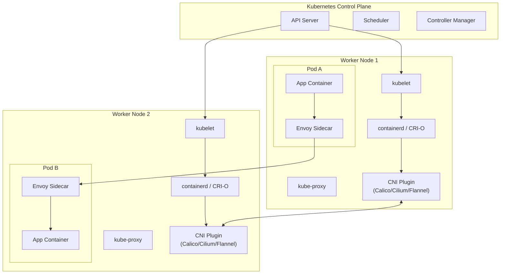
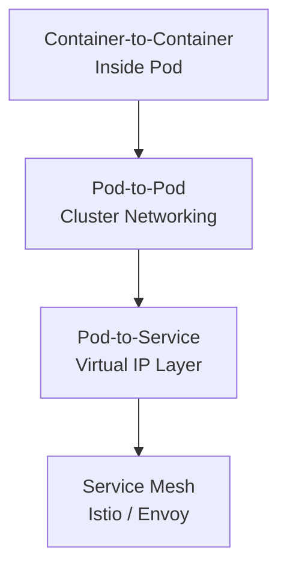
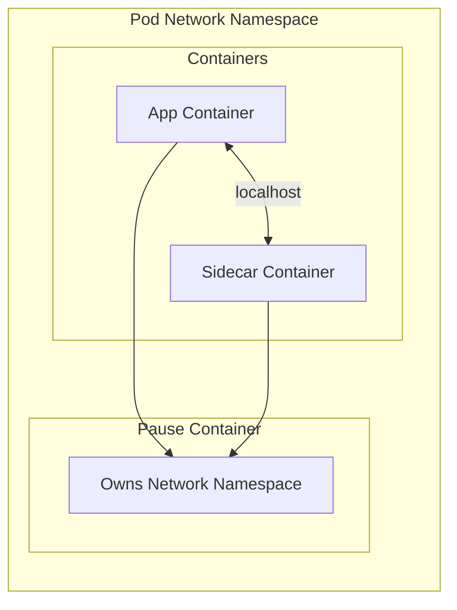
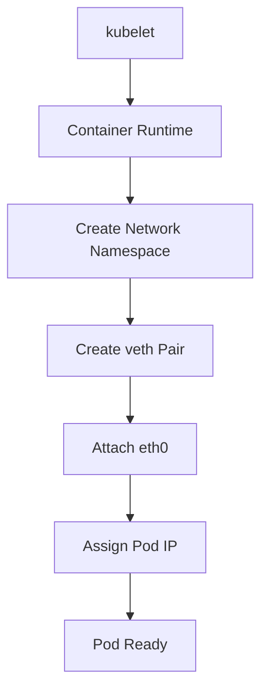
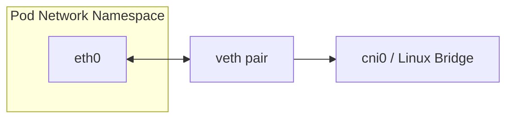
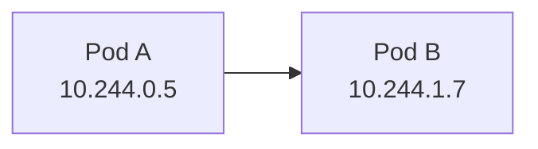
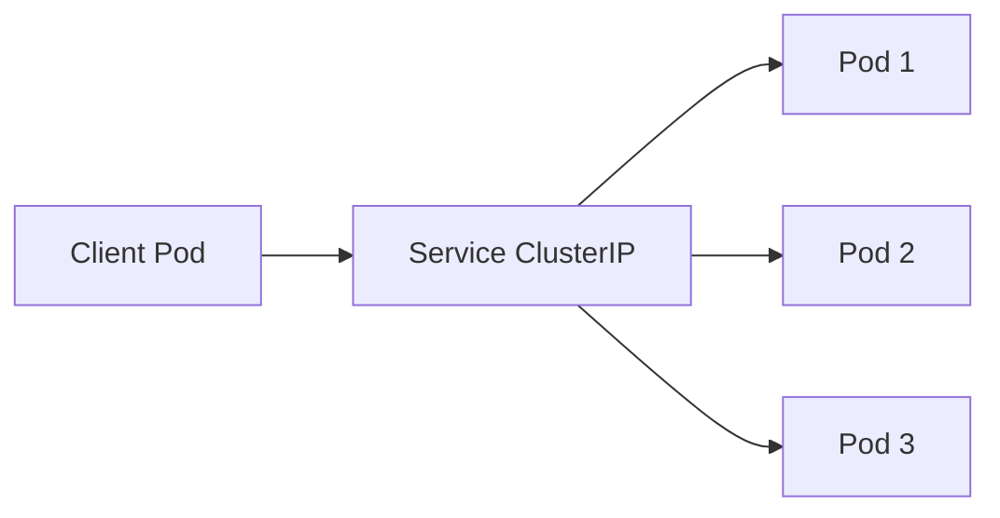
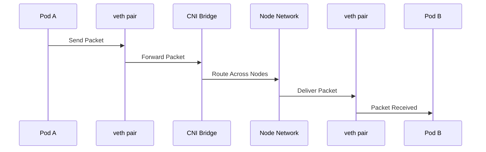

# Kubernetes Pod Networking — Complete Deep Dive

---

# 1. Kubernetes Networking Model

Kubernetes follows a strict networking model:

## Core Rules

1. Every Pod gets its own IP address
2. Every Pod can communicate with every other Pod
3. Communication works across nodes
4. Pod IPs are routable inside the cluster
5. Containers inside the same Pod share networking

This enables:

* Flat cluster networking
* Direct Pod communication
* Service discovery
* Distributed microservices

---

# 2. High-Level Kubernetes Networking Architecture



---

# 3. Kubernetes Networking Layers

Kubernetes networking has multiple layers.



| Layer                  | Responsibility          |
| ---------------------- | ----------------------- |
| Container-to-Container | localhost communication |
| Pod-to-Pod             | CNI routing             |
| Pod-to-Service         | Stable virtual IPs      |
| Service Mesh           | Traffic policies, mTLS  |

---

# 4. Intra-Pod Networking

A Pod is fundamentally a shared Linux network namespace.

All containers inside a Pod share:

* Same IP address
* Same network namespace
* Same routing table
* Same interfaces
* Same port space

This is why localhost communication works.

Example:

```bash
curl http://localhost:8080
```

---

## Shared Network Namespace



---

## Important Constraint

Two containers inside the same Pod cannot bind to the same port.

Example:

```text
Container A -> port 8080
Container B -> port 8080 ❌
```

One will fail because both share the same port namespace.

---

# 5. Pause Container

Every Pod contains a special infrastructure container called the Pause Container.

Purpose:

* Holds the Pod network namespace alive
* Maintains Pod lifecycle
* Anchors shared networking

The Pod IP belongs to the Pod network namespace — not directly to application containers.

---

# 6. Pod Network Stack Internals

When a Pod is created:



---

# 7. veth Pair Architecture

Pods connect to the node network using virtual ethernet pairs.



One side exists inside the Pod.

The other side exists on the node.

This creates connectivity between Pod and node networking.

---

# 8. Inter-Pod Networking

Each Pod receives a unique IP from the cluster CIDR.

Example:



Pods communicate directly:

```bash
http://10.244.1.7:80
```

---

# 9. Overlay vs Routed Networking

The CNI decides how packets travel across nodes.

## Overlay Networking

Examples:

* Flannel VXLAN
* Calico IP-in-IP

Encapsulates packets between nodes.

```text
Pod Packet
→ VXLAN Encapsulation
→ Node Network
→ Decapsulation
→ Target Pod
```

---

## Native Routed Networking

Examples:

* Calico BGP
* Cilium eBPF

Uses direct routing without overlays.

Benefits:

* Lower latency
* Better performance
* Reduced encapsulation overhead

---

# 10. Kubernetes Services

Pod IPs are ephemeral.

They change when:

* Pod restarts
* Pod reschedules
* Node fails
* Deployments scale

Therefore Kubernetes introduces Services.

A Service provides:

* Stable virtual IP
* Stable DNS name
* Load balancing

---

# 11. Service Networking



---

# 12. kube-proxy Role

CNI handles Pod connectivity.

kube-proxy handles Service virtual IP routing.

It programs:

* iptables
* IPVS
* eBPF rules

to route traffic from Services to backend Pods.

---

## Service Flow


---

# 13. EndpointSlices

Modern Kubernetes uses EndpointSlices.

They store backend Pod information for Services.

```text
Service
→ EndpointSlice
→ Pod Endpoints
```

This improves scalability compared to older Endpoints objects.

---

# 14. Kubernetes DNS

Most applications communicate using DNS instead of Pod IPs.

Kubernetes uses CoreDNS.

Example:

```text
my-service.default.svc.cluster.local
```

---

## DNS Resolution Flow


---

# 15. Pod-to-Pod Packet Journey



---

# 16. CNI Responsibilities

Kubernetes itself does NOT implement networking.

It defines the networking model.

The CNI plugin implements the actual data plane.

Responsibilities:

* Assign Pod IPs
* Configure interfaces
* Create veth pairs
* Setup routing
* Enable cross-node communication
* Enforce policies

---

# 17. Common CNI Plugins

| CNI     | Characteristics            |
| ------- | -------------------------- |
| Flannel | Simple overlay networking  |
| Calico  | Routing + Network Policies |
| Cilium  | eBPF-based dataplane       |
| Weave   | Overlay mesh networking    |

---

# 18. kube-proxy Modes

kube-proxy supports multiple modes.

| Mode      | Description           |
| --------- | --------------------- |
| userspace | Legacy implementation |
| iptables  | Most common           |
| IPVS      | Better scalability    |
| eBPF      | Modern replacement    |

Modern systems like Cilium can replace kube-proxy using eBPF.

---

# 19. eBPF Networking

Traditional Linux networking:

```text
Packet
→ iptables chains
→ routing
→ destination
```

eBPF networking:

```text
Packet
→ eBPF kernel program
→ destination
```

Benefits:

* Lower latency
* Faster packet processing
* Reduced iptables complexity
* Better scalability

---

# 20. Service Mesh Layer

Istio operates ABOVE the Kubernetes network layer.

CNI provides connectivity.

Istio manages:

* Traffic routing
* Retries
* Circuit breaking
* mTLS
* Observability

---

## Istio Architecture


---

# 21. Network Policies

By default:

All Pods can communicate with all Pods.

NetworkPolicies restrict traffic.


Policies are enforced by CNIs like:

* Calico
* Cilium

---

# 22. Common Failure Scenarios

## Port Conflict

Two containers bind same port inside Pod.

---

## Hardcoded Pod IP

Pod recreated → IP changes → application breaks.

---

## Missing NetworkPolicy Rule

Traffic silently blocked.

---

## MTU Mismatch

Overlay network fragmentation issues.

---

## DNS Failures

CoreDNS unavailable → Service discovery fails.

---

## Conntrack Exhaustion

Node connection tracking table becomes full.

---

## CNI Misconfiguration

Cross-node routing fails.

---

# 23. Practical Lab

Create Pod:

```bash
kubectl run nginx --image=nginx
```

Check Pod:

```bash
kubectl get pod -o wide
```

Create test Pod:

```bash
kubectl run tester --image=busybox -it --rm -- sh
```

Inside tester:

```bash
ping <pod-ip>

wget -qO- <pod-ip>
```

Check interfaces:

```bash
ip addr
```

---

# 24. Complete Mental Model

```text
Container
    ↓
Pod
    ↓
veth pair
    ↓
CNI Networking
    ↓
Service Networking
    ↓
kube-proxy
    ↓
Cluster Network
    ↓
Service Mesh (Optional)
```

---

# 25. Final Summary

* Pod = one IP
* Containers inside Pod share networking
* Pods communicate directly
* Services provide stable access
* kube-proxy handles Service routing
* CNI provides networking implementation
* DNS enables service discovery
* Istio adds service mesh features
* eBPF modernizes packet processing

Kubernetes networking is fundamentally a layered Linux networking system abstracted for distributed applications.
