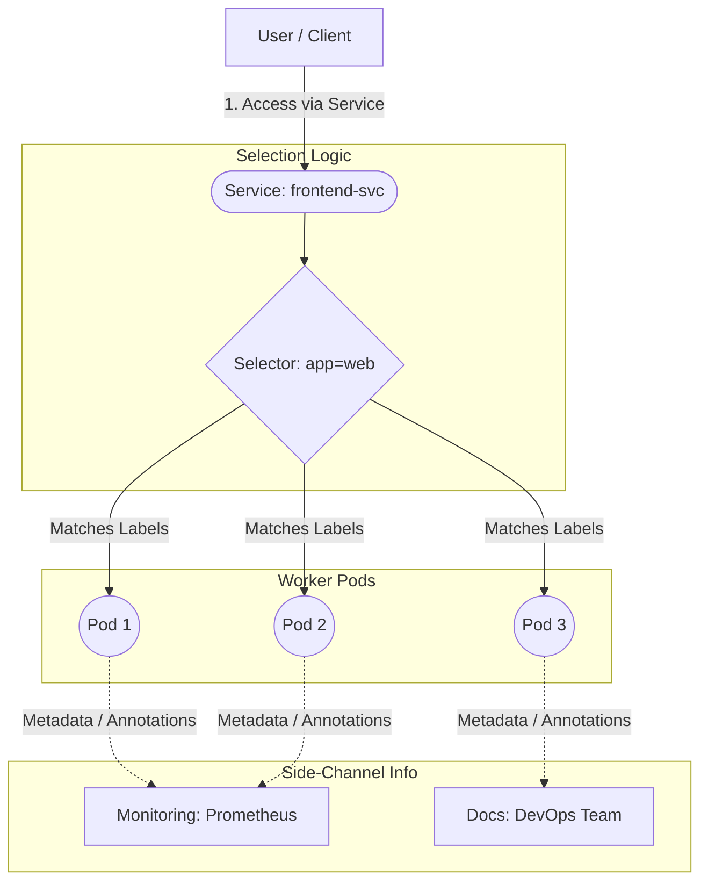

# Labels, Selectors, and Annotations – Introduction

## 1. Why This Concept Appears Early

Kubernetes does **not** work by naming things.
It works by **tagging and selecting things**.

Labels, selectors, and annotations are used **everywhere**:

* Workload grouping
* Traffic routing
* Scaling
* Scheduling
* Monitoring
* Tool integrations

Understanding them early makes the rest of Kubernetes **much easier**.

## 2. What Are Labels?

**Labels** are simple **key–value pairs** attached to Kubernetes objects.

They answer the question:

> “What is this object?”

### Simple Example

```yaml
labels:
  app: frontend
  env: dev
```

Labels are:

* Short
* Meaningful
* Used for grouping and selection


## 3. Why Labels Exist

Labels allow Kubernetes to:

* Group related objects
* Select specific workloads
* Apply actions to many objects at once

Without labels:

* Services cannot route traffic
* Scaling cannot work
* Policies cannot be applied


## 4. What Are Selectors?

**Selectors** are rules used to **find objects by their labels**.

They answer the question:

> “Which objects should I act on?”

### Simple Idea

```
Select all objects where:
app = frontend
```

Selectors connect objects together logically.


## 5. Labels + Selectors (Mental Model)

```
Labels    → Identity
Selectors → Matching logic
```

Example flow:

* Pods are labeled `app=frontend`
* A Service selects `app=frontend`
* Traffic reaches the correct Pods

No hardcoding.
No IP dependency.


## 6. What Are Annotations?

**Annotations** are also key–value pairs, but they serve a **different purpose**.

They answer the question:

> “What extra information should tools or humans know?”

Example:

```yaml
annotations:
  description: "Frontend service for payments"
```

Annotations are:

* Informational
* Not used for selection
* Often read by external tools

## 7. Labels vs Annotations (Beginner View)

| Feature                  | Labels    | Annotations |
| ------------------------ | --------- | ----------- |
| Used for selection       | Yes       | No          |
| Used by Kubernetes logic | Yes       | No          |
| Used by tools            | Sometimes | Yes         |
| Size limit               | Small     | Large       |
| Purpose                  | Grouping  | Metadata    |


## 8. Where You Will See Them Used

### Labels

* Services selecting Pods
* Deployments managing replicas
* NetworkPolicies targeting workloads
* Autoscaling decisions

### Annotations

* Ingress configuration
* Monitoring (Prometheus)
* Service mesh behavior
* Documentation and ownership info



## 9. Real-World Analogy

Think of Kubernetes objects like **products in a warehouse**:

* **Labels** → category stickers
* **Selectors** → search filters
* **Annotations** → product notes

Kubernetes operates by filtering, not by fixed names.


## 10. Common Beginner Mistakes

* Trying to select Pods using annotations
* Using too many labels with no standard
* Putting sensitive data in annotations


## 11. Why This Matters for DevOps Engineers

Labels and annotations:

* Enable automation
* Reduce manual configuration
* Power observability tools
* Make clusters manageable at scale

Without them, Kubernetes becomes **unusable**.


## 12. Key Takeaways

* Labels identify objects
* Selectors match objects
* Annotations describe objects
* Labels drive Kubernetes behavior
* Annotations drive tooling behavior
