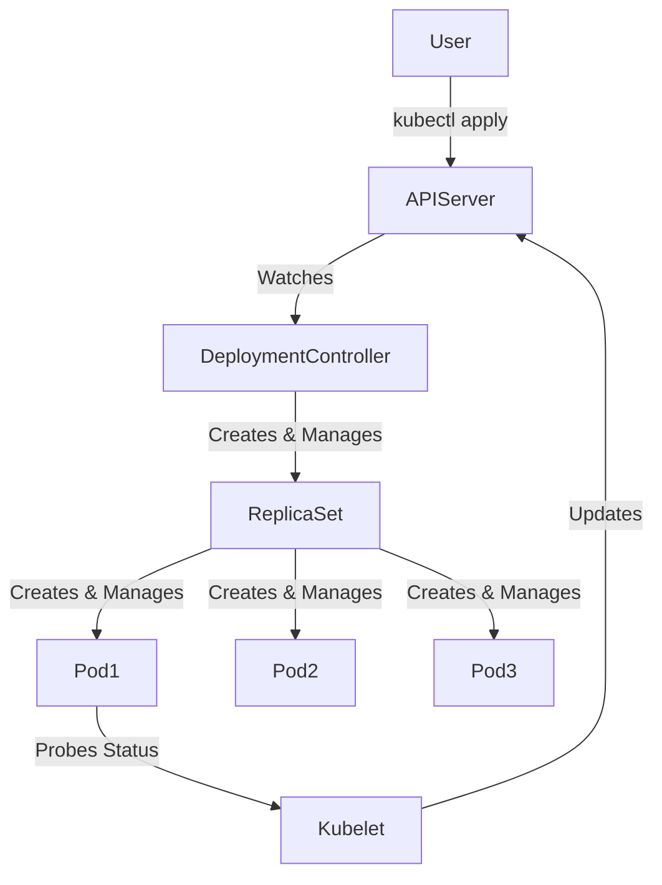

# Deployment Fundamentals

## 1. Topic Overview

A **Deployment** is a declarative Kubernetes controller that ensures a specified number of identical Pods (replicas) are running at all times. It acts as a supervisor for `ReplicaSets`, abstracting away the manual management of Pod counts, updates, and rollbacks.

In production, Deployments are the standard way to run 
**stateless applications** (like web servers, APIs, and microservices). They provide core SRE and DevOps capabilities such as **self-healing** (restarting failed pods automatically), **rolling updates** (zero-downtime releases), and **rollbacks** (reverting to a stable state if a bad release occurs). You never manage Pods or ReplicaSets manually in a production environment; you manage the Deployment, and the Kubernetes control loop handles the rest.

---

## 2. Architecture / Flow Diagram



---

## 3. Prerequisites

Before starting the lab, ensure your environment is clean and running. Execute these commands sequentially.

```bash
# 1. Verify Minikube is running
minikube status

# 2. Verify kubectl is configured to the correct cluster
kubectl cluster-info

# 3. Enable the metrics-server (required for resource monitoring)
minikube addons enable metrics-server

# 4. Create an isolated namespace for this lab
kubectl create namespace deploy-lab

# 5. Set the default context to the new namespace
kubectl config set-context --current --namespace=deploy-lab

```

---

## 4. Hands-On Lab

### Step 1: Deploying a Production-Grade Application

**Short explanation:**
We are creating a robust Deployment. Unlike simple tutorials, this includes resource requests/limits (for cluster stability) and health probes (for self-healing and zero-downtime routing). This is how workloads are defined in actual production environments.

**YAML:** `nginx-deployment.yaml`

```yaml
apiVersion: apps/v1
kind: Deployment
metadata:
  name: web-api
  namespace: deploy-lab
  labels:
    app: web-api
    env: production
spec:
  replicas: 3
  selector:
    matchLabels:
      app: web-api
  strategy:
    type: RollingUpdate
    rollingUpdate:
      maxSurge: 1
      maxUnavailable: 0
  template:
    metadata:
      labels:
        app: web-api
    spec:
      containers:
      - name: nginx
        image: nginx:1.25.0-alpine
        ports:
        - containerPort: 80
        resources:
          requests:
            cpu: "100m"
            memory: "128Mi"
          limits:
            cpu: "250m"
            memory: "256Mi"
        livenessProbe:
          httpGet:
            path: /
            port: 80
          initialDelaySeconds: 5
          periodSeconds: 10
        readinessProbe:
          httpGet:
            path: /
            port: 80
          initialDelaySeconds: 2
          periodSeconds: 5

```

**Command:**

```bash
kubectl apply -f nginx-deployment.yaml

```

**Verification:**

```bash
# Watch the pods come up in real-time
kubectl get pods -w

# Verify the Deployment and ReplicaSet status
kubectl get deploy,rs

```

**Expected Outcome:**
Kubernetes creates the Deployment, which generates a ReplicaSet, which schedules 3 Pods. The Pods will only transition to `READY 1/1` once the `readinessProbe` succeeds.

---

### Step 2: Inspecting the Deployment Architecture

**Short explanation:**
We must verify how the Deployment mapped our labels and created the underlying ReplicaSet. We will use `jsonpath` to extract specific operational data without parsing through massive YAML outputs.

**Command:**

```bash
# Inspect the deployment details
kubectl describe deployment web-api

# Use JSONPath to find the exact image running in the deployment
kubectl get deployment web-api -o=jsonpath='{.spec.template.spec.containers[0].image}{"\n"}'

```

**Verification:**

```bash
# List resources showing their labels
kubectl get pods --show-labels

```

**Expected Outcome:**
You will see `nginx:1.25.0-alpine` outputted by the JSONPath command. The `describe` command will show the ScalingReplicaSet events at the bottom.

---

### Step 3: Failure Simulation and Self-Healing

**Short explanation:**
Hardware fails. Nodes crash. We are manually deleting a Pod to simulate a failure and observe the ReplicaSet instantly recovering the lost capacity to maintain the desired state of 3 replicas.

**Command:**

```bash
# Get current pods
kubectl get pods

# Delete a specific pod (replace <pod-name> with an actual pod name from above)
kubectl delete pod <pod-name>

```

**Verification:**

```bash
# Quickly list events sorted by creation time to see the reconciliation loop in action
kubectl get events --sort-by=.metadata.creationTimestamp | tail -n 10

```

**Expected Outcome:**
The ReplicaSet controller detects actual state (2 Pods) does not match desired state (3 Pods) and immediately creates a new Pod. Total downtime for the application is zero because the other 2 replicas continue serving traffic.

---

### Step 4: Performing a Rolling Update

**Short explanation:**
We are upgrading the application to a new version. Because we configured `maxUnavailable: 0` and `maxSurge: 1`, Kubernetes will spin up a new Pod, wait for its readiness probe to pass, and only then terminate an old Pod.

**Command:**

```bash
# Update the image declaratively
kubectl set image deployment/web-api nginx=nginx:1.26.0-alpine

# Immediately watch the rollout status
kubectl rollout status deployment/web-api

```

**Verification:**

```bash
# Verify the new ReplicaSet took over
kubectl get rs

# Check the rollout history
kubectl rollout history deployment/web-api

```

**Expected Outcome:**
You will see a new ReplicaSet created. The old ReplicaSet is scaled down to 0 but kept in the cluster for rollback purposes. The new ReplicaSet is scaled to 3.

---

### Step 5: Failed Release and Rollback Recovery

**Short explanation:**
A developer accidentally pushed a bad image tag. We will simulate an outage by deploying a non-existent image, observe the failure, and execute an SRE rollback.

**Command:**

```bash
# Push a broken image tag
kubectl set image deployment/web-api nginx=nginx:broken-tag-999

# Watch the pods. You will see ImagePullBackOff
kubectl get pods -w

```

**Verification:**

```bash
# Cancel the watch (Ctrl+C), then inspect the broken pod
kubectl describe pod -l app=web-api | grep -A 5 Events:

# Perform the rollback to the previous stable revision
kubectl rollout undo deployment/web-api

# Verify recovery
kubectl rollout status deployment/web-api

```

**Expected Outcome:**
Because of the `maxUnavailable: 0` setting, the broken pod fails to start, but the remaining stable pods are NEVER terminated. The Deployment pauses. When we `undo`, Kubernetes scales back up the previous working ReplicaSet.

---

### Step 6: Verifying Workload Accessibility

**Short explanation:**
Before declaring a deployment healthy, SREs must verify the application is actually serving network traffic from within the cluster. We will use `port-forward` to test local connectivity.

**Command:**

```bash
# Port forward local port 8080 to the Deployment's port 80
kubectl port-forward deployment/web-api 8080:80 &

# Test the connection
curl -I http://localhost:8080

# Kill the background port-forward process
kill %1

```

**Verification:**

```bash
# Check resource consumption using metrics-server
kubectl top pods

```

**Expected Outcome:**
The `curl` command returns a `200 OK` HTTP header, proving the Nginx containers are running, serving traffic, and accurately passing their readiness probes.

---

## 5. Core Commands Cheat Sheet

### Cluster & Namespace Commands

| Action | Command | Purpose |
| --- | --- | --- |
| Get Events | `kubectl get events --sort-by=.metadata.creationTimestamp` | Real-time debugging of cluster actions |
| Monitor Resources | `kubectl top nodes` / `kubectl top pods` | View CPU/Memory consumption |
| Set Context | `kubectl config set-context --current --namespace=XYZ` | Change default namespace |

### Pod & Debugging Commands

| Action | Command | Purpose |
| --- | --- | --- |
| Inspect Object | `kubectl describe pod <name>` | Deep dive into pod lifecycle & events |
| View Logs | `kubectl logs <name> --tail=50 -f` | Stream the last 50 lines of app logs |
| Exec Shell | `kubectl exec -it <name> -- /bin/sh` | Enter the container for interactive debugging |
| Filter by Label | `kubectl get pods -l app=web-api` | Operational filtering |

### Deployment & Rollout Commands

| Action | Command | Purpose |
| --- | --- | --- |
| Scale | `kubectl scale deploy <name> --replicas=5` | Imperatively change desired state |
| Set Image | `kubectl set image deploy/<name> <container>=<image>` | Trigger a rolling update |
| Rollout Status | `kubectl rollout status deploy <name>` | Block terminal until update completes |
| Rollout History | `kubectl rollout history deploy <name>` | View previous revisions |
| Rollback | `kubectl rollout undo deploy <name> --to-revision=1` | Revert to a specific known good state |

---

## 6. Advanced Operations

* **Production Troubleshooting via Ephemeral Containers:** Sometimes production containers lack debugging tools (like `curl` or `ping`) because they are built from minimal base images (like `scratch` or `alpine`). Advanced operators use `kubectl debug -it <pod-name> --image=busybox` to attach a temporary debugging container to a running pod without restarting it.
* **Rollout Pausing:** When performing a canary release, you can use `kubectl rollout pause deploy <name>`. This updates a small subset of pods. You monitor the metrics, and if successful, you run `kubectl rollout resume deploy <name>` to finish the deployment.
* **Advanced JSONPath:** In CI/CD pipelines, engineers use JSONPath to assert states programmatically. E.g., `kubectl get deploy web-api -o jsonpath='{.status.readyReplicas}'` to ensure the readiness matches desired replicas before a pipeline passes.

---

## 7. Real-Time Industry Usage

* **Zero-Downtime Deployments (CI/CD):** Deployments are the foundation of GitOps tools like ArgoCD and Flux. A developer merges code to `main`, a pipeline builds the Docker image, updates the Deployment YAML in Git, and ArgoCD instantly syncs the cluster, executing a Rolling Update.
* **Horizontal Pod Autoscaler (HPA) Integration:** In production, `replicas` are rarely static. SREs bind an HPA to the Deployment. During high traffic (e.g., Black Friday for e-commerce), the HPA automatically edits the Deployment's replica count based on CPU or custom metrics.
* **Common Mistake - Missing Probes:** Deploying without `readinessProbes`. If an application takes 30 seconds to boot (like a heavy Java Spring Boot app), but has no probe, K8s sends traffic to it instantly. Users get 502 errors until the app warms up. *Always configure probes.*

---

## 8. Troubleshooting Scenarios

### Scenario 1: ImagePullBackOff Loop

* **Symptoms:** Pods are stuck in `Pending` or `ImagePullBackOff` state. Rollout hangs indefinitely.
* **Root Cause:** The image name is misspelled, the tag doesn't exist in the registry, or the cluster lacks the `imagePullSecret` to access a private registry.
* **Debug Commands:**
```bash
kubectl get pods
kubectl describe pod <failing-pod-name> | grep -i error

```


```
* **Resolution:** 
  ```bash
  kubectl set image deployment/web-api nginx=nginx:1.25.0-alpine

```

* **Operational Learning:** Always verify image repository credentials and tags. Kubernetes will continuously retry pulling the image (BackOff), protecting the old ReplicaSet from being terminated.

### Scenario 2: CrashLoopBackOff due to Misconfiguration

* **Symptoms:** Pod starts, dies immediately, restarts, and dies again. Status shows `CrashLoopBackOff`.
* **Root Cause:** The application is throwing a fatal error on startup (e.g., missing environment variable, bad database connection string, or a syntax error in the code).
* **Debug Commands:**
```bash
kubectl logs <failing-pod-name> --previous
kubectl describe pod <failing-pod-name>

```


```
* **Resolution:** Fix the underlying ConfigMap/Secret or application code, then restart the rollout.
  ```bash
kubectl rollout restart deployment/web-api

```

* **Operational Learning:** Use `--previous` with the logs command to see why the *last* instance of the container crashed before the kubelet restarted it.

### Scenario 3: Stuck Rollout (Readiness Probe Failure)

* **Symptoms:** A rolling update starts, 1 new pod is created but stays `READY 0/1`. The old pods continue running. The rollout never finishes.
* **Root Cause:** The new application version has a bug preventing the `/healthz` or `/` endpoint from returning HTTP 200. Kubernetes refuses to send traffic to it, and refuses to kill the old pods (`maxUnavailable: 0`).
* **Debug Commands:**
```bash
kubectl rollout status deployment/web-api
kubectl describe pod <new-pod-name> | grep -i probe

```


```
* **Resolution:** Execute a rollback.
  ```bash
kubectl rollout undo deployment/web-api

```

* **Operational Learning:** This demonstrates the exact value of Deployments. A catastrophic application bug was deployed, but because of Readiness Probes, **zero users experienced downtime**.

---

## 9. Cleanup Activity

To ensure your local Minikube environment remains clean and doesn't exhaust CPU/Memory resources, execute the following safe teardown commands.

```bash
# 1. Delete the deployment
kubectl delete deployment web-api

# 2. Delete the namespace (this automatically deletes all resources inside it)
kubectl delete namespace deploy-lab

# 3. Switch context back to default
kubectl config set-context --current --namespace=default

# 4. Optional: Stop minikube if you are done for the day
minikube stop

```

---

## 10. Key Takeaways

* **Declarative over Imperative:** You tell Kubernetes *what* you want (3 replicas of Nginx 1.25), and the Deployment Controller continuously works to make the cluster match that state.
* **Abstracted Pod Management:** Deployments manage ReplicaSets, which manage Pods. You never touch Pods directly in production.
* **Probes save production:** Without `liveness` and `readiness` probes, Kubernetes cannot accurately know if an application is truly healthy, rendering rolling updates dangerous.
* **Rollbacks are instant:** Because previous ReplicaSets are kept in a scaled-down state, reverting a bad change is as fast as starting containers, requiring no new image downloads.

---

## 11. Lab Challenges

### Beginner Exercises

1. **Imperative Scaling:** Deploy `nginx` imperatively (`kubectl create deploy my-nginx --image=nginx`). Scale it to 5 replicas using a single command.
2. **Label Inspection:** Find the auto-generated `pod-template-hash` label on the Pods created in Exercise 1 using `kubectl get pods --show-labels`.
3. **Log Extraction:** Write a single command that tails the logs of all pods matching the label `app=web-api` simultaneously.

### Intermediate Exercises

4. **Probe Architecture:** Create a Deployment YAML for `httpd:alpine`. Intentionally misconfigure the `readinessProbe` to hit port `8080` (httpd runs on 80). Apply it and diagnose the exact event error using `kubectl describe`.
5. **Resource Limits Check:** Modify your deployment to request `2000m` CPU. Apply it. Explain why the Pods remain in `Pending` state on a standard Minikube node.
6. **Rollout Pausing:** Trigger an image update, immediately pause the rollout, verify that only a subset of pods updated, and then resume it.

### Troubleshooting Exercises

7. **The Silent Failure:** Deploy an image named `busybox` with no sleep command. Observe the `CrashLoopBackOff`. Fix it by adding `command: ["sleep", "3600"]` to the container spec in the YAML.
8. **Orphaned Pods:** Create a Deployment. Manually edit one of the Pod's labels using `kubectl label pod <name> app=something-else --overwrite`. Observe what the ReplicaSet does and explain why.

### Production-Style Challenge

9. **Zero-Downtime Migration:** Write a Deployment for a Node.js API (you can use `kennethreitz/httpbin` as a mock image). Configure the `RollingUpdate` strategy to `maxSurge: 2` and `maxUnavailable: 25%`. Write a bash while-loop that `curl`s the service every 0.5 seconds. Trigger an image update to a new version and prove via your terminal output that 0 requests were dropped during the deployment transition.