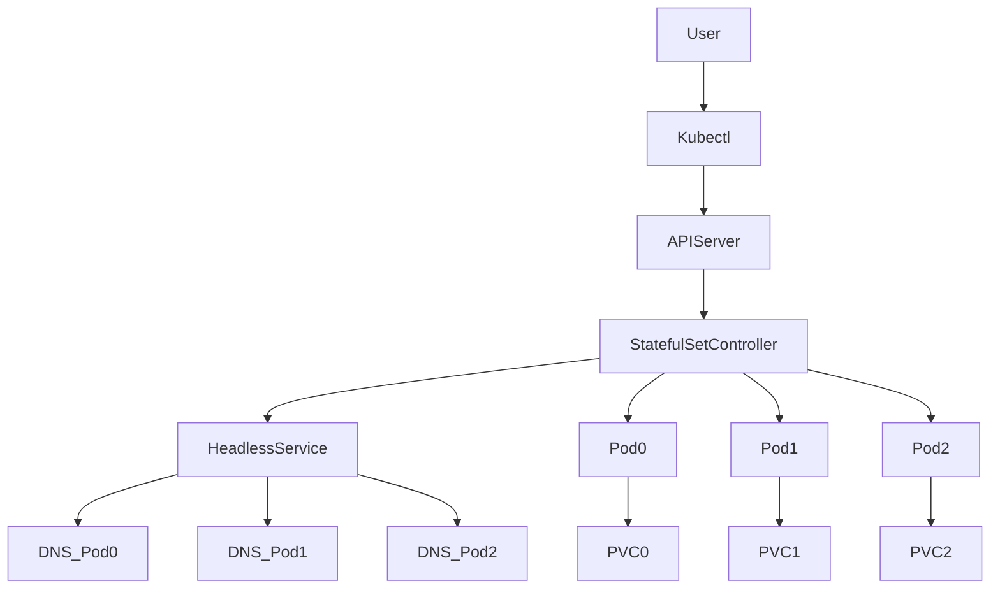

# StatefulSet Fundamentals

## 1. Topic Overview

A **StatefulSet** is a core Kubernetes controller designed to manage **stateful applications** where pod identity, stable persistent storage, and ordered execution are strictly required.

While Deployments treat Pods as interchangeable and disposable (stateless), StatefulSets treat each Pod as a unique, irreplaceable entity. This controller is the industry standard for deploying distributed databases (MySQL, PostgreSQL, MongoDB), message brokers (Kafka), and clustering systems (Zookeeper, Redis) inside Kubernetes.

StatefulSets rely on four foundational pillars:

1. **Stable Network Identity:** Each Pod gets a permanent DNS name via a **Headless Service**.
2. **Stable Storage:** Each Pod gets its own dedicated persistent volume via `volumeClaimTemplates`.
3. **Ordinal Indexing:** Pods are assigned predictable, permanent numbers (0, 1, 2...).
4. **Ordered Operations:** Scaling and updates happen sequentially, ensuring data safety and cluster quorum.

---

## 2. Architecture / Flow Diagram



---

## 3. Prerequisites

Execute these commands sequentially to prepare your Minikube environment.

```bash
# 1. Verify Minikube and storage provisioner are running
minikube status

# 2. Verify the standard StorageClass exists (required for volumeClaimTemplates)
kubectl get storageclass

# 3. Enable metrics-server for resource monitoring
minikube addons enable metrics-server

# 4. Create an isolated namespace for stateful operations
kubectl create namespace sts-lab

# 5. Set default context to the new namespace
kubectl config set-context --current --namespace=sts-lab

```

---

## 4. Hands-On Lab

### Step 1: Deploying the Headless Service

**Short explanation:**
StatefulSets absolutely require a Headless Service (`clusterIP: None`) to control the network domain. Without this, Kubernetes will not generate the individual Pod DNS records required for clustering.

**YAML: headless-svc.yaml**

```yaml
apiVersion: v1
kind: Service
metadata:
  name: web-store-headless
  namespace: sts-lab
  labels:
    app: web-store
spec:
  clusterIP: None
  selector:
    app: web-store
  ports:
  - port: 80
    name: web

```

**Command:**

```bash
# Save to headless-svc.yaml and apply
kubectl apply -f headless-svc.yaml

```

**Verification:**

```bash
# Verify the service has NO ClusterIP
kubectl get svc web-store-headless

```

**Expected Outcome:**
The Service is created with `CLUSTER-IP` showing as `None`. It does not load balance; it only creates DNS records.

---

### Step 2: Creating the StatefulSet

**Short explanation:**
We deploy an Nginx StatefulSet. The `volumeClaimTemplates` block will dynamically provision a dedicated 1Gi disk for *each* Pod and mount it to `/usr/share/nginx/html`.

**YAML:**

```yaml
apiVersion: apps/v1
kind: StatefulSet
metadata:
  name: web-store
  namespace: sts-lab
  labels:
    app: web-store

spec:
  serviceName: web-store-headless
  replicas: 3

  selector:
    matchLabels:
      app: web-store

  template:
    metadata:
      labels:
        app: web-store

    spec:
      initContainers:
      - name: init-html
        image: busybox
        command:
        - sh
        - -c
        - echo "web-store" > /data/index.html

        volumeMounts:
        - name: store-data
          mountPath: /data

      containers:
      - name: nginx
        image: nginx:1.25.0-alpine

        ports:
        - containerPort: 80
          name: web

        resources:
          requests:
            cpu: "50m"
            memory: "64Mi"
          limits:
            cpu: "100m"
            memory: "128Mi"

        volumeMounts:
        - name: store-data
          mountPath: /usr/share/nginx/html

        readinessProbe:
          httpGet:
            path: /
            port: web
          initialDelaySeconds: 5
          periodSeconds: 5

  volumeClaimTemplates:
  - metadata:
      name: store-data

    spec:
      accessModes:
      - ReadWriteOnce
      resources:
        requests:
          storage: 1Gi
```

**Command:**

```bash
# Save to statefulset.yaml and apply
kubectl apply -f statefulset.yaml

# Immediately watch the ordered creation
watch kubectl get pods,pvc

```

**Verification:**

```bash
# Check the generated Persistent Volume Claims
kubectl get pvc

# Use JSONPath to verify that each Pod is bound to its specific PVC
kubectl get pods -o=jsonpath='{range .items[*]}{.metadata.name}{"\t"}{.spec.volumes[0].persistentVolumeClaim.claimName}{"\n"}{end}'

```

**Expected Outcome:**
Pods are created strictly in order: `web-store-0`, then `web-store-1`, then `web-store-2`. Each Pod automatically generates a uniquely named PVC (e.g., `store-data-web-store-0`).

---

### Step 3: Proving Stable Storage Identity

**Short explanation:**
A StatefulSet guarantees that if a Pod crashes, it reconnects to the *exact same disk*. We will write custom data to `web-store-0`, delete the Pod (simulating node failure), and verify the data survives when the Pod is recreated.

**Command:**

```bash
# 1. Write unique data into web-store-0's persistent volume
kubectl exec web-store-0 -- sh -c 'echo "I am Pod Zero and my data is permanent" > /usr/share/nginx/html/index.html'

# 2. Verify the data exists
kubectl exec web-store-0 -- cat /usr/share/nginx/html/index.html

# 3. Delete the pod to simulate a crash
kubectl delete pod web-store-0

# 4. Watch the recreation
kubectl get pods -w

```

**Verification:**

```bash
# Once web-store-0 is Running again, check if the data survived
kubectl exec web-store-0 -- cat /usr/share/nginx/html/index.html

# Inspect cluster events to see the precise reconciliation steps
kubectl get events --sort-by=.metadata.creationTimestamp | tail -n 15

```

**Expected Outcome:**
Even though `web-store-0` was destroyed and recreated (potentially on a different worker node in a real cluster), it remounted `store-data-web-store-0` and the custom `index.html` remained fully intact.

---

### Step 4: Proving Stable Network Identity (DNS)

**Short explanation:**
We will launch an ephemeral troubleshooting Pod to query the internal Kubernetes DNS. We will verify that each Pod has a dedicated, predictable hostname that applications can use to communicate with it directly.

**Command:**

```bash
# Launch a temporary busybox pod for DNS lookups
kubectl run dns-test --image=busybox:1.28 --rm -it --restart=Never -- sh

# Inside the busybox shell, perform nslookup:
nslookup web-store-0.web-store-headless.sts-lab.svc.cluster.local
nslookup web-store-1.web-store-headless.sts-lab.svc.cluster.local

# Exit the shell
exit

```

**Verification:**

```bash
# Check the headless service endpoints
kubectl get endpoints web-store-headless

```

**Expected Outcome:**
The `nslookup` resolves directly to the individual Pod IPs. In a database cluster, `web-store-1` would use `web-store-0.web-store-headless...` to sync data from the primary node.

---

### Step 5: Rolling Updates in Reverse Order

**Short explanation:**
When updating a StatefulSet, it updates sequentially in reverse order (LIFO - Last In, First Out) to protect quorum-based systems. It updates Pod 2, waits for it to be Ready, then updates Pod 1, then Pod 0.

**Command:**

```bash
# Change the image version to trigger an update
kubectl set image sts/web-store nginx=nginx:1.26.0-alpine

# Watch the rollout status block and execute in reverse order
kubectl rollout status sts/web-store

```

**Verification:**

```bash
# Verify the new image using jsonpath
kubectl get sts web-store -o=jsonpath='{.spec.template.spec.containers[0].image}{"\n"}'

```

**Expected Outcome:**
The rollout status outputs: `Waiting for statefulset spec update to be observed...`, then `web-store-2` is terminated and updated. Once `web-store-2` passes readiness probes, `web-store-1` updates, and so on.

---

## 5. Core Commands Cheat Sheet

### StatefulSet Commands

| Action | Command | Purpose |
| --- | --- | --- |
| Get Status | `kubectl get sts` | View statefulset capacity and readiness |
| Scale | `kubectl scale sts <name> --replicas=5` | Scale stateful nodes sequentially |
| Rollout Status | `kubectl rollout status sts <name>` | Monitor a rolling update |
| Rollout History | `kubectl rollout history sts <name>` | View previous StatefulSet configurations |
| Undo Rollout | `kubectl rollout undo sts <name>` | Revert to previous configuration |

### Storage & Network Commands

| Action | Command | Purpose |
| --- | --- | --- |
| List PVCs | `kubectl get pvc` | Show all persistent volume claims |
| View Endpoints | `kubectl get endpoints <svc-name>` | See IPs registered to the headless service |
| Inspect Pod DNS | `kubectl exec <pod> -- cat /etc/resolv.conf` | Verify search domains injected by K8s |

### Debugging Commands

| Action | Command | Purpose |
| --- | --- | --- |
| Exec into Pod | `kubectl exec -it <pod-name> -- /bin/sh` | Enter the container file system |
| Sort Events | `kubectl get events --sort-by=.metadata.creationTimestamp` | Trace operational timelines |
| Read Logs | `kubectl logs <pod-name> -f` | Tail application logs for errors |

---

## 6. Advanced Operations

* **Pod Management Policy:** By default, StatefulSets use `OrderedReady` policy (strict sequential creation/deletion). SREs can change this to `Parallel` if the stateful application handles its own cluster formation and just needs stable identities without the slow sequential boot time.
* **Volume Expansion:** To increase storage in a StatefulSet, you cannot simply edit the `volumeClaimTemplates` (it is immutable). You must manually edit the underlying PVCs (`kubectl edit pvc <pvc-name>`), then delete the Pods to force them to restart and recognize the expanded volume, provided the underlying `StorageClass` supports `allowVolumeExpansion`.
* **StatefulSet Deletion:** Running `kubectl delete sts <name>` deletes the Pods sequentially. **Crucially, it does NOT delete the PVCs.** This is a safety mechanism to prevent accidental data loss. PVCs must be deleted manually.

---

## 7. Real-Time Industry Usage

* **Database Replication:** In a MongoDB or PostgreSQL cluster, `pod-0` is typically designated as the Primary (Write) node. `pod-1` and `pod-2` are Read Replicas. The replicas use the Headless Service DNS to reliably find and subscribe to `pod-0`'s transaction logs, even if `pod-0` crashes and restarts on a different server.
* **Message Brokers (Kafka):** Kafka relies heavily on StatefulSets. Each broker needs a stable identity so that Zookeeper (or KRaft) knows exactly which broker holds which partition of data. If a broker's IP changes but its DNS identity remains stable, the cluster heals instantly.
* **Operational Considerations:** StatefulSets take significantly longer to scale and deploy than Deployments because of the `OrderedReady` requirement. Do not use StatefulSets for stateless APIs simply because you want dedicated storage.

---

## 8. Troubleshooting Scenarios

### Scenario 1: Pod Stuck in "Pending" (Storage Failure)

* **Symptoms:** `web-store-2` is stuck in `Pending` state. `web-store-3` is never created.
* **Root Cause:** The underlying Storage provisioner has run out of disk space, or the `StorageClass` requested in `volumeClaimTemplates` does not exist. The PVC remains `Pending`, so the Pod cannot schedule.
* **Debug Commands:**
```bash
kubectl get pods
kubectl describe pod web-store-2
kubectl describe pvc store-data-web-store-2

```


```
* **Resolution:** Ensure the correct `StorageClass` is available or increase physical cloud storage quotas.
* **Operational Learning:** Because StatefulSets are ordered, a failure in provisioning storage for Pod 2 will completely block the creation of Pod 3 and beyond.

### Scenario 2: Broken Network Identity
* **Symptoms:** Pods cannot resolve each other. Database replication fails.
* **Root Cause:** The `serviceName` defined in the StatefulSet YAML does not match the actual name of the created Headless Service, or the Headless Service is missing `clusterIP: None`.
* **Debug Commands:**
  ```bash
  kubectl get svc
  kubectl describe sts web-store | grep -i "Service Name"

```

* **Resolution:** Correct the `serviceName` field in the StatefulSet or recreate the Headless Service with the exact matching name.
* **Operational Learning:** The StatefulSet controller does not validate if the headless service exists during creation. It assumes you have created it correctly.

### Scenario 3: Stuck Rolling Update

* **Symptoms:** You update the image, `web-store-2` terminates, recreates, but stays `READY 0/1`. `web-store-1` and `web-store-0` never update.
* **Root Cause:** The new image has a misconfiguration, causing the readiness probe to fail on the updated Pod.
* **Debug Commands:**
```bash
kubectl rollout status sts web-store
kubectl describe pod web-store-2 | grep -i probe
kubectl logs web-store-2

```


```
* **Resolution:** Rollback the StatefulSet to the previous version.
  ```bash
  kubectl rollout undo sts web-store

```

* **Operational Learning:** Ordered operations protect the cluster. The bad update broke Pod 2, but because it never became Ready, the StatefulSet controller refused to update and break Pods 1 and 0.

---

## 9. Cleanup Activity

Because StatefulSets protect your data, deleting the StatefulSet does not delete the PVCs. We must clean them up explicitly to free Minikube disk space.

```bash
# 1. Delete the StatefulSet (Pods will terminate in reverse order: 2, 1, 0)
kubectl delete sts web-store

# 2. Delete the Headless Service
kubectl delete svc web-store-headless

# 3. Manually delete the Persistent Volume Claims (CRITICAL for cleanup)
kubectl delete pvc -l app=web-store

# 4. Delete the namespace
kubectl delete namespace sts-lab

# 5. Switch context back
kubectl config set-context --current --namespace=default

```

---

## 10. Key Takeaways

* **Identity & Storage:** StatefulSets guarantee a stable network hostname (via Headless Service) and stable persistent storage (via PVC templates) that survive Pod restarts.
* **Strict Ordering:** Pods are created (0 to N) and deleted (N to 0) in order. Updates wait for the current Pod to be Ready before moving to the next.
* **Data Safety First:** Deleting a StatefulSet will never automatically delete your Persistent Volumes.
* **Target Audience:** Use StatefulSets for clustered databases, message queues, and systems requiring stable identities. Use Deployments for everything else.

---

## 11. Lab Challenges

### Beginner Exercises

1. **Explore Headless SVC:** Recreate the headless service but remove `clusterIP: None`. Describe the StatefulSet Pods and inspect `/etc/resolv.conf`. How did the DNS resolution change?
2. **Label Filtering:** Use a single command to list all PVCs that belong exclusively to the `web-store` StatefulSet using label selectors.
3. **Ordinal Scaling:** Scale the StatefulSet to 5 replicas. Observe the exact names of the new PVCs that are dynamically generated.

### Intermediate Exercises

4. **Data Survival Test:** Exec into `web-store-1`, install `curl` (`apk add curl`), and write a text file to the mounted volume. Scale the StatefulSet down to 1 (which deletes `web-store-1`). Scale it back up to 2. Exec back in and verify your file is still there.
5. **Simulate a Storage Block:** Create a new StatefulSet but specify a `storageClassName` in the `volumeClaimTemplates` that does not exist in your cluster. Observe the Pod states and diagnose the exact event preventing startup.
6. **Parallel Policy:** Modify the StatefulSet YAML to include `podManagementPolicy: Parallel`. Delete and recreate the StatefulSet. Use `watch kubectl get pods` and observe the difference in how quickly the cluster scales up.

### Troubleshooting Exercises

7. **The Rogue Probe:** Modify the `readinessProbe` to ping a non-existent port (e.g., `8080`). Apply the change. Attempt to scale the StatefulSet up. Why do the new Pods never get created?
8. **Orphaned Pod Recovery:** Forcibly delete `web-store-0` without waiting (`kubectl delete pod web-store-0 --grace-period=0 --force`). Track the Kubernetes event logs to document how the StatefulSet Controller responds to a forceful termination.

### Production-Style Challenge

9. **Primary-Replica Simulation:** Deploy a Redis StatefulSet (2 replicas). Configure it so that `redis-0` acts as the primary instance, and `redis-1` automatically detects its own ordinal index via a startup script, queries `redis-0.redis-headless` via DNS, and configures itself as a read-only replica of `redis-0`. (Hint: use an `initContainer` or custom bash entrypoint in the StatefulSet template).
