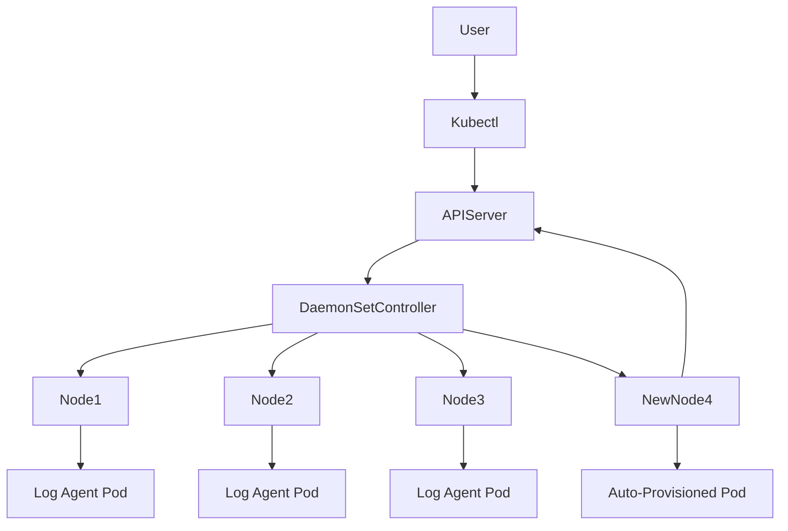

# DaemonSet Fundamentals

## 1. Topic Overview

A **DaemonSet** is a core Kubernetes controller that guarantees exactly **one instance of a Pod runs on every eligible Node** in the cluster.

While Deployments scale based on user demand (replicas), DaemonSets scale automatically based on **cluster infrastructure** (node count). When a new worker node joins the cluster, the DaemonSet controller instantly schedules a Pod on it. When a node is removed, the Pod is garbage collected. In production DevOps and SRE environments, DaemonSets are the absolute standard for deploying cluster-wide infrastructure agents, such as log collectors (Fluentd, Promtail), monitoring exporters (Datadog, Node Exporter), networking plugins (Calico, Cilium), and security scanners (Falco).

---

## 2. Architecture / Flow Diagram



---

## 3. Prerequisites

To properly observe a DaemonSet, we need a multi-node cluster. Execute these commands to provision a 2-node Minikube cluster and prepare the environment.

```bash
# 1. Start a 2-node Minikube cluster using a dedicated profile
minikube start --nodes 2 --profile ds-cluster

# 2. Verify both nodes are Ready
kubectl get nodes

# 3. Create a dedicated namespace for infrastructure agents
kubectl create namespace infra-system

# 4. Set the default context to the new namespace
kubectl config set-context --current --namespace=infra-system

```

---

## 4. Hands-On Lab

### Step 1: Deploying a Node-Level Log Collector

**Short explanation:**
We will deploy a mock log collector that mounts the underlying Node's `/var/log` directory using a `hostPath` volume. This is the exact mechanism tools like Filebeat or Fluentd use to scrape system logs directly from the host.

**YAML:** `node-logger-ds.yaml`

```yaml
apiVersion: apps/v1
kind: DaemonSet
metadata:
  name: node-logger
  namespace: infra-system
  labels:
    app: node-logger
spec:
  selector:
    matchLabels:
      app: node-logger
  template:
    metadata:
      labels:
        app: node-logger
    spec:
      tolerations:
      - key: node-role.kubernetes.io/control-plane
        operator: Exists
        effect: NoSchedule
      containers:
      - name: log-tailer
        image: busybox:1.36
        command: ["/bin/sh", "-c", "tail -f /var/log/syslog || tail -f /var/log/messages || sleep 3600"]
        resources:
          requests:
            cpu: "50m"
            memory: "50Mi"
          limits:
            cpu: "100m"
            memory: "100Mi"
        volumeMounts:
        - name: varlog
          mountPath: /host/var/log
          readOnly: true
      volumes:
      - name: varlog
        hostPath:
          path: /var/log
          type: Directory

```

**Command:**

```bash
# Apply the DaemonSet
kubectl apply -f node-logger-ds.yaml

```

**Verification:**

```bash
# Verify the DaemonSet status
kubectl get daemonset node-logger

# Check the pods and observe their node assignments
kubectl get pods -o wide

```

**Expected Outcome:**
You will see exactly 2 Pods created—one assigned to `ds-cluster` (the control plane node) and one assigned to `ds-cluster-m02` (the worker node). The `tolerations` block allowed the Pod to bypass the control-plane taint and schedule on the master node.

---

### Step 2: Inspecting Node-to-Pod Mapping

**Short explanation:**
In large clusters, `kubectl get pods -o wide` is too noisy. SREs use JSONPath to extract programmatic mappings to verify infrastructure agents are running on the intended nodes.

**Command:**

```bash
# Use JSONPath to output a clean List of Nodes and their respective DaemonSet Pod
kubectl get pods -l app=node-logger -o=jsonpath='{range .items[*]}{"Node: "}{.spec.nodeName}{"\t--> Pod: "}{.metadata.name}{"\n"}{end}'

```

**Verification:**

```bash
# Verify the DaemonSet's node targeting logic
kubectl describe daemonset node-logger | grep -A 3 "Node Selector"

```

**Expected Outcome:**
The terminal will explicitly print which pod belongs to which node. The `describe` command will confirm `Node Selector: <none>`, meaning it targets every node in the cluster.

---

### Step 3: Failure Simulation and Node-Aware Recovery

**Short explanation:**
If a DaemonSet Pod crashes, the controller does not just spin up a replacement anywhere; it strictly spins it up on the *exact same node* that lost the Pod. We will simulate a fatal crash.

**Command:**

```bash
# Identify the pod running on node 'ds-cluster-m02'
kubectl get pods -o wide

# Delete that specific pod (replace <pod-name>)
kubectl delete pod <pod-name>

# Immediately watch the recreation
kubectl get pods -o wide -w

```

**Verification:**

```bash
# Check the event logs to see the controller's immediate reaction
kubectl get events --sort-by=.metadata.creationTimestamp | tail -n 5

```

**Expected Outcome:**
The deleted pod terminates, and a new pod instantly transitions to `Pending` → `ContainerCreating` → `Running`. Crucially, its `NODE` column will remain `ds-cluster-m02`. The controller ensures the 1-to-1 ratio is maintained.

---

### Step 4: Modifying Node Placement (Node Selectors)

**Short explanation:**
Not all DaemonSets should run on every node. For example, a GPU driver DaemonSet should only run on nodes with GPUs. We will label our worker node and modify the DaemonSet to only schedule on it, forcing the control-plane pod to be evicted.

**Command:**

```bash
# 1. Label the worker node
kubectl label node ds-cluster-m02 workload-type=logging

# 2. Patch the DaemonSet on-the-fly to add a nodeSelector
kubectl patch daemonset node-logger -p '{"spec": {"template": {"spec": {"nodeSelector": {"workload-type": "logging"}}}}}'

```

**Verification:**

```bash
# Watch the pods adjust to the new desired state
kubectl get pods -o wide

# Verify the patch applied successfully
kubectl get daemonset node-logger

```

**Expected Outcome:**
The DaemonSet Controller instantly terminates the Pod on the `ds-cluster` (control-plane) node because it no longer satisfies the `nodeSelector`. The `DESIRED` count drops from 2 to 1. Only the Pod on `ds-cluster-m02` remains.

---

### Step 5: Verifying Node-Level Access via Exec

**Short explanation:**
To prove the DaemonSet Pod is actually interacting with its underlying host, we will execute a shell inside the remaining Pod and inspect the mounted host filesystem.

**Command:**

```bash
# Get the remaining pod name
POD_NAME=$(kubectl get pods -l app=node-logger -o jsonpath='{.items[0].metadata.name}')

# Exec into the pod and list the host's log directory
kubectl exec -it $POD_NAME -- ls -lh /host/var/log

```

**Verification:**

```bash
# Read the host's kubelet log or syslog directly from the pod
kubectl exec -it $POD_NAME -- head -n 10 /host/var/log/syslog

```

**Expected Outcome:**
Even though you are inside a container (`busybox`), you will see the actual log files of the Minikube Linux VM. This proves the `hostPath` volume mount is successfully bridging the container to the node's core infrastructure.

---

## 5. Core Commands Cheat Sheet

### Cluster & Node Commands

| Action | Command | Purpose |
| --- | --- | --- |
| List Nodes | `kubectl get nodes --show-labels` | View all nodes and their scheduling labels |
| Add Label | `kubectl label node <node-name> disk=ssd` | Tag a node for specific DaemonSet targeting |
| Remove Label | `kubectl label node <node-name> disk-` | Remove a tag (forces DS pod eviction) |

### DaemonSet Commands

| Action | Command | Purpose |
| --- | --- | --- |
| Get Summary | `kubectl get ds` | View Desired vs Ready pod counts per DS |
| Inspect DS | `kubectl describe ds <name>` | See tolerations, selectors, and rollout status |
| Rollout Status | `kubectl rollout status ds/<name>` | Track progress of a cluster-wide DS update |
| Edit DS | `kubectl edit ds <name>` | Interactively modify the DS configuration |

### Debugging Commands

| Action | Command | Purpose |
| --- | --- | --- |
| Pod Placement | `kubectl get pods -o wide` | Verify which Pods live on which Nodes |
| View Logs | `kubectl logs ds/<name>` | (Warning) Prints logs from ALL pods in the DS |
| Taint Check | `kubectl describe node <name> | grep Taints` | See why a DS pod might be skipping a node |

---

## 6. Advanced Operations

* **Tolerations:** By default, Kubernetes places a `NoSchedule` taint on the control-plane node to prevent application pods from running there. DaemonSets often require a `tolerations` block (as seen in Step 1) to ignore this taint so infrastructure agents can monitor the master nodes as well.
* **Rolling Updates (`maxUnavailable`):** During an update, you don't want to bring down monitoring on all nodes simultaneously. A DaemonSet's `updateStrategy` uses `maxUnavailable: 1` by default, updating one node's agent at a time to ensure cluster-wide observability is never completely lost.
* **HostNetwork:** Advanced networking DaemonSets (like `kube-proxy` or Calico) bypass the pod network entirely by setting `hostNetwork: true`. This binds the pod's ports directly to the node's physical network interface.

---

## 7. Real-Time Industry Usage

* **Log Aggregation (Fluent-bit / Promtail):** Instead of configuring logging inside every application container, DevOps teams deploy a log-forwarder DaemonSet. It mounts the node's container log directory (`/var/log/containers/`), reads standard output from all pods on that node, and forwards it to Splunk, Datadog, or Elasticsearch.
* **Security Agents (Falco / Aqua / CrowdStrike):** Security tools run as DaemonSets with elevated privileges (`privileged: true`) to monitor host kernel calls (eBPF) and detect malicious activity across all workloads on the node.
* **Storage Provisioners (CSI Node Drivers):** Cloud providers use DaemonSets to install the drivers required to attach cloud volumes (like AWS EBS or GCP Persistent Disks) directly to the worker nodes.

---

## 8. Troubleshooting Scenarios

### Scenario 1: Pod Not Scheduling on Master Node

* **Symptoms:** A DaemonSet shows 5 Desired pods, but only 4 are Ready. `kubectl get pods -o wide` reveals the master node has no pod.
* **Root Cause:** The control-plane node is tainted, and the DaemonSet YAML lacks the corresponding `toleration` to bypass it.
* **Debug Commands:**
```bash
kubectl describe node <master-node> | grep Taints
kubectl describe ds <daemonset-name> | grep Tolerations

```


```
* **Resolution:** Add the `node-role.kubernetes.io/control-plane:NoSchedule` toleration to the DaemonSet pod spec.
* **Operational Learning:** The DaemonSet controller respects standard scheduling rules and taints. It will not force a Pod onto a Node unless explicitly allowed.

### Scenario 2: CrashLoopBackOff due to Port Conflict
* **Symptoms:** A new monitoring DaemonSet pod is constantly crashing with a `bind: address already in use` error in the logs.
* **Root Cause:** The DaemonSet uses `hostNetwork: true`, and the port it is trying to bind to (e.g., `9100`) is already being used by another host process or another DaemonSet on that specific node.
* **Debug Commands:**
  ```bash
  kubectl logs <crashing-pod-name>
  kubectl exec -it <healthy-pod-on-another-node> -- netstat -tulpn

```

* **Resolution:** Change the application's binding port via ConfigMap, or identify and remove the conflicting service on the target node.
* **Operational Learning:** When using `hostNetwork`, the pod loses network isolation. You must manage port collisions exactly as you would on bare-metal servers.

### Scenario 3: Stuck Rollout

* **Symptoms:** After updating the DaemonSet image, the rollout is paused. `kubectl get ds` shows `UPDATED 1`, but the rest of the nodes are unchanged.
* **Root Cause:** The new image is broken (e.g., `ImagePullBackOff`). Because the default `maxUnavailable` is 1, the controller updates the first node, sees it fail, and refuses to proceed to the other nodes, protecting the cluster.
* **Debug Commands:**
```bash

```


kubectl rollout status ds/
kubectl get pods -l app= | grep -i error

```
* **Resolution:** Revert the change using `kubectl rollout undo ds/<name>`.
* **Operational Learning:** DaemonSet rolling updates inherently protect infrastructure by halting progression if the new configuration is unhealty.

---

## 9. Cleanup Activity

Execute the following commands to tear down the lab safely and reclaim system resources.

```bash
# 1. Delete the DaemonSet
kubectl delete ds node-logger

# 2. Remove the custom label from the worker node
kubectl label node ds-cluster-m02 workload-type-

# 3. Delete the infrastructure namespace
kubectl delete namespace infra-system

# 4. Switch context back to default
kubectl config set-context --current --namespace=default

# 5. Delete the entire multi-node Minikube cluster profile
minikube delete --profile ds-cluster

```

---

## 10. Key Takeaways

* **Infrastructure First:** DaemonSets are the primary tool for cluster bootstrapping, logging, and monitoring at the node level.
* **Zero Manual Scaling:** You never run `kubectl scale ds`. The number of pods is strictly determined by the number of matching nodes in your cluster.
* **Node Selectors are Powerful:** You can use labels and node selectors to create sub-groups of infrastructure (e.g., running specialized GPU metric exporters only on GPU-enabled nodes).
* **Taints & Tolerations Matter:** The DaemonSet controller obeys taints. If you want true cluster-wide coverage, you must explicitly tolerate all taints.

---

## 11. Lab Challenges

### Beginner Exercises

1. **Explore the System:** Kubernetes natively runs some of its own control plane components as DaemonSets. Run `kubectl get ds -n kube-system`. Identify the networking DaemonSet (likely `kube-proxy` or a CNI like `kindnet`).
2. **Imperative Labeling:** Label your control-plane node `env=dev` and your worker node `env=prod`.
3. **DS Inspection:** Run `kubectl describe ds kube-proxy -n kube-system` and locate its `Update Strategy`. What is the `Max unavailable` setting?

### Intermediate Exercises

4. **Deploy Node Exporter:** Write a DaemonSet YAML from scratch that deploys the `quay.io/prometheus/node-exporter:v1.8.1` image. Expose container port `9100`. Apply it to the cluster.
5. **HostNetwork Testing:** Modify the Node Exporter DaemonSet to include `hostNetwork: true`. Port-forward from the pod and `curl localhost:9100/metrics`.
6. **Eviction by Label:** Modify your Node Exporter DaemonSet to include a `nodeSelector` targeting `env=prod`. Observe which pod is terminated.

### Troubleshooting Exercises

7. **The Taint Trap:** Taint your worker node with `kubectl taint nodes ds-cluster-m02 maintenance=true:NoSchedule`. Observe what happens to the running DaemonSet pods. Modify the YAML to tolerate this new taint to get the pod back.
8. **Broken Mount:** Edit your `node-logger` DaemonSet. Change the `hostPath` type from `Directory` to `File`, but leave the path as `/var/log`. Apply it and debug the resulting `CreateContainerConfigError` or `CreateContainerError`.

### Production-Style Challenge

9. **The Zero-Downtime Agent Upgrade:** Deploy a dummy DaemonSet (use `nginx:1.24.0-alpine`) across a 3-node cluster. Configure the `updateStrategy` so that it updates exactly 2 nodes at a time instead of 1 (`maxUnavailable: 2`). Trigger an update to `nginx:1.25.0-alpine` and write a watch command that proves 2 nodes updated simultaneously while the 3rd waited.