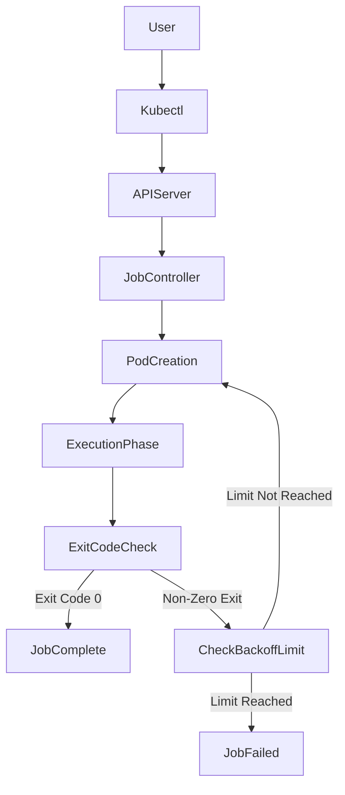

# Job Fundamentals

## 1. Topic Overview

A **Job** is a declarative Kubernetes controller designed specifically for ephemeral, finite workloads. While Deployments and StatefulSets are engineered to run continuously and serve persistent traffic, a Job's sole purpose is to execute a containerized task **to completion** and then cleanly terminate.

In production SRE and DevOps workflows, Jobs are the backbone of batch processing, database schema migrations, daily data backups, and automated infrastructure audits. They provide robust operational guarantees: if the script or container fails (returns a non-zero exit code), the Job controller will automatically restart the Pod or spawn a new one based on configurable backoff limits, ensuring critical batch tasks eventually succeed without manual intervention.

---

## 2. Architecture / Flow Diagram



---

## 3. Prerequisites

Before executing the lab, prepare a clean operational environment. Execute these commands sequentially.

```bash
# 1. Verify Minikube is active
minikube status

# 2. Verify kubectl context
kubectl cluster-info

# 3. Create an isolated namespace for batch operations
kubectl create namespace job-lab

# 4. Set the default context to the new namespace
kubectl config set-context --current --namespace=job-lab

```

---

## 4. Hands-On Lab

### Step 1: Deploying a Standard Batch Task

**Short explanation:**
We will deploy a Job simulating a database schema migration. We explicitly define a `backoffLimit` to control how many times Kubernetes should retry the task if it encounters an error.

**YAML:** `db-migration-job.yaml`

```yaml
apiVersion: batch/v1
kind: Job
metadata:
  name: db-schema-migration
  namespace: job-lab
spec:
  backoffLimit: 3
  template:
    spec:
      restartPolicy: Never
      containers:
      - name: migration-worker
        image: alpine:3.18
        command: ["/bin/sh", "-c", "echo 'Starting DB migration...'; sleep 5; echo 'Migration complete!'; exit 0"]
        resources:
          requests:
            cpu: "50m"
            memory: "64Mi"

```

**Command:**

```bash
# Apply the Job
kubectl apply -f db-migration-job.yaml

```

**Verification:**

```bash
# Watch the Job and Pod status
kubectl get jobs,pods -w

```

**Expected Outcome:**
The Job spins up a single Pod. The Pod enters `Running`, executes for 5 seconds, and transitions to `Completed`. The Job status updates to `COMPLETIONS 1/1`.

---

### Step 2: Inspecting Job Execution State

**Short explanation:**
Unlike Deployments, completed Job Pods are not immediately deleted. They remain in the cluster so SREs can inspect their exit codes and final logs. We will use `jsonpath` to extract the exact exit code.

**Command:**

```bash
# Extract the Pod name belonging to the Job
POD_NAME=$(kubectl get pods -l job-name=db-schema-migration -o jsonpath='{.items[0].metadata.name}')

# Check the logs of the completed execution
kubectl logs $POD_NAME

# Programmatically verify the exit code
kubectl get pod $POD_NAME -o jsonpath='{.status.containerStatuses[0].state.terminated.exitCode}{"\n"}'

```

**Verification:**

```bash
# Inspect the Job resource details
kubectl describe job db-schema-migration

```

**Expected Outcome:**
The logs will show the echoed script output. The exit code query will return `0`, proving the container shut down cleanly and triggered the Job's `Complete` state.

---

### Step 3: Failure Simulation and Backoff Limit

**Short explanation:**
Batch jobs fail (e.g., network timeouts, bad data). We will deploy a Job that intentionally fails (exit code 1) to observe the Job Controller's retry mechanism and backoff behavior.

**YAML:** `failing-job.yaml`

```yaml
apiVersion: batch/v1
kind: Job
metadata:
  name: network-audit-job
  namespace: job-lab
spec:
  backoffLimit: 2
  template:
    spec:
      restartPolicy: Never
      containers:
      - name: auditor
        image: alpine:3.18
        command: ["/bin/sh", "-c", "echo 'Auditing AWS Security Groups...'; echo 'Error: Connection timeout'; exit 1"]

```

**Command:**

```bash
# Apply the failing Job
kubectl apply -f failing-job.yaml

```

**Verification:**

```bash
# Watch the controller recreate Pods as they fail
kubectl get pods -l job-name=network-audit-job -w

```

**Expected Outcome:**
Because `restartPolicy: Never` is set, the container isn't restarted inside the pod; instead, the Job Controller provisions entirely new Pods. You will see 3 Pods in total (1 initial + 2 retries specified by `backoffLimit`). Once the limit is exhausted, the Job is marked as `Failed`.

---

### Step 4: Workload Recovery via Dependency Resolution

**Short explanation:**
Jobs are immutable—you cannot edit a running Job's pod template. However, you can fix environmental dependencies. We will deploy a Job that fails due to a missing ConfigMap, observe the error, and recover the workload dynamically by injecting the missing configuration.

**YAML:** `data-sync-job.yaml`

```yaml
apiVersion: batch/v1
kind: Job
metadata:
  name: data-sync
  namespace: job-lab
spec:
  backoffLimit: 4
  template:
    spec:
      restartPolicy: OnFailure
      containers:
      - name: sync-worker
        image: alpine:3.18
        command: ["/bin/sh", "-c", "cat /config/settings.conf && echo 'Sync successful' && exit 0"]
        volumeMounts:
        - name: config-vol
          mountPath: /config
      volumes:
      - name: config-vol
        configMap:
          name: sync-config

```

**Command:**

```bash
# 1. Apply the job (which requires an absent ConfigMap)
kubectl apply -f data-sync-job.yaml

# 2. Observe the CreateContainerConfigError
kubectl get pods

```

**Verification & Recovery:**

```bash
# 3. Diagnose the exact error
kubectl describe pod -l job-name=data-sync | grep -i "Error"

# 4. Operational Recovery: Create the missing dependency
kubectl create configmap sync-config --from-literal=settings.conf="TARGET_DB=Snowflake"

# 5. Watch the Job automatically recover and complete
kubectl get pods -l job-name=data-sync -w

```

**Expected Outcome:**
The Job initially gets stuck. Once the `ConfigMap` is created, the Kubelet immediately mounts it, the container starts, prints the configuration, exits with code 0, and the Job completes successfully.

---

### Step 5: Parallel Execution

**Short explanation:**
For heavy data processing, Jobs can scale horizontally. We will execute a Job requiring 4 successful completions, processing 2 at a time (Parallelism).

**YAML:** `parallel-job.yaml`

```yaml
apiVersion: batch/v1
kind: Job
metadata:
  name: batch-processor
  namespace: job-lab
spec:
  completions: 4
  parallelism: 2
  template:
    spec:
      restartPolicy: OnFailure
      containers:
      - name: worker
        image: busybox
        command: ["/bin/sh", "-c", "echo 'Processing data chunk...'; sleep 3; exit 0"]

```

**Command:**

```bash
# Apply the parallel job
kubectl apply -f parallel-job.yaml

```

**Verification:**

```bash
# Watch the pods execute in pairs of 2
kubectl get pods -l job-name=batch-processor -w

```

**Expected Outcome:**
The Job Controller spawns 2 Pods simultaneously. Once they complete, it spawns the next 2, until exactly 4 total completions are achieved.

---

## 5. Core Commands Cheat Sheet

### Job Commands

| Action | Command | Purpose |
| --- | --- | --- |
| List Jobs | `kubectl get jobs` | View completions and duration |
| Inspect Job | `kubectl describe job <name>` | See backoff limits, parallelism, and pod events |
| Delete Job | `kubectl delete job <name>` | Removes the Job AND its completed Pods |

### Pod & Debugging Commands

| Action | Command | Purpose |
| --- | --- | --- |
| View Logs | `kubectl logs job/<name>` | Streams the logs of the Job's Pod |
| Check Exit Code | `kubectl get pod <name> -o yaml | grep exitCode` | Determine exact script failure reason |
| Tail Follow | `kubectl logs -f job/<name>` | Watch batch script output in real-time |

---

## 6. Advanced Operations

* **TTL After Finished (`ttlSecondsAfterFinished`):** Leaving completed Pods in a cluster indefinitely clutters the API and wastes ETCD storage. By adding `ttlSecondsAfterFinished: 100` to the Job spec, the Kubernetes control plane will automatically garbage collect the Job and its Pods 100 seconds after completion.
* **Active Deadline (`activeDeadlineSeconds`):** Scripts can freeze (e.g., hanging on an unresponsive external API). If you set `activeDeadlineSeconds: 60`, Kubernetes will forcefully terminate the Job and mark it as Failed if it runs longer than 60 seconds, preventing zombie processes.
* **Suspend/Resume:** Introduced in newer Kubernetes versions, SREs can set `suspend: true` in the Job spec. This pauses the Job (no new Pods are spawned) without deleting it, useful for temporarily halting batch processing during a major incident.

---

## 7. Real-Time Industry Usage

* **Data Warehouse Migrations:** Moving large datasets into platforms like Snowflake. A CronJob triggers a Job that spins up a Python Pod, runs a multi-threaded upload script, and safely spins down, costing zero compute dollars when not running.
* **Machine Learning Batch Inferences:** Using AI platforms like AWS SageMaker or Bedrock. A Kubernetes Job kicks off to pull a dataset from S3, run inference against an LLM via API, write the results back to a database, and terminate.
* **Infrastructure Security Audits:** A Python script deployed as a Job runs nightly to scan AWS CloudTrail logs and Security Group configurations, looking for exposed CIDR blocks, alerting a Slack webhook, and exiting.

---

## 8. Troubleshooting Scenarios

### Scenario 1: The Zombie Job (Hung Script)

* **Symptoms:** A database migration Job shows `Running` for 3 hours. It usually takes 2 minutes. Logs show it is stuck trying to connect to a database.
* **Root Cause:** The script has no internal timeout, and the database endpoint is unreachable. The Pod never hits an `exit` code, so the Job Controller assumes it is still working.
* **Debug Commands:**
```bash
kubectl describe job db-migration
kubectl logs job/db-migration

```


```
* **Resolution:** Edit the script to include timeouts, AND enforce infrastructure-level limits by adding `activeDeadlineSeconds: 300` (5 minutes) to the Job Spec.
* **Operational Learning:** Never trust application code to fail gracefully. Always configure `activeDeadlineSeconds` for finite tasks to prevent cluster resource locking.

### Scenario 2: Infinite Pod Creation
* **Symptoms:** Your cluster is suddenly filled with hundreds of Pods belonging to a single Job. Nodes are running out of IP addresses.
* **Root Cause:** The Job has `restartPolicy: Never` but the `backoffLimit` was either omitted (defaults to 6) or manually set exceptionally high. The container keeps crashing, and the controller keeps provisioning entirely new Pods to retry.
* **Debug Commands:**
  ```bash
  kubectl get pods -l job-name=<name>
  kubectl describe pod <any-failed-pod>

```

* **Resolution:** Delete the Job immediately to stop the controller. Fix the underlying crash reason before reapplying.
```bash
kubectl delete job <name>

```


```
* **Operational Learning:** `restartPolicy: Never` forces the creation of a *new* Pod on failure. `restartPolicy: OnFailure` restarts the container *inside the same* Pod. Choose based on whether your task leaves corrupt local state behind.

### Scenario 3: Immutability Errors
* **Symptoms:** An engineer tries to update the Docker image of a running/failed Job using `kubectl set image` or `kubectl apply`. The API server rejects the command with a validation error.
* **Root Cause:** Unlike Deployments, the `spec.template` of a Job is immutable. You cannot change a Job's execution parameters once it is created.
* **Debug Commands:** N/A (The error is returned directly to the terminal).
* **Resolution:** You must delete the existing Job and apply the new YAML.
  ```bash
kubectl replace --force -f job.yaml

```

* **Operational Learning:** Jobs are fundamentally immutable records of an execution event. If the parameters change, it is operationally a *new* execution event.

---

## 9. Cleanup Activity

Execute these commands to remove the Jobs, Pods, and isolated namespace.

```bash
# 1. Delete all Jobs in the namespace (this automatically deletes their Pods)
kubectl delete jobs --all

# 2. Delete the created ConfigMap
kubectl delete configmap sync-config

# 3. Delete the isolated namespace
kubectl delete namespace job-lab

# 4. Reset your context to default
kubectl config set-context --current --namespace=default

```

---

## 10. Key Takeaways

* **Run to Completion:** Jobs guarantee a script executes successfully and stops, rather than keeping a web server running forever.
* **Exit Codes Dictate Action:** The Kubernetes Job controller relies entirely on the Linux container exit code (`0` = Success, `1+` = Failure).
* **Automated Retries:** `backoffLimit` provides native infrastructure resilience against transient network drops or temporary database locks.
* **Cleanup is Manual (by default):** Unless you configure `ttlSecondsAfterFinished`, completed Pods remain for SRE inspection.

---

## 11. Lab Challenges

### Beginner Exercises

1. **The Hello World Job:** Write a Job YAML from scratch that echoes "SRE Bootcamp" and completes. Apply it and verify the logs.
2. **Imperative Creation:** Use the CLI to imperatively create a Job without YAML: `kubectl create job test-job --image=busybox -- date`.
3. **Log Extraction:** Write a one-liner to extract the logs of a Job without using the `job/` prefix (Hint: use label selectors).

### Intermediate Exercises

4. **Implementing TTL:** Modify the `db-migration-job.yaml` to include `ttlSecondsAfterFinished: 15`. Apply it, run `watch kubectl get jobs,pods`, and observe the automatic garbage collection.
5. **Parallel Math:** Create a Job with `parallelism: 3` and `completions: 3`. The container should run a bash loop calculating prime numbers for 10 seconds, then exit 0. Observe CPU spikes via `minikube dashboard` or `kubectl top pods`.
6. **Active Deadline:** Create a Job that runs `sleep 3600`. Set the `activeDeadlineSeconds: 10`. Apply it and watch the Job transition to `Failed` due to `DeadlineExceeded`.

### Troubleshooting Exercises

7. **The Crash Loop:** Create a Job with `restartPolicy: OnFailure` and `backoffLimit: 4`. The command should be `ls /nonexistent-directory`. Apply it and track how the container restart backoff timer increases exponentially.
8. **Resource Starvation:** Define a Job that requests `cpu: "4000m"` (4 Cores). Apply it to Minikube. Diagnose exactly why it stays in `Pending` state using operational commands.

### Production-Style Challenge

9. **The Idempotent Workflow:** Write a Job containing an InitContainer and a Main Container. The InitContainer must successfully ping `google.com` (simulating checking external API readiness). Only if the ping succeeds (exit 0) should the Main Container run a script that echoes "API Data Synced!". Ensure `restartPolicy: Never` is set. Test it by intentionally breaking the ping URL first, recovering it, and observing the Pod phases.