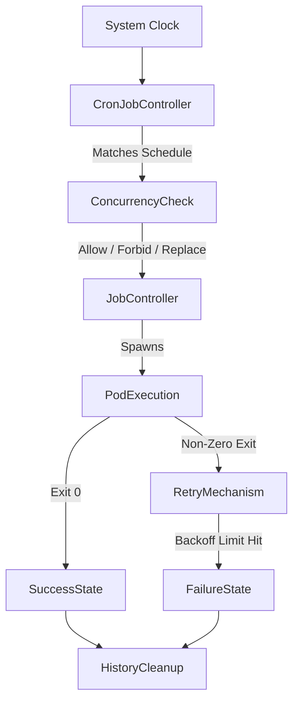

# CronJob Fundamentals

## 1. Topic Overview

A **CronJob** is a Kubernetes controller that creates **Jobs** on a repeating schedule using standard Linux `cron` syntax.

While a Job executes a finite task once, a CronJob ensures that task is executed periodically (e.g., nightly, hourly, or weekly). In enterprise production environments, SREs and DevOps engineers use CronJobs to automate critical infrastructure maintenance routines such as database backups (e.g., `pg_dump` to AWS S3), log rotation, stale cache eviction, and TLS certificate renewals.

CronJobs abstract away the need for external scheduling servers (like Jenkins or a dedicated Cron VM). They manage the complete lifecycle of periodic tasks, including how overlapping executions are handled (Concurrency Policy) and how many historical executions are kept for auditing (History Limits).

---

## 2. Architecture / Flow Diagram



---

## 3. Prerequisites

Prepare your Minikube environment to isolate these batch workloads. Execute the commands sequentially.

```bash
# 1. Verify Minikube cluster is healthy
minikube status

# 2. Verify kubectl is communicating with the cluster
kubectl cluster-info

# 3. Create an isolated namespace for schedule-based workloads
kubectl create namespace cron-lab

# 4. Set the default context to the new namespace
kubectl config set-context --current --namespace=cron-lab

```

---

## 4. Hands-On Lab

### Step 1: Deploying a Production-Grade CronJob

**Short explanation:**
We will deploy a CronJob that simulates a routine database backup. We schedule it to run every minute (`* * * * *`) so we can observe the results immediately without waiting for an hour. We include production best practices: resource limits, history limits, and a specific concurrency policy.

**YAML:** `db-backup-cron.yaml`

```yaml
apiVersion: batch/v1
kind: CronJob
metadata:
  name: nightly-db-backup
  namespace: cron-lab
spec:
  schedule: "* * * * *"
  concurrencyPolicy: Forbid
  successfulJobsHistoryLimit: 3
  failedJobsHistoryLimit: 1
  jobTemplate:
    spec:
      backoffLimit: 2
      template:
        spec:
          restartPolicy: OnFailure
          containers:
          - name: backup-worker
            image: alpine:3.18
            command: ["/bin/sh", "-c", "echo 'Connecting to Database...'; sleep 5; echo 'Backup successfully uploaded to S3'; exit 0"]
            resources:
              requests:
                cpu: "50m"
                memory: "64Mi"
              limits:
                cpu: "100m"
                memory: "128Mi"

```

**Command:**

```bash
# Apply the CronJob definition
kubectl apply -f db-backup-cron.yaml

```

**Verification:**

```bash
# View the CronJob schedule and wait for the first execution (up to 60 seconds)
kubectl get cronjob nightly-db-backup -w

```

**Expected Outcome:**
The `LAST SCHEDULE` column will initially show `<none>`. Within one minute, the CronJob controller matches the clock, spawns a Job, and updates the `ACTIVE` count to `1`. The `LAST SCHEDULE` updates to the current timestamp.

---

### Step 2: Inspecting the Spawned Job and Pods

**Short explanation:**
A CronJob does not run pods directly; it creates a Job object. We need to inspect the lineage from CronJob → Job → Pod to verify operational success and extract logs.

**Command:**

```bash
# List all jobs generated by the CronJob
kubectl get jobs

# Extract the exact name of the most recent Job using JSONPath
LAST_JOB=$(kubectl get jobs -o jsonpath='{.items[0].metadata.name}')

# View the logs of the pod generated by that specific Job
kubectl logs job/$LAST_JOB

```

**Verification:**

```bash
# Inspect the operational events of the CronJob itself
kubectl describe cronjob nightly-db-backup | grep -A 5 "Events:"

```

**Expected Outcome:**
The Job logs will output the mock backup success message. The events will clearly show `SuccessfulCreate` indicating the CronJob controller successfully generated the Job object.

---

### Step 3: Simulating Overlapping Executions (ConcurrencyPolicy)

**Short explanation:**
In production, if a backup takes 2 hours but the schedule runs every 1 hour, running them simultaneously (`Allow`) could crash the database via I/O exhaustion. We defined `concurrencyPolicy: Forbid`. We will simulate a slow job to prove the controller prevents overlaps.

**YAML:** `slow-backup-cron.yaml`

```yaml
apiVersion: batch/v1
kind: CronJob
metadata:
  name: slow-backup
  namespace: cron-lab
spec:
  schedule: "* * * * *"
  concurrencyPolicy: Forbid
  jobTemplate:
    spec:
      template:
        spec:
          restartPolicy: Never
          containers:
          - name: worker
            image: busybox
            command: ["/bin/sh", "-c", "echo 'Running slow backup...'; sleep 120; exit 0"]

```

**Command:**

```bash
# Apply the slow-running CronJob
kubectl apply -f slow-backup-cron.yaml

```

**Verification:**

```bash
# Wait 2 minutes, then check the events to see the blocked execution
kubectl get events --sort-by=.metadata.creationTimestamp | grep "slow-backup"

```

**Expected Outcome:**
After the first minute, the initial Job spawns and sleeps for 120 seconds. On the second minute, the CronJob controller evaluates the schedule, sees the previous Job is still running, respects the `Forbid` policy, and **skips** the execution. This protects cluster resources.

---

### Step 4: Out-of-Band Manual Execution

**Short explanation:**
During an incident, SREs cannot wait for the 3:00 AM schedule to run a backup or cleanup script. You can manually spawn an immediate Job directly from a CronJob template.

**Command:**

```bash
# Manually trigger the backup right now
kubectl create job --from=cronjob/nightly-db-backup emergency-backup-01

# Watch the manually triggered job execute
kubectl get jobs emergency-backup-01 -w

```

**Verification:**

```bash
# Check the logs of the manually triggered job
kubectl logs job/emergency-backup-01

```

**Expected Outcome:**
Kubernetes instantly creates a Job named `emergency-backup-01` using the exact container specifications defined in the `nightly-db-backup` CronJob, bypassing the time schedule entirely.

---

### Step 5: Suspending a CronJob

**Short explanation:**
During a major database migration or incident, you must pause automated jobs to prevent them from interfering with manual SRE work. Deleting the CronJob loses its history; suspending it is the production standard.

**Command:**

```bash
# Imperatively patch the CronJob to suspend future executions
kubectl patch cronjob nightly-db-backup -p '{"spec" : {"suspend" : true }}'

```

**Verification:**

```bash
# Verify the suspend status
kubectl get cronjob nightly-db-backup

```

**Expected Outcome:**
The `SUSPEND` column changes from `False` to `True`. The CronJob remains in the cluster and retains its history, but the controller will no longer spawn new Jobs until the patch is reverted.

---

## 5. Core Commands Cheat Sheet

### CronJob Commands

| Action | Command | Purpose |
| --- | --- | --- |
| List CronJobs | `kubectl get cj` | View schedules, active status, and last run time |
| Manual Trigger | `kubectl create job --from=cj/<name> <job-name>` | Run scheduled task immediately |
| Suspend Schedule | `kubectl patch cj <name> -p '{"spec":{"suspend":true}}'` | Pause automated executions |
| Resume Schedule | `kubectl patch cj <name> -p '{"spec":{"suspend":false}}'` | Unpause automated executions |

### Verification & Debugging

| Action | Command | Purpose |
| --- | --- | --- |
| Inspect Object | `kubectl describe cj <name>` | View policies, history limits, and spawn events |
| View History | `kubectl get jobs -l <label>` | List the preserved history of completed/failed runs |
| Sort Events | `kubectl get events --sort-by=.metadata.creationTimestamp` | Trace controller scheduling decisions |

---

## 6. Advanced Operations

* **History Limits:** By default, Kubernetes keeps 3 successful and 1 failed Jobs. In high-frequency CronJobs (e.g., every minute), leaving this unchecked can bloat the ETCD database. Always explicitly define `successfulJobsHistoryLimit` and `failedJobsHistoryLimit`.
* **Starting Deadline (`startingDeadlineSeconds`):** If the CronJob controller goes down, or the cluster lacks compute resources, a Job might miss its scheduled window. If you set `startingDeadlineSeconds: 60`, Kubernetes will skip the run if it is delayed by more than 60 seconds, rather than running a stale, delayed job.
* **Concurrency `Replace`:** Setting `concurrencyPolicy: Replace` is highly useful for metric-gathering scripts. If a previous script gets stuck, the controller will automatically terminate the hung Job and replace it with a fresh execution.

---

## 7. Real-Time Industry Usage

* **Cloud Resource Cleanup:** A DevOps pipeline spins up dynamic preview environments (Namespaces). A CronJob runs at midnight, executing a Python script that uses the Kubernetes API to delete any namespaces older than 24 hours, saving thousands in cloud compute costs.
* **Certificate Rotation:** A CronJob runs a Certbot container weekly. It attempts to renew Let's Encrypt TLS certificates. If successful, it stores the new certificates in a Kubernetes Secret, ensuring ingress traffic remains secure.
* **Reporting Aggregation:** An e-commerce platform uses a CronJob to run a heavy SQL aggregation query at 2:00 AM (low traffic hours) to generate daily sales reports and email them to stakeholders.

---

## 8. Troubleshooting Scenarios

### Scenario 1: Overlapping Job Resource Exhaustion

* **Symptoms:** The cluster runs out of memory/CPU. `kubectl get pods` shows dozens of pods belonging to the same CronJob all running concurrently.
* **Root Cause:** The `concurrencyPolicy` was left as default (`Allow`). The batch script takes 10 minutes to run, but the schedule triggers it every 5 minutes. The Jobs pile up and exhaust node resources.
* **Debug Commands:**
```bash
kubectl get cj <name> -o yaml | grep concurrencyPolicy
kubectl top pods

```


```
* **Resolution:** Edit the CronJob to use `concurrencyPolicy: Forbid` or `Replace`, and investigate why the script execution time exceeds the schedule interval.
* **Operational Learning:** Never use `Allow` for heavy batch workloads unless horizontal processing is explicitly designed into the application logic.

### Scenario 2: CronJob Stops Triggering
* **Symptoms:** A daily CronJob hasn't run for three days. `kubectl get cj` shows `ACTIVE 0` and an old `LAST SCHEDULE` timestamp.
* **Root Cause:** A previous execution got stuck in a `Running` state indefinitely (e.g., waiting on an external API), and the `concurrencyPolicy` is set to `Forbid`. Because the old Job never exited, the controller refuses to spawn new ones.
* **Debug Commands:**
  ```bash
  kubectl get jobs | grep <cronjob-name>
  kubectl describe pod <stuck-pod-name>

```

* **Resolution:** Manually delete the stuck Job (`kubectl delete job <stale-job>`). To prevent recurrence, add `activeDeadlineSeconds` to the Job template to force a timeout.
* **Operational Learning:** Combine `concurrencyPolicy: Forbid` with `activeDeadlineSeconds` to ensure hung processes do not permanently block your scheduling pipeline.

### Scenario 3: Schedule Timezone Confusion

* **Symptoms:** A CronJob scheduled for midnight (`0 0 * * *`) actually executes at 5:30 AM local time.
* **Root Cause:** Kubernetes CronJobs evaluate schedules based on the `kube-controller-manager` timezone, which is almost exclusively set to UTC in cloud environments (AWS/GCP/Azure).
* **Debug Commands:**
```bash
date -u
kubectl logs -n kube-system <kube-controller-manager-pod> | grep Timezone

```


```
* **Resolution:** In Kubernetes 1.25+, you can explicitly set the timezone in the CronJob spec using the `timeZone` field (e.g., `timeZone: "Asia/Kolkata"`).
* **Operational Learning:** Always assume UTC for distributed cloud infrastructure unless explicitly declared otherwise.

---

## 9. Cleanup Activity

Execute the following commands to tear down the scheduling lab and reclaim local resources.

```bash
# 1. Delete all CronJobs in the namespace
kubectl delete cronjobs --all

# 2. Delete all manually triggered Jobs
kubectl delete jobs --all

# 3. Delete the isolated namespace
kubectl delete namespace cron-lab

# 4. Switch context back to default
kubectl config set-context --current --namespace=default

```

---

## 10. Key Takeaways

* **Automated Batch Processing:** CronJobs bring native `cron` capabilities to distributed systems without relying on external VMs or Jenkins.
* **Concurrency Control:** Policies (`Allow`, `Forbid`, `Replace`) protect your infrastructure from overlapping executions and cascading failures.
* **History Management:** Retaining history limits (`successfulJobsHistoryLimit`, `failedJobsHistoryLimit`) is critical for debugging batch processes post-mortem.
* **Manual Overrides:** The ability to instantly trigger a scheduled task via `kubectl create job --from` is an indispensable incident management tool.

---

## 11. Lab Challenges

### Beginner Exercises

1. **Imperative Creation:** Use the CLI to create a CronJob named `ping-test` that pings `google.com` every 5 minutes. (Hint: `kubectl create cronjob --help`).
2. **Schedule Modification:** Edit your existing CronJob imperative via `kubectl edit` and change the schedule to run exactly at the top of every hour.
3. **Log Retrieval:** Write a sequence of commands to find the most recently failed execution of a CronJob and output its container logs.

### Intermediate Exercises

4. **Timezone Implementation:** Write a CronJob YAML that prints "Good Morning" at 9:00 AM explicitly utilizing the `timeZone` field configured to `America/New_York` or `Asia/Kolkata`.
5. **Enforcing Timeouts:** Create a CronJob with a script that sleeps for 300 seconds. Add `activeDeadlineSeconds: 30` to the Job template. Observe the system forcefully terminating the Job as a failure.
6. **Concurrency Swap:** Modify the `slow-backup` CronJob from the lab to use `concurrencyPolicy: Replace`. Watch the Pods and document how the controller handles the second minute's execution.

### Troubleshooting Exercises

7. **The Impossible Schedule:** Create a CronJob with the schedule `* * 30 2 *` (February 30th). Apply it. Check the events. How does the API server validate or reject invalid cron expressions?
8. **The Ghost Job:** Set `successfulJobsHistoryLimit: 0` and `failedJobsHistoryLimit: 0`. Apply the CronJob and let it run once. Attempt to get the logs. Explain why this configuration is dangerous for production troubleshooting.

### Production-Style Challenge

9. **The Self-Cleaning Cluster:** Write a CronJob that uses the `bitnami/kubectl:latest` image. Mount a custom `ServiceAccount` with RBAC permissions (Role/RoleBinding) that allows it to list and delete Pods. The script should run every 10 minutes and delete any Pods in the `default` namespace that have a status of `Evicted` or `Failed`. (This tests your understanding of CronJobs, RBAC, and cluster automation).