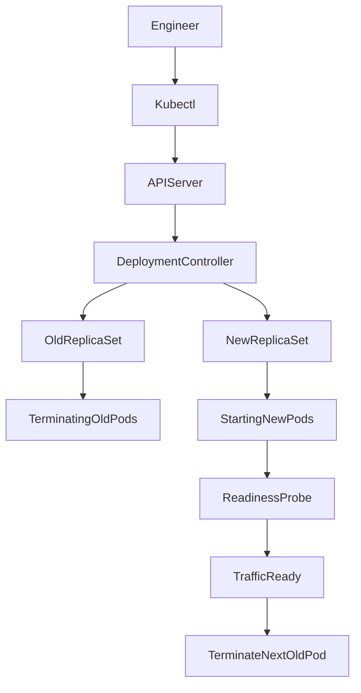

# Rollouts and Rollbacks in Kubernetes

## 1. Topic Overview

In a production Kubernetes environment, uptime is non-negotiable. **Rollouts and Rollbacks** are native workload mechanisms that allow DevOps and SRE teams to safely deploy new versions of applications and rapidly revert them if catastrophic failures occur.

A **Rollout** (Rolling Update) gradually replaces old Pods with new ones, ensuring that a minimum number of healthy Pods are always available to serve user traffic. A **Rollback** acts as an operational undo button, referencing a natively stored revision history to instantly revert the Deployment to a known-stable state. These features form the foundation of continuous delivery, enabling zero-downtime deployments without relying on external routing orchestrators.

---

## 2. Architecture / Flow Diagram



---

## 3. Prerequisites

Before executing this lab, ensure your Minikube environment is running and isolated. Execute the following commands in order:

```bash
# Verify Minikube is active
minikube status

# Verify kubectl context
kubectl cluster-info

# Enable the metrics server for resource visibility
minikube addons enable metrics-server

# Create an isolated namespace for rollout operations
kubectl create namespace rollout-lab

# Set the default context to the new namespace
kubectl config set-context --current --namespace=rollout-lab

```

---

## 4. Hands-On Lab

### Step 1: Deploying the Baseline Application (v1)

**Short explanation:**
We are deploying a mock `payment-service` at version 1 (using `nginx:1.24.0-alpine` as our stand-in). This YAML includes a `strategy` block defining `maxSurge` and `maxUnavailable`, along with readiness probes. Probes are strictly required; without them, a rollout will assume a Pod is ready the millisecond the container starts, leading to dropped traffic.

**YAML:**

```yaml
apiVersion: apps/v1
kind: Deployment
metadata:
  name: payment-service
  namespace: rollout-lab
  labels:
    app: payment-service
spec:
  replicas: 4
  selector:
    matchLabels:
      app: payment-service
  strategy:
    type: RollingUpdate
    rollingUpdate:
      maxUnavailable: 1
      maxSurge: 1
  template:
    metadata:
      labels:
        app: payment-service
    spec:
      containers:
      - name: api
        image: nginx:1.24.0-alpine
        ports:
        - containerPort: 80
        resources:
          requests:
            cpu: "50m"
            memory: "64Mi"
          limits:
            cpu: "100m"
            memory: "128Mi"
        readinessProbe:
          httpGet:
            path: /
            port: 80
          initialDelaySeconds: 2
          periodSeconds: 5

```

**Command:**

```bash
# Apply the initial deployment
kubectl apply -f payment-service.yaml

```

**Verification:**

```bash
# Watch the pods come online
kubectl get pods -w

# Check the rollout history (Revision 1)
kubectl rollout history deployment/payment-service

```

**Expected Outcome:**
The Deployment will create a ReplicaSet, which provisions 4 Pods. The rollout history will show `REVISION 1`. Traffic is stable.

---

### Step 2: Triggering a Canary-Style Paused Rollout (v2)

**Short explanation:**
We will update the image to v2 (`1.25.0-alpine`), but we will immediately pause the rollout. This is a common SRE technique called a "Canary Deployment." It allows one new Pod to spin up so engineers can verify metrics and logs before letting the update replace the remaining old Pods.

**Command:**

```bash
# Trigger the update and immediately pause the deployment
kubectl set image deployment/payment-service api=nginx:1.25.0-alpine
kubectl rollout pause deployment/payment-service

```

**Verification:**

```bash
# View the ReplicaSets to see the old and new running simultaneously
kubectl get rs

# Use JSONPath to verify the images running across all pods
kubectl get pods -o jsonpath='{range .items[*]}{.metadata.name}{"\t"}{.spec.containers[0].image}{"\n"}{end}'

```

**Expected Outcome:**
You will see two ReplicaSets. Because `maxSurge` is 1, a 5th Pod (running `1.25.0-alpine`) is created and ready. The rollout halts. The old Pods remain fully active.

---

### Step 3: Resuming and Completing the Rollout

**Short explanation:**
Assuming our canary Pod is healthy and throwing no errors, we will resume the rollout to let the Deployment Controller upgrade the rest of the fleet sequentially.

**Command:**

```bash
# Resume the paused rollout
kubectl rollout resume deployment/payment-service

# Watch the rollout status until completion
kubectl rollout status deployment/payment-service

```

**Verification:**

```bash
# Verify the updated revision history
kubectl rollout history deployment/payment-service

```

**Expected Outcome:**
The command blocks the terminal until the controller safely replaces the remaining 3 Pods. The rollout history will now list `REVISION 2`.

---

### Step 4: Simulating a Catastrophic Deployment Failure

**Short explanation:**
A developer merges a PR with a broken Docker image tag (`nginx:broken-tag`). We will push this update to production and observe how the `RollingUpdate` strategy mathematically prevents a full outage.

**Command:**

```bash
# Trigger an update with a non-existent image
kubectl set image deployment/payment-service api=nginx:broken-tag

# Monitor the rollout status (it will hang)
kubectl rollout status deployment/payment-service --timeout=15s

```

**Verification:**

```bash
# Inspect the pods to see the exact failure state
kubectl get pods

# Diagnose the specific pod failure
kubectl describe pod -l app=payment-service | grep -A 5 "Events:"

```

**Expected Outcome:**
Because `maxUnavailable` is 1, the Deployment terminates exactly 1 old Pod and tries to start a new one. The new Pod fails with `ImagePullBackOff`. The controller **halts the rollout completely**. The 3 remaining healthy Pods continue serving 100% of user traffic.

---

### Step 5: SRE Operational Recovery (Rollback)

**Short explanation:**
Instead of hunting for the bug while the deployment is stuck, the immediate SRE action is to recover the cluster state by rolling back to the last known stable revision (Revision 2).

**Command:**

```bash
# Abort the broken rollout and revert to the previous state
kubectl rollout undo deployment/payment-service

# Verify the recovery
kubectl rollout status deployment/payment-service

```

**Verification:**

```bash
# Check the history to see the rollback recorded as a new revision
kubectl rollout history deployment/payment-service

# Confirm the running image is back to the stable version
kubectl get deployment payment-service -o jsonpath='{.spec.template.spec.containers[0].image}{"\n"}'

```

**Expected Outcome:**
The broken Pod is immediately terminated. The previous ReplicaSet is scaled back up to 4. The rollout history will now show `REVISION 4` (which is a clone of Revision 2).

---

## 5. Core Commands Cheat Sheet

### Deployment Commands

| Action | Command | Purpose |
| --- | --- | --- |
| Update Image | `kubectl set image deploy/<name> <container>=<image>` | Triggers a rolling update |
| Edit Deploy | `kubectl edit deploy <name>` | Modify YAML spec on the fly |
| Scale | `kubectl scale deploy/<name> --replicas=5` | Does not trigger a new revision |

### Rollout Commands

| Action | Command | Purpose |
| --- | --- | --- |
| Check Status | `kubectl rollout status deploy/<name>` | Block terminal until rollout completes |
| View History | `kubectl rollout history deploy/<name>` | List all past revisions |
| Pause Update | `kubectl rollout pause deploy/<name>` | Halt a rollout mid-flight |
| Resume Update | `kubectl rollout resume deploy/<name>` | Continue a paused rollout |

### Debugging Commands

| Action | Command | Purpose |
| --- | --- | --- |
| View RS | `kubectl get rs` | See scaled up/down ReplicaSets |
| Live Events | `kubectl get events --sort-by=.metadata.creationTimestamp` | Track cluster state changes |
| Pod Logs | `kubectl logs deploy/<name> --all-containers=true` | Aggregate logs during rollout |

---

## 6. Advanced Operations

* **Revision History Limits:** By default, Kubernetes keeps 10 old ReplicaSets for rollback purposes. If you deploy 50 times a day, this clutters the cluster. Set `spec.revisionHistoryLimit: 5` in the Deployment YAML to automatically garbage-collect older, unneeded ReplicaSets.
* **Rollback to Specific Version:** If the previous version (Revision 3) also had a bug, and you need to revert to yesterday's state (Revision 1), use: `kubectl rollout undo deployment/<name> --to-revision=1`.
* **Change Causes:** To make `rollout history` readable, annotate deployments during updates: `kubectl annotate deployment <name> kubernetes.io/change-cause="Updated payment gateway SDK"`. This prints a human-readable message in the history table.

---

## 7. Real-Time Industry Usage

* **GitOps Integration:** In modern CI/CD, engineers never run `kubectl set image` manually. Instead, ArgoCD or Flux watches a Git repository. When a commit changes the image tag in Git, ArgoCD applies it, triggering the K8s rolling update natively.
* **Probes as Safety Nets:** Deployments without `readinessProbes` are functionally blind. Without them, Kubernetes assumes a pod is ready instantly. In a rollout, this causes K8s to kill old pods immediately, routing traffic to new pods that might still be booting up their application frameworks (like Java Spring), resulting in dropped requests.
* **Zero-Downtime Database Migrations:** Rollouts are often paired with backward-compatible database changes. A rollout pushes v2 of the app (which can read v1 and v2 DB schemas). Once stable, a job migrates the DB schema entirely.

---

## 8. Troubleshooting Scenarios

### Scenario 1: CrashLoopBackOff Halting Rollout

* **Symptoms:** Rollout hangs. New pods crash, restart, and crash again. Old pods remain running.
* **Root Cause:** Application code failure. The container boots, but an application thread throws a fatal exception (e.g., missing environment variable) causing the process to exit with a non-zero code.
* **Debug Commands:**
```bash
kubectl get pods
kubectl logs <new-crashing-pod> --previous

```


```
* **Resolution:** 
  ```bash
kubectl rollout undo deployment/payment-service

```

* **Operational Learning:** Use the `--previous` flag when checking logs of a `CrashLoopBackOff` pod to see the exact stack trace of the container *before* the kubelet restarted it.

### Scenario 2: Rollout Succeeds but Traffic is Dropped

* **Symptoms:** `kubectl rollout status` says the rollout was successful. However, users are reporting 502 Bad Gateway errors for about 30 seconds during the deployment.
* **Root Cause:** The application takes 30 seconds to warm up its cache, but the Deployment is missing a `readinessProbe`. Kubernetes sent traffic to the pod before the application was actually ready to receive HTTP requests.
* **Debug Commands:**
```bash

```


kubectl describe deploy payment-service | grep -i probe

```
* **Resolution:** Add a `readinessProbe` with an appropriate `initialDelaySeconds` to the Deployment YAML and re-apply.
* **Operational Learning:** Kubernetes only knows the container process started. It does not know if your application logic is ready. Probes translate application state to cluster state.

### Scenario 3: Stuck "Terminating" Pods
* **Symptoms:** During a rollout, new pods are `Running`, but old pods are stuck in `Terminating` state for over 5 minutes.
* **Root Cause:** The application is not handling `SIGTERM` signals properly, or it has a `terminationGracePeriodSeconds` set unusually high. The kubelet is waiting for the app to shut down gracefully before forcing a `SIGKILL`.
* **Debug Commands:**
  ```bash
  kubectl describe pod <terminating-pod>

```

* **Resolution:** Fix the application code to handle graceful shutdowns. For immediate operational relief:
```bash
kubectl delete pod <terminating-pod> --grace-period=0 --force

```


```
* **Operational Learning:** Rollouts require fast boot times and fast, graceful shutdown times to be effective. 

---

## 9. Cleanup Activity

Execute these commands to securely tear down the lab without leaving orphaned resources in Minikube.

```bash
# 1. Delete the Deployment (this deletes all associated ReplicaSets and Pods)
kubectl delete deployment payment-service

# 2. Delete the namespace
kubectl delete namespace rollout-lab

# 3. Revert context back to the default namespace
kubectl config set-context --current --namespace=default

```

---

## 10. Key Takeaways

* **Safety via Math:** `maxSurge` controls how fast you scale up; `maxUnavailable` controls how much capacity you can lose. Tuning these dictates the aggressiveness and safety of your rollout.
* **ReplicaSets are History:** The Deployment controller keeps old ReplicaSets scaled down to 0. A rollback simply scales the old ReplicaSet back up and the new one down.
* **Probes Dictate Pace:** The `RollingUpdate` strategy relies entirely on `readinessProbes` to know when it is safe to terminate older Pods.
* **Pause for Confidence:** Using `rollout pause` allows SREs to inject manual or automated verification steps (canary analysis) into the middle of a deployment pipeline.

---

## 11. Lab Challenges

### Beginner Exercises

1. **Manual Rollout:** Deploy an `nginx:1.24` deployment with 3 replicas imperatively using `kubectl create deploy web --image=nginx:1.24 --replicas=3`. Update it to `1.25` using `kubectl set image`.
2. **History Inspection:** Find the exact command to view the detailed specifications of a specific revision (e.g., Revision 1) using the `rollout history` command.
3. **Imperative Scaling:** Scale a deployment to 10 replicas. Does this create a new Revision in the rollout history? Verify your answer using the CLI.

### Intermediate Exercises

4. **Change Cause Tracking:** Update a deployment's image, but this time ensure that `kubectl rollout history` displays "Updated frontend to v2.0" in the `CHANGE-CAUSE` column.
5. **Aggressive Rollouts:** Modify a deployment YAML so that a rollout replaces all pods instantly with zero regard for downtime (Hint: `maxUnavailable: 100%`). Apply the change and observe the pod termination behavior.
6. **History Limits:** Update your Deployment YAML to include `revisionHistoryLimit: 2`. Perform 5 image updates in a row. Verify how many ReplicaSets remain in the cluster.

### Troubleshooting Exercises

7. **The Deadlock:** Create a Deployment with 2 replicas, `maxUnavailable: 0`, and `maxSurge: 0`. Trigger a rollout. Observe the status. Why is the rollout permanently deadlocked?
8. **Probe Tuning:** Create a Deployment that uses `busybox` running a sleep command. Configure a `readinessProbe` that intentionally fails. Trigger an update. Document the exact event log that proves the Deployment controller halted the rollout due to the probe.

### Production-Style Challenge

9. **The Blue-Green Workaround:** Kubernetes Deployments do native Rolling Updates, not Blue-Green deployments. Using only native K8s primitives (Deployments, Services, Labels), script a Blue-Green deployment workflow.
* *Requirements:* Deploy Version A and route a Service to it. Deploy Version B completely in the background (no traffic). Once Version B is fully ready, execute a single command to instantly cut 100% of the Service traffic from Version A to Version B.