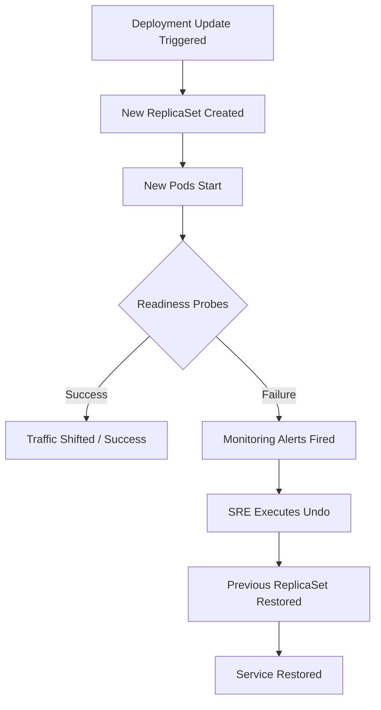

# Production Incident Recovery: Kubernetes Rollbacks

## 1. Topic Overview

In a production Kubernetes environment, a **Rollback** is your emergency brake. Not every deployment succeeds—applications can crash, latency can spike, or readiness probes can fail due to misconfigurations.

While a Rollout focuses on moving forward, a Rollback focuses on **Mean Time To Recovery (MTTR)**. When an incident occurs immediately following a release, the core DevOps/SRE philosophy is: **Rollback first to restore service, investigate the root cause later.** Kubernetes facilitates this by storing a history of previous `ReplicaSets`. Rolling back does not require rebuilding container images or running full CI pipelines; it simply instructs the Deployment Controller to scale the old, known-stable ReplicaSet back up, instantly reverting the cluster to a healthy state.

---

## 2. Architecture / Flow Diagram



---

## 3. Prerequisites

Prepare your environment to simulate an isolated production incident response scenario. Execute sequentially.

```bash
# 1. Verify Minikube is operational
minikube status

# 2. Create an isolated namespace for incident simulation
kubectl create namespace incident-response

# 3. Set the default context to the new namespace
kubectl config set-context --current --namespace=incident-response

# 4. Ensure metrics-server is running for resource monitoring
minikube addons enable metrics-server

```

---

## 4. Hands-On Lab

### Step 1: Establishing the Stable Baseline (Revision 1)

**Short explanation:**
We must first establish a stable production workload. We will deploy the `inventory-api` using a known good image, configure resource limits, and explicitly set `revisionHistoryLimit` so Kubernetes retains our rollback data.

**YAML:** `inventory-api.yaml`

```yaml
apiVersion: apps/v1
kind: Deployment
metadata:
  name: inventory-api
  namespace: incident-response
  labels:
    app: inventory
spec:
  replicas: 3
  revisionHistoryLimit: 5
  selector:
    matchLabels:
      app: inventory
  template:
    metadata:
      labels:
        app: inventory
    spec:
      containers:
      - name: app
        image: nginx:1.24.0-alpine
        ports:
        - containerPort: 80
        readinessProbe:
          httpGet:
            path: /
            port: 80
          initialDelaySeconds: 2
          periodSeconds: 5

```

**Command:**

```bash
# Deploy the stable baseline
kubectl apply -f inventory-api.yaml

# Annotate the deployment to record the change cause for our SRE history
kubectl annotate deployment inventory-api kubernetes.io/change-cause="Initial stable release v1.24"

# Wait for the deployment to become ready
kubectl rollout status deployment/inventory-api

```

**Verification:**

```bash
# Verify the baseline rollout history
kubectl rollout history deployment/inventory-api

```

**Expected Outcome:**
The API is deployed successfully. The rollout history displays `REVISION 1` alongside the human-readable `CHANGE-CAUSE` we annotated, establishing our stable fallback point.

---

### Step 2: A Successful Feature Release (Revision 2)

**Short explanation:**
We will simulate a normal, successful upgrade to version 1.25. Tracking change causes is critical for identifying which revision to roll back to during complex incidents.

**Command:**

```bash
# Update the image
kubectl set image deployment/inventory-api app=nginx:1.25.0-alpine

# Update the annotation to reflect the new release
kubectl annotate deployment inventory-api kubernetes.io/change-cause="Feature release v1.25"

# Monitor the successful rollout
kubectl rollout status deployment/inventory-api

```

**Verification:**

```bash
# View the updated history
kubectl rollout history deployment/inventory-api

```

**Expected Outcome:**
The cluster now runs Revision 2. Revision 1's ReplicaSet is scaled to 0 but preserved in the cluster.

---

### Step 3: Triggering a Sev-1 Production Incident

**Short explanation:**
A developer pushes a critical misconfiguration to the production pipeline. We will intentionally deploy an invalid image tag, causing the new Pods to fail their startup sequence, simulating a production outage during deployment.

**Command:**

```bash
# Push the broken release
kubectl set image deployment/inventory-api app=nginx:fatal-error-tag

# Annotate the bad release
kubectl annotate deployment inventory-api kubernetes.io/change-cause="Critical security patch (Broken)"

# Watch the rollout hang and fail
kubectl rollout status deployment/inventory-api --timeout=15s

```

**Verification:**

```bash
# Triage the incident by inspecting pod states
kubectl get pods -l app=inventory

# Diagnose the specific failure reason
kubectl describe pod -l app=inventory | grep -A 5 "Events:"

```

**Expected Outcome:**
The rollout halts. `kubectl get pods` reveals Pods stuck in `ImagePullBackOff` or `ErrImagePull`. Because we configured readiness probes, Kubernetes refuses to terminate the remaining Revision 2 Pods, but the deployment is now deadlocked and unhealthy.

---

### Step 4: Emergency Rollback Execution

**Short explanation:**
The application is failing. We will not troubleshoot the bad image right now; we must restore service immediately. We will execute the `undo` command to revert to the previous ReplicaSet.

**Command:**

```bash
# Execute the emergency rollback to the previous version
kubectl rollout undo deployment/inventory-api

# Immediately watch the recovery process
kubectl get pods -w

```

**Verification:**

```bash
# Verify the rollout status confirms recovery
kubectl rollout status deployment/inventory-api

# Check the history to see the rollback recorded
kubectl rollout history deployment/inventory-api

```

**Expected Outcome:**
The broken Pods are immediately terminated. The Deployment controller scales the ReplicaSet for Revision 2 back up. The history now shows a new Revision (Revision 4), which is functionally identical to the stable Revision 2. Service is fully restored.

---

### Step 5: Surgical Rollback to a Specific Revision

**Short explanation:**
Sometimes the previous release (Revision 2) contained a latent bug that wasn't discovered until today. You must bypass the immediate previous version and rollback to the original, older baseline (Revision 1).

**Command:**

```bash
# Review history to identify the target revision number
kubectl rollout history deployment/inventory-api

# Execute a targeted rollback to the known-good Revision 1
kubectl rollout undo deployment/inventory-api --to-revision=1

```

**Verification:**

```bash
# Confirm the active image has reverted to 1.24.0
kubectl get deployment inventory-api -o jsonpath='{.spec.template.spec.containers[0].image}{"\n"}'

```

**Expected Outcome:**
The deployment reverts directly to the state recorded in Revision 1 (`nginx:1.24.0-alpine`). A new revision is appended to the history log representing this change.

---

## 5. Core Commands Cheat Sheet

### Incident Triage Commands

| Action | Command | Purpose |
| --- | --- | --- |
| Find Failing Pods | `kubectl get pods --field-selector status.phase=Failed` | Quickly isolate crashed workloads |
| Check Events | `kubectl get events --sort-by=.metadata.creationTimestamp` | Read the cluster's recent operational logs |
| Inspect Status | `kubectl describe deployment <name>` | See ReplicaSet scaling bottlenecks |

### Rollback Execution Commands

| Action | Command | Purpose |
| --- | --- | --- |
| View Timeline | `kubectl rollout history deploy/<name>` | List available recovery points |
| Revert One Step | `kubectl rollout undo deploy/<name>` | Restore the immediate previous version |
| Revert to Target | `kubectl rollout undo deploy/<name> --to-revision=X` | Restore a specific historical baseline |
| Annotate State | `kubectl annotate deploy <name> kubernetes.io/change-cause="Message"` | Document changes for audit logs |

---

## 6. Advanced Operations

* **ConfigMap/Secret Rollbacks:** A critical limitation of Kubernetes Deployments is that they **do not automatically roll back if a referenced ConfigMap or Secret changes**. If you break a ConfigMap, rolling back the Deployment does nothing. *Best Practice:* Append hashes to ConfigMap names (e.g., `app-config-v1`, `app-config-v2`) and update the Deployment YAML to point to the new name. This forces the Deployment to track the config change in its revision history.
* **Pausing for Incident Triage:** If a rollout is behaving erratically but hasn't fully failed, use `kubectl rollout pause deployment/<name>`. This freezes the ReplicaSet scaling, allowing you to `kubectl exec` into the canary pod, test its local endpoints, and extract diagnostic data before either resuming or rolling back.
* **Automated Rollbacks (Progress Deadline):** Set `progressDeadlineSeconds: 600` in the Deployment spec. If the rollout fails to make progress for 10 minutes, K8s marks the Deployment condition as `Progressing=False`. CI/CD systems (like Jenkins or ArgoCD) can query this condition and automatically trigger a rollback script.

---

## 7. Real-Time Industry Usage

* **The "Rollback First" Culture:** In high-performing SRE teams, engineers are actively discouraged from debugging live production outages while the system is degraded. The playbook strictly mandates: Undo the deployment, confirm recovery, and then debug the broken image in a lower environment (`dev` or `staging`).
* **GitOps Reconciliation:** When using GitOps tools like Flux or ArgoCD, running manual `kubectl rollout undo` commands creates configuration drift (the cluster state no longer matches Git). In GitOps environments, you perform a rollback by hitting `git revert` on the repository and letting the orchestrator sync the old YAML back to the cluster.
* **Canary Analysis:** Advanced release strategies use tools like Argo Rollouts. They deploy 5% of the new version, compare Prometheus metrics (error rates, latency) against the old version, and trigger an automated rollback if the new version breaches the Service Level Objective (SLO).

---

## 8. Troubleshooting Scenarios

### Scenario 1: The Blind Deployment (Missing Probes)

* **Symptoms:** You deploy a new version. The rollout succeeds instantly. Two minutes later, alerts fire for 502 Bad Gateway errors. You rollback, and it succeeds instantly, but users still experience downtime.
* **Root Cause:** The Deployment lacks `readinessProbes`. Kubernetes assumes the application is healthy the moment the Linux process starts. It killed the old pods before the new application framework (e.g., Java/Node) finished booting.
* **Debug Commands:**
```bash

```


kubectl describe deploy  | grep Probe

```
* **Resolution:** Add `readinessProbes` to the deployment. Rollouts cannot protect you if they cannot accurately measure application health.
* **Operational Learning:** A rollback is only as effective as your readiness probes. Without them, both rollouts and rollbacks will cause hard downtime.

### Scenario 2: Rollback Fails to Restore Configuration
* **Symptoms:** The app crashes due to a bad database password. You run `kubectl rollout undo`, the pods recreate, but they still crash with the same database error.
* **Root Cause:** The database password was changed in a `Secret`. `rollout undo` only restores the Deployment's `PodTemplateSpec` (the image tag, env variables). It does not revert external objects like `Secrets` or `ConfigMaps`.
* **Debug Commands:**
  ```bash
  kubectl describe pod <failing-pod> | grep -i secret
  kubectl logs <failing-pod>

```

* **Resolution:** You must manually revert the YAML for the `Secret` or `ConfigMap` to its previous state and restart the deployment.
* **Operational Learning:** Treat configurations as immutable. Create `db-secret-v2`, update the deployment to use `v2`, and deploy. If it fails, the rollback will safely revert the deployment to point back to `db-secret-v1`.

### Scenario 3: Missing Revision History

* **Symptoms:** You need to roll back to yesterday's stable release. You run `kubectl rollout history`, but only the current broken revision is listed.
* **Root Cause:** The `revisionHistoryLimit` in the Deployment spec was set to `0`. The Deployment controller aggressively garbage-collected the old ReplicaSets the moment the new one was created.
* **Debug Commands:**
```bash

```


kubectl get deploy  -o yaml | grep revisionHistoryLimit

```
* **Resolution:** You cannot use `rollout undo`. You must manually re-apply the older YAML file from your version control system.
* **Operational Learning:** Always explicitly set `revisionHistoryLimit: 5` (or higher) in production manifests to guarantee emergency recovery options.

---

## 9. Cleanup Activity

Execute these commands to clear the incident simulation data and restore the cluster to a clean state.

```bash
# 1. Delete the Deployment and all retained ReplicaSets
kubectl delete deployment inventory-api

# 2. Delete the incident response namespace
kubectl delete namespace incident-response

# 3. Reset the context to the default namespace
kubectl config set-context --current --namespace=default

```

---

## 10. Key Takeaways

* **Fast Recovery Over Fast Fixes:** During an incident, restoring service via `rollout undo` takes priority over root cause analysis.
* **ReplicaSets are the Backbone:** Rollbacks are mathematically fast because they do not redownload or rebuild anything; they simply scale up an existing, dormant ReplicaSet.
* **Annotation is Crucial:** Using `kubernetes.io/change-cause` prevents SREs from flying blind. Knowing *what* Revision 3 was makes targeting rollbacks vastly safer.
* **Probes Control the Brake:** If readiness probes are misconfigured, Kubernetes won't know the rollout is failing, and you won't know you need to pull the emergency brake.

---

## 11. Lab Challenges

### Beginner Exercises

1. **The Panic Button:** Deploy `httpd:alpine`. Immediately trigger an update to a broken image `httpd:fatal`. Before it finishes timing out, execute a single command to abort the rollout and restore `httpd:alpine`.
2. **History Exploration:** Run `kubectl get rs --show-labels`. Identify which ReplicaSet belongs to your current active revision and which belongs to your rollback history.
3. **Imperative Annotation:** Without editing a YAML file, use the CLI to add the change-cause annotation "Urgent hotfix applied" to an existing deployment.

### Intermediate Exercises

4. **The Ghost Rollback:** Edit a Deployment and change an arbitrary label on the Pod template. Do not change the image. Run `kubectl rollout history`. Did it create a new revision? Explain why.
5. **ConfigMap Immutability:** Create a ConfigMap with `KEY=VALUE1`. Mount it into a Deployment. Update the ConfigMap to `KEY=VALUE2`. Check the Pod logs. Did the Deployment roll out? Modify the setup using the hashed-name technique so the Deployment natively tracks the config change.
6. **Limit Testing:** Deploy an app with `revisionHistoryLimit: 1`. Perform 3 successful image updates. Check the history. Explain the operational risk of this configuration.

### Troubleshooting Exercises

7. **The Dead End:** Delete all ReplicaSets associated with a Deployment manually using `kubectl delete rs --all`. Now attempt to run `kubectl rollout undo`. Document the error message and explain what critical cluster state was destroyed.
8. **Probe Deadlock:** Deploy an application with a `readinessProbe` that expects an HTTP 200 on `/health`. The application image does not have a `/health` endpoint. Execute a rollback to a version that *does* have the endpoint. Validate that traffic routing recovers.

### Production-Style Challenge

9. **The Automated Rollback Hook:** Write a bash script `deploy.sh` that takes an image tag as an argument. The script should apply the image update to a Deployment and then execute `kubectl rollout status` with a timeout of 30 seconds. If the `rollout status` command exits with a non-zero exit code (indicating a failure or timeout), the script must automatically execute `kubectl rollout undo` and alert the terminal that a rollback occurred. Test it against both a valid and an invalid image tag.