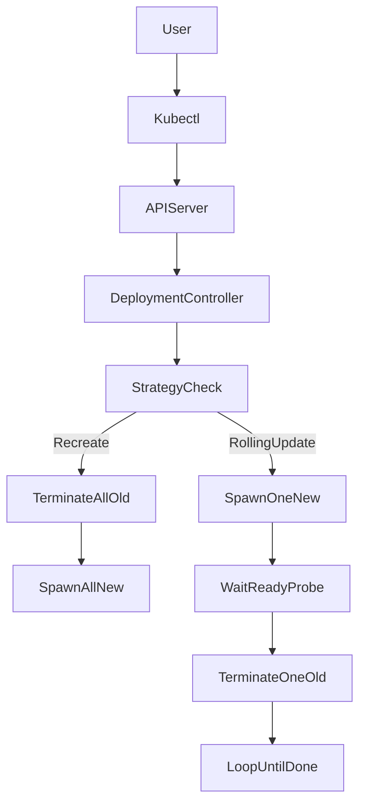

# Kubernetes Update Strategies (Zero-Downtime Deployments)

## 1. Topic Overview

In Kubernetes, Pods are ephemeral and immutable—meaning they cannot be updated in place. When deploying a new version of an application, the Deployment Controller must systematically terminate old Pods and provision new ones.

An **Update Strategy** dictates exactly *how* this replacement occurs. It controls the mathematical pacing of the deployment, defining how much extra compute can be provisioned (`maxSurge`) and how much capacity can temporarily go offline (`maxUnavailable`). In production DevOps and SRE workflows, choosing the right strategy is the difference between a seamless, zero-downtime release and a hard outage. While Kubernetes natively handles `RollingUpdate` and `Recreate` strategies, advanced traffic-routing techniques allow engineers to simulate `Canary` and `Blue-Green` deployments.

---

## 2. Architecture / Flow Diagram



---

## 3. Prerequisites

Ensure your Minikube environment is clean and ready for operational testing. Execute these commands sequentially.

```bash
# 1. Verify Minikube is active
minikube status

# 2. Verify kubectl is communicating with the correct cluster
kubectl cluster-info

# 3. Enable metrics-server for resource observability
minikube addons enable metrics-server

# 4. Create an isolated namespace for deployment strategy testing
kubectl create namespace strategy-lab

# 5. Set the default context to the new namespace
kubectl config set-context --current --namespace=strategy-lab

```

---

## 4. Hands-On Lab

### Step 1: The Recreate Strategy (Planned Downtime)

**Short explanation:**
We deploy an application using the `Recreate` strategy. This forcefully kills all existing Pods before scheduling new ones. In production, this is strictly reserved for legacy applications that cannot run multiple versions concurrently (e.g., rigid database locks).

**YAML:** `api-recreate.yaml`

```yaml
apiVersion: apps/v1
kind: Deployment
metadata:
  name: payment-api
  namespace: strategy-lab
spec:
  replicas: 3
  strategy:
    type: Recreate
  selector:
    matchLabels:
      app: payment-api
  template:
    metadata:
      labels:
        app: payment-api
    spec:
      containers:
      - name: api
        image: nginx:1.24.0-alpine
        ports:
        - containerPort: 80
        resources:
          requests:
            cpu: "50m"
            memory: "64Mi"

```

**Command:**

```bash
# Apply the initial deployment
kubectl apply -f api-recreate.yaml

# Wait for it to become ready
kubectl rollout status deployment/payment-api

# Trigger an update and watch the destructive behavior
kubectl set image deployment/payment-api api=nginx:1.25.0-alpine
kubectl get pods -w

```

**Verification:**

```bash
# Cancel the watch (Ctrl+C). Check the event timeline to prove total downtime occurred.
kubectl get events --sort-by=.metadata.creationTimestamp | tail -n 10

```

**Expected Outcome:**
You will see all 3 old Pods enter `Terminating` simultaneously. The cluster will have 0 running Pods (a complete outage). Only after they are fully deleted will the 3 new Pods enter `Pending` and `Running`.

---

### Step 2: The RollingUpdate Strategy (Zero Downtime)

**Short explanation:**
We modify the Deployment to use the industry-standard `RollingUpdate` strategy. By setting `maxUnavailable: 0` and `maxSurge: 1`, we instruct Kubernetes to never drop below 100% capacity during the update.

**YAML:** `api-rolling.yaml`

```yaml
apiVersion: apps/v1
kind: Deployment
metadata:
  name: payment-api
  namespace: strategy-lab
spec:
  replicas: 3
  strategy:
    type: RollingUpdate
    rollingUpdate:
      maxSurge: 1
      maxUnavailable: 0
  selector:
    matchLabels:
      app: payment-api
  template:
    metadata:
      labels:
        app: payment-api
    spec:
      containers:
      - name: api
        image: nginx:1.26.0-alpine
        ports:
        - containerPort: 80
        resources:
          requests:
            cpu: "50m"
            memory: "64Mi"
        readinessProbe:
          httpGet:
            path: /
            port: 80
          initialDelaySeconds: 3
          periodSeconds: 5

```

**Command:**

```bash
# Apply the rolling update configuration
kubectl apply -f api-rolling.yaml

# Watch the seamless transition
kubectl get pods -w

```

**Verification:**

```bash
# Verify the active deployment strategy via JSONPath
kubectl get deployment payment-api -o jsonpath='{"Strategy: "}{.spec.strategy.type}{"\nMaxSurge: "}{.spec.strategy.rollingUpdate.maxSurge}{"\nMaxUnavailable: "}{.spec.strategy.rollingUpdate.maxUnavailable}{"\n"}'

```

**Expected Outcome:**
The controller provisions 1 new Pod (Surge). It waits for the `readinessProbe` to pass. Once ready, it terminates 1 old Pod, maintaining 3 healthy Pods at all times.

---

### Step 3: Canary Deployment Simulation

**Short explanation:**
A Canary deployment routes a tiny fraction of user traffic to a new version to test stability. Using native Kubernetes, we achieve this by running a stable Deployment (large replica count) and a canary Deployment (small replica count) behind a single Service.

**YAML:** `canary-setup.yaml`

```yaml
apiVersion: v1
kind: Service
metadata:
  name: payment-service
  namespace: strategy-lab
spec:
  selector:
    app: payment-api  # Selects BOTH stable and canary pods
  ports:
  - port: 80
---
apiVersion: apps/v1
kind: Deployment
metadata:
  name: payment-canary
  namespace: strategy-lab
spec:
  replicas: 1
  selector:
    matchLabels:
      app: payment-api
      track: canary
  template:
    metadata:
      labels:
        app: payment-api
        track: canary
    spec:
      containers:
      - name: api
        image: nginx:1.27.0-alpine
        ports:
        - containerPort: 80

```

**Command:**

```bash
# Deploy the Service and the Canary deployment
kubectl apply -f canary-setup.yaml

```

**Verification:**

```bash
# Inspect the Service endpoints. Notice it routes to 4 total IPs (3 stable + 1 canary)
kubectl describe service payment-service | grep Endpoints

# Use label selectors to distinguish the tracks
kubectl get pods --show-labels

```

**Expected Outcome:**
Because both Deployments share the `app: payment-api` label, the `payment-service` balances traffic across all 4 Pods. Statistically, ~25% of traffic hits the `nginx:1.27` canary, allowing SREs to monitor logs for errors before upgrading the stable Deployment.

---

### Step 4: Blue-Green Deployment Simulation

**Short explanation:**
Blue-Green eliminates all update pacing risks by spinning up an entire duplicate environment (Green) and instantly flipping a Service router to it. If Green fails, you instantly flip the router back to Blue.

**Command:**

```bash
# 1. Label the existing 'payment-api' deployment as our Blue environment
kubectl patch deployment payment-api -p '{"spec": {"template": {"metadata": {"labels": {"version": "blue"}}}}}'

# 2. Update the Service to route ONLY to Blue
kubectl patch service payment-service -p '{"spec": {"selector": {"version": "blue"}}}'

# 3. Create a cloned Green deployment (simulated via imperative command for speed)
kubectl create deployment payment-green --image=nginx:1.28.0-alpine
kubectl patch deployment payment-green -p '{"spec": {"template": {"metadata": {"labels": {"app": "payment-api", "version": "green"}}}}}'

# 4. Wait for Green to be fully ready (background testing phase)
kubectl rollout status deployment/payment-green

```

**Verification & Traffic Switch:**

```bash
# Verify the service is currently pointing to Blue IPs
kubectl get endpoints payment-service

# INSTANT TRAFFIC CUTOVER: Patch the service to point to Green
kubectl patch service payment-service -p '{"spec": {"selector": {"version": "green"}}}'

# Verify the IPs have changed instantly
kubectl get endpoints payment-service

```

**Expected Outcome:**
Traffic is instantly redirected to the new `payment-green` Pods. The `payment-api` (Blue) Pods remain running but receive zero traffic, standing by as an instant rollback target.

---

### Step 5: Update Failure and Operational Rollback

**Short explanation:**
A bad configuration can freeze a `RollingUpdate`. We will simulate a readiness probe failure. The controller will halt the rollout, preventing a full outage. We will then execute an SRE rollback.

**Command:**

```bash
# Update the Green deployment with a fatally flawed readiness probe
kubectl patch deployment payment-green -p '{"spec": {"template": {"spec": {"containers": [{"name": "nginx", "readinessProbe": {"httpGet": {"path": "/fatal-error", "port": 80}}}]}}}}'

# Trigger an image update to force the rollout of the bad probe
kubectl set image deployment/payment-green nginx=nginx:1.29.0-alpine

# Watch the rollout hang indefinitely
kubectl rollout status deployment/payment-green --timeout=20s

```

**Verification:**

```bash
# Investigate the failure
kubectl describe pod -l version=green | grep -i probe

# Execute the rollback
kubectl rollout undo deployment/payment-green

# Confirm recovery
kubectl rollout status deployment/payment-green

```

**Expected Outcome:**
The new Pod fails its probe and never becomes `Ready`. Because we use `RollingUpdate`, Kubernetes refuses to kill the old Green Pods. The `undo` command safely abandons the broken ReplicaSet and restores stability.

---

## 5. Core Commands Cheat Sheet

### Deployment & Strategy Commands

| Action | Command | Purpose |
| --- | --- | --- |
| Apply Strategy | `kubectl apply -f file.yaml` | Declaratively update the pacing strategy |
| Pause Rollout | `kubectl rollout pause deploy <name>` | Halt update (useful for manual canary testing) |
| Resume Rollout | `kubectl rollout resume deploy <name>` | Continue paused update |
| Rollback | `kubectl rollout undo deploy <name>` | Revert to previous stable configuration |

### Routing & Debugging Commands

| Action | Command | Purpose |
| --- | --- | --- |
| Patch Service | `kubectl patch svc <name> -p '...'` | Instantly switch Blue-Green traffic |
| Verify Endpoints | `kubectl get ep <svc-name>` | See exactly which Pod IPs receive traffic |
| Extract JSONPath | `kubectl get deploy <name> -o=jsonpath='{.spec.strategy}'` | Programmatically check update settings |
| Sort Events | `kubectl get events --sort-by=.metadata.creationTimestamp` | Trace controller update logic |

---

## 6. Advanced Operations

* **Progressive Delivery (Argo Rollouts):** Natively, Kubernetes does not monitor CPU or HTTP 500 errors during a `RollingUpdate`. SREs use tools like Argo Rollouts or Flagger to create true "Progressive Delivery," where the system automatically pauses the rollout, queries Prometheus metrics, and automatically rolls back if the canary degrades.
* **Tuning `maxUnavailable` for Scale:** For a massive deployment (e.g., 100 replicas), `maxUnavailable: 1` is too slow. SREs use percentages: `maxUnavailable: 10%`. This allows the controller to replace 10 Pods at a time, drastically speeding up the release while maintaining 90% capacity.
* **Termination Grace Periods:** During a `RollingUpdate`, old Pods receive a `SIGTERM`. If an application takes 45 seconds to finish processing in-flight database transactions, you must set `terminationGracePeriodSeconds: 60` in the Pod spec to prevent K8s from forcefully killing it (`SIGKILL`) mid-transaction.

---

## 7. Real-Time Industry Usage

* **E-Commerce Black Friday (Canary):** Deploying a new checkout service feature during high traffic. The feature is rolled out to 1% of users via Istio or Ingress controllers (advanced Canary routing). The SRE team monitors the conversion rate. If sales drop, the Canary is killed instantly.
* **Stateful Database Migrations (Recreate):** A monolithic application requires a breaking database schema change. SREs switch the Deployment strategy to `Recreate`, ensuring all web instances are fully disconnected from the database before the schema migration script runs, preventing data corruption.
* **Zero-Downtime APIs (RollingUpdate):** Standard microservices use `RollingUpdate` with `maxSurge: 25%` and `maxUnavailable: 0`. This is the default CI/CD pipeline strategy in platforms like GitLab CI or GitHub Actions, ensuring APIs never drop incoming REST calls during hourly releases.

---

## 8. Troubleshooting Scenarios

### Scenario 1: The RollingUpdate Capacity Drop

* **Symptoms:** During an update, the application triggers PagerDuty alerts for high latency and CPU throttling.
* **Root Cause:** The strategy was misconfigured as `maxUnavailable: 50%` with `maxSurge: 0`. The cluster immediately killed half the healthy Pods before spinning up new ones, sending 100% of the traffic to the surviving 50%, causing them to CPU-throttle.
* **Debug Commands:**
```bash
kubectl get deploy <name> -o yaml | grep -A 3 strategy
kubectl top pods

```


```
* **Resolution:** Update the YAML to `maxUnavailable: 0` and `maxSurge: 25%`. 
* **Operational Learning:** Always over-provision compute during an update (`maxSurge`) rather than under-provisioning (`maxUnavailable`) when dealing with CPU-bound workloads.

### Scenario 2: The Infinite Rollout (Bad Image)
* **Symptoms:** You deploy a new version. `kubectl rollout status` hangs forever. The old version is still serving traffic.
* **Root Cause:** A developer specified `image: myapp:latest`, but the registry credentials changed, or the tag doesn't exist. The new Pod is stuck in `ImagePullBackOff`.
* **Debug Commands:**
  ```bash
  kubectl get pods
  kubectl describe pod <pending-pod> | grep -i events -A 5

```

* **Resolution:**
```bash

```


kubectl rollout undo deployment/

```
* **Operational Learning:** This scenario proves the value of `RollingUpdate`. Because the new Pod never became `Ready`, Kubernetes refused to scale down the old ReplicaSet. The bad deployment was caught safely with zero user impact. Never use the `:latest` tag; it prevents deterministic rollbacks.

### Scenario 3: Blue-Green Stateful Split-Brain
* **Symptoms:** After flipping the Service to the Green environment, users report seeing their old profile data, but their new orders are missing. 
* **Root Cause:** The application uses an in-memory local cache instead of a centralized Redis cluster. The Blue and Green environments have different, unsynchronized local states.
* **Debug Commands:**
  ```bash
kubectl exec -it <green-pod> -- env | grep REDIS

```

* **Resolution:** Flip the Service selector immediately back to Blue. Redesign the application to be completely stateless before attempting Blue-Green deployments again.
* **Operational Learning:** Blue-Green deployments require 100% stateless workloads. If local state exists, instantaneous traffic flipping will result in fragmented user experiences.

---

## 9. Cleanup Activity

Execute these commands to remove all simulated strategies and reclaim cluster resources safely.

```bash
# 1. Delete deployments and service
kubectl delete deployment payment-api payment-green payment-canary
kubectl delete service payment-service

# 2. Delete the dedicated namespace
kubectl delete namespace strategy-lab

# 3. Reset your context to the default namespace
kubectl config set-context --current --namespace=default

```

---

## 10. Key Takeaways

* **Replace, Don't Patch:** Kubernetes enforces immutability. You do not patch live code in a container; you replace the entire Pod through a controller-managed strategy.
* **RollingUpdate vs Recreate:** Use `RollingUpdate` for zero-downtime, stateless microservices. Reserve `Recreate` exclusively for legacy systems that cannot tolerate concurrent version execution.
* **Probes Are Mandatory:** A `RollingUpdate` is functionally blind without a `readinessProbe`. Without it, K8s will route traffic to a container the millisecond the process starts, causing dropped connections.
* **Service-Based Routing:** Native Kubernetes doesn't have "Blue-Green" or "Canary" objects. These are *techniques* achieved by manipulating Service `selectors` across multiple Deployments.

---

## 11. Lab Challenges

### Beginner Exercises

1. **Imperative Update:** Deploy `nginx:1.24` imperatively. Find the exact command to update the image to `nginx:1.25` and simultaneously record the command in the rollout history's `CHANGE-CAUSE`.
2. **Strategy Inspection:** Run `kubectl get deploy coredns -n kube-system -o yaml`. What update strategy does the core Kubernetes DNS service use by default? What are its Surge and Unavailable parameters?
3. **Rollout Tracking:** Trigger an update to a Deployment. While it is updating, use a single command to stream the logs of all containers inside that specific Deployment.

### Intermediate Exercises

4. **The Slow Roll:** Write a Deployment YAML with 10 replicas. Configure the `RollingUpdate` strategy so that it replaces exactly one Pod at a time. Apply it, trigger an update, and time how long the complete rollout takes.
5. **Canary Weighting:** Expand the Canary Lab (Step 3). Scale the stable Deployment to 9 replicas and the Canary to 1. Deploy a temporary Pod running `curl`. Write a bash `while` loop that curls the Service 100 times and counts how many times the response came from the Canary version.
6. **Blue-Green Scripting:** Write a bash script that takes two arguments: `DEPLOYMENT_NAME` and `SERVICE_NAME`. The script should parse the Service's current selector, determine if it points to Blue or Green, and execute the `kubectl patch` command to swap it to the other color automatically.

### Troubleshooting Exercises

7. **The Surge Limit:** Create a Minikube cluster with very low CPU capacity (e.g., `--cpus=2`). Deploy an app requesting `1000m` CPU per Pod with 2 replicas. Set `maxSurge: 2`. Trigger an update. Diagnose why the update becomes permanently deadlocked due to resource starvation.
8. **Broken Downward Cutover:** Configure a `RollingUpdate` with `maxUnavailable: 100%` and `maxSurge: 0`. Deploy it. Trigger an update. Observe and document the exact sequence of Pod phases. How does this differ operationally from the `Recreate` strategy?

### Production-Style Challenge

9. **The Automated Rollback Circuit Breaker:** In a real CI/CD pipeline, you don't stare at `kubectl rollout status`. Write a deployment pipeline script (`deploy.sh`) that takes an image tag. The script must:
1. Apply the new image.
2. Wait up to 45 seconds for the rollout to complete.
3. If the rollout command exits with a failure code (or times out), the script must automatically execute `kubectl rollout undo`, print a severe alert to the terminal, and exit with code 1 to fail the CI/CD pipeline. Test it using both a valid and a broken image.