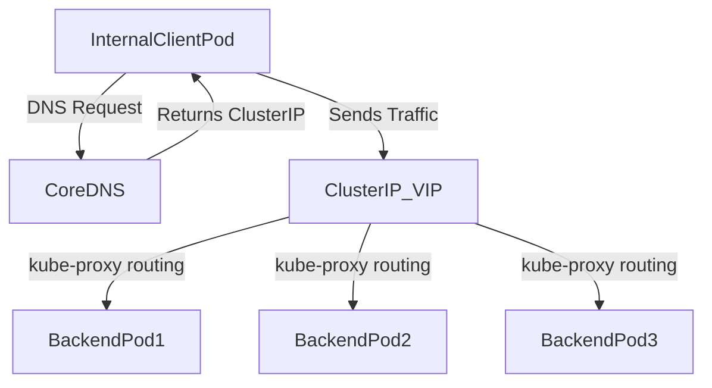

# ClusterIP Service Fundamentals

## 1. Topic Overview

A **ClusterIP Service** is the default and most fundamental networking object in Kubernetes. It provides a stable, internal virtual IP (VIP) address and DNS name that routes traffic to a dynamic set of backend Pods.

Because Pods are ephemeral—they are constantly created, destroyed, and rescheduled with new IP addresses—applications cannot rely on direct Pod-to-Pod communication. The ClusterIP Service solves this by acting as an internal load balancer. In production environments, SREs and DevOps teams use ClusterIPs to facilitate secure, intra-cluster microservice communication, such as a frontend application querying a backend API, or an API writing to a database.

---

## 2. Architecture / Flow Diagram



---

## 3. Prerequisites

Ensure your cluster is running and prepare an isolated namespace for this lab. Execute these commands sequentially.

```bash
# 1. Verify Minikube and cluster health
minikube status
kubectl cluster-info

# 2. Enable metrics-server (standard in production)
minikube addons enable metrics-server

# 3. Create a dedicated namespace for networking labs
kubectl create namespace service-lab

# 4. Set the default context to the new namespace
kubectl config set-context --current --namespace=service-lab

```

---

## 4. Hands-On Lab

### Step 1: Deploying the Backend Microservice

**Short explanation:**
We must first deploy a set of backend Pods that the Service will route traffic to. We will deploy an `inventory-api` using an Nginx image, incorporating production best practices like labels and readiness probes.

**Command:**

```bash
kubectl apply -f inventory-api-deployment.yaml

```

**YAML:** `inventory-api-deployment.yaml`

```yaml
apiVersion: apps/v1
kind: Deployment
metadata:
  name: inventory-api
  namespace: service-lab
  labels:
    app: inventory-api
spec:
  replicas: 3
  selector:
    matchLabels:
      app: inventory-api
  template:
    metadata:
      labels:
        app: inventory-api
    spec:
      containers:
      - name: api
        image: nginx:1.24.0-alpine
        ports:
        - containerPort: 80
        readinessProbe:
          httpGet:
            path: /
            port: 80
          initialDelaySeconds: 2
          periodSeconds: 5

```

**Verification:**

```bash
# Block terminal until the deployment is fully rolled out
kubectl rollout status deployment/inventory-api

# Verify the Pods and their ephemeral IP addresses
kubectl get pods -o wide --show-labels

```

**Expected Outcome:**
The Deployment controller creates a ReplicaSet which provisions 3 Pods. Each Pod receives a unique, ephemeral IP address. They all share the label `app=inventory-api`, which is critical for the next step.

---

### Step 2: Creating the ClusterIP Service

**Short explanation:**
We will create a ClusterIP Service that binds to the backend Pods using a label selector. This creates the stable internal Virtual IP that other microservices will use to communicate with the `inventory-api`.

**Command:**

```bash
kubectl apply -f inventory-api-svc.yaml

```

**YAML:** `inventory-api-svc.yaml`

```yaml
apiVersion: v1
kind: Service
metadata:
  name: inventory-api-svc
  namespace: service-lab
  labels:
    app: inventory-api
spec:
  type: ClusterIP
  selector:
    app: inventory-api
  ports:
  - protocol: TCP
    port: 80
    targetPort: 80

```

**Verification:**

```bash
# Verify the Service creation and retrieve the stable ClusterIP
kubectl get svc inventory-api-svc

# Extract just the ClusterIP using JSONPath for automation scripts
kubectl get svc inventory-api-svc -o jsonpath='{.spec.clusterIP}{"\n"}'

```

**Expected Outcome:**
Kubernetes assigns a stable internal IP address (e.g., `10.96.x.x`) to the Service. The `PORT(S)` column will show `80/TCP`. This IP will never change as long as the Service exists.

---

### Step 3: Inspecting Service Endpoints

**Short explanation:**
A Service itself does not route traffic; it creates an `Endpoints` object that maintains an up-to-date list of healthy Pod IPs matching the label selector. We must verify this dynamic mapping.

**Command:**

```bash
# Retrieve the Endpoints object automatically generated by the Service
kubectl get endpoints inventory-api-svc

```

**YAML:**

```yaml
# No YAML creation required for this step. Endpoints are auto-generated.

```

**Verification:**

```bash
# Describe the service to see the Endpoints mapping clearly
kubectl describe svc inventory-api-svc

# Compare the Endpoint IPs with the actual Pod IPs
kubectl get pods -l app=inventory-api -o wide

```

**Expected Outcome:**
The IPs listed under the `Endpoints` field of the Service will perfectly match the ephemeral IPs of the 3 `inventory-api` Pods. If a Pod fails its readiness probe, its IP is immediately removed from this list.

---

### Step 4: Testing Internal DNS and Connectivity

**Short explanation:**
ClusterIPs are only accessible from *inside* the cluster. We will simulate a frontend microservice (e.g., `payment-service`) by launching a temporary debug Pod to test DNS resolution and HTTP connectivity to the backend.

**Command:**

```bash
# Launch an ephemeral debug Pod and open an interactive shell
kubectl run payment-service-test --image=busybox:1.36 -it --rm --restart=Never -- sh

```

**YAML:**

```yaml
# Executed imperatively for rapid debugging

```

**Verification:**

```bash
# 1. INSIDE THE POD: Test Kubernetes internal DNS resolution
nslookup inventory-api-svc

# 2. INSIDE THE POD: Test HTTP connectivity using the Service DNS name
wget -qO- http://inventory-api-svc:80

# 3. Exit the temporary pod
exit

```

**Expected Outcome:**
The `nslookup` command resolves `inventory-api-svc` to the Service's ClusterIP via CoreDNS. The `wget` command successfully returns the Nginx HTML payload. The Service load-balances the request to one of the 3 backend Pods.

---

### Step 5: Failure Simulation and Endpoint Observation

**Short explanation:**
We will simulate a node or process failure by forcefully deleting a Pod. We will observe the ReplicaSet instantly self-healing the Pod, and the Service instantly updating its Endpoints to maintain traffic routing.

**Command:**

```bash
# Open a second terminal window if possible, or run this in the background to watch endpoints
watch kubectl get endpoints inventory-api-svc

# In your main terminal, delete one of the backend Pods
kubectl delete pod -l app=inventory-api | head -n 1 | xargs kubectl delete pod

```

**YAML:**

```yaml
# Operational simulation; no YAML required.

```

**Verification:**

```bash
# Check the event logs to trace the operational timeline
kubectl get events --sort-by=.metadata.creationTimestamp | tail -n 10

# Verify the new Pod is running and endpoints are updated
kubectl get pods -l app=inventory-api -o wide
kubectl get endpoints inventory-api-svc

```

**Expected Outcome:**
When the Pod is deleted, its IP is instantly removed from the Endpoints list (zero downtime). The ReplicaSet spawns a new Pod with a *new* IP. Once the new Pod passes its readiness probe, the Service automatically adds the *new* IP to the Endpoints list.

---

## 5. Core Commands Cheat Sheet

### Cluster & Namespace Commands

| Action | Command | Purpose |
| --- | --- | --- |
| Create Namespace | `kubectl create ns <name>` | Isolate network environments |
| Set Context | `kubectl config set-context --current --namespace=<name>` | Set default namespace |
| View Events | `kubectl get events --sort-by=.metadata.creationTimestamp` | Trace operational timelines |

### Service & Endpoint Commands

| Action | Command | Purpose |
| --- | --- | --- |
| List Services | `kubectl get svc` | View ClusterIPs and Ports |
| Describe Service | `kubectl describe svc <name>` | Inspect Selectors and Endpoints |
| View Endpoints | `kubectl get endpoints <name>` | See active backend Pod IPs |
| Extract ClusterIP | `kubectl get svc <name> -o jsonpath='{.spec.clusterIP}'` | Programmatic extraction |

### Debugging & Routing Commands

| Action | Command | Purpose |
| --- | --- | --- |
| Port Forward | `kubectl port-forward svc/<name> 8080:80` | Route local traffic to internal service |
| Label Match | `kubectl get pods -l app=<label>` | Verify selector logic |
| Debug Shell | `kubectl run debug --rm -it --image=busybox -- sh` | Test internal cluster DNS/routing |

---

## 6. Advanced Operations

* **Port Forwarding for Local Debugging:** Often, engineers need to access an internal ClusterIP from their local laptop without exposing it to the internet. Use `kubectl port-forward svc/inventory-api-svc 8080:80`. You can now navigate to `localhost:8080` in your browser, and kubectl tunnels the traffic directly to the internal Service.
* **kube-proxy and iptables:** A ClusterIP is not a real network interface; it is a virtual IP managed by `kube-proxy` running on every worker node. `kube-proxy` writes `iptables` (or IPVS) rules that intercept traffic destined for the ClusterIP and rewrite the destination to one of the backend Pod IPs.
* **Headless Services:** If you set `clusterIP: None` in the Service YAML, it becomes a "Headless Service". It no longer load balances via a single IP. Instead, a DNS lookup for the Service name returns the raw IP addresses of *all* backing Pods directly, which is required for StatefulSets (like databases) that handle their own replication.

---

## 7. Real-Time Industry Usage

* **Microservice Decoupling:** In an E-commerce platform, the `frontend-ui` deployment talks to the `checkout-api` via a ClusterIP. When the `checkout-api` team scales their deployment from 5 to 50 Pods for Black Friday, the `frontend-ui` code requires zero changes because the ClusterIP remains identical.
* **Internal Caching Layers:** Deploying Redis or Memcached inside the cluster. A ClusterIP is placed in front of the cache Pods so application backends have a stable, internal DNS name (`redis-master-svc.internal.svc.cluster.local`) to write and read cache data.
* **Service Discovery:** Native Kubernetes relies entirely on ClusterIP and CoreDNS for service discovery. Modern service meshes (like Istio or Linkerd) build their advanced routing capabilities on top of these fundamental ClusterIP structures.

---

## 8. Troubleshooting Scenarios

### Scenario 1: The "Connection Refused" TargetPort Error

* **Symptoms:** The Service exists, Endpoints look correct, but running `curl` inside the cluster results in `Connection refused`.
* **Root Cause:** The `targetPort` in the Service YAML does not match the actual port the container application is listening on. For example, the Service sends traffic to port `80`, but the Node.js app inside the Pod is listening on port `3000`.
* **Debug Commands:**
```bash
kubectl describe svc inventory-api-svc
kubectl logs -l app=inventory-api

```


```
* **Resolution:** Edit the Service YAML so that `targetPort` aligns with the application's actual listening port (e.g., `targetPort: 3000`), and reapply.
* **Operational Learning:** `port` is what the Service listens on internally. `targetPort` is where the Service sends the traffic on the Pod. They do not have to be identical, but `targetPort` MUST be correct.

### Scenario 2: The Empty Endpoints Dilemma
* **Symptoms:** DNS resolves the Service name to an IP, but requests timeout. `kubectl get endpoints <svc-name>` shows `<none>` or empty IPs.
* **Root Cause:** The Service's `selector` labels do not exactly match the Pod's `labels`. Kubernetes cannot find any backend Pods to attach to the Service.
* **Debug Commands:**
  ```bash
  kubectl get svc inventory-api-svc -o yaml | grep -A 2 selector
  kubectl get pods --show-labels

```

* **Resolution:** Correct the typo in either the Deployment's `template.metadata.labels` or the Service's `selector` block so they match perfectly, and reapply.
* **Operational Learning:** Services do not target Deployments; they target Pods directly via labels. Label hygiene is critical for Kubernetes networking.

### Scenario 3: Internal DNS Resolution Failure

* **Symptoms:** `curl http://inventory-api-svc` returns `Could not resolve host`, but `curl http://<ClusterIP>` works perfectly.
* **Root Cause:** The CoreDNS Pods in the `kube-system` namespace are crashing, or the cluster network plugin (CNI) is failing, preventing DNS queries from resolving to the VIP.
* **Debug Commands:**
```bash
kubectl get pods -n kube-system -l k8s-app=kube-dns
kubectl logs -n kube-system -l k8s-app=kube-dns

```


```
* **Resolution:** Restart the CoreDNS deployment to flush stale configurations or restore crashed pods: `kubectl rollout restart deployment coredns -n kube-system`.
* **Operational Learning:** Kubernetes internal networking relies heavily on CoreDNS. If you can reach an IP but not a name, DNS is the culprit.

---

## 9. Cleanup Activity

Execute these commands to remove all simulated resources and reclaim cluster capacity safely.

```bash
# 1. Delete the Service
kubectl delete svc inventory-api-svc

# 2. Delete the Deployment
kubectl delete deployment inventory-api

# 3. Delete the networking namespace
kubectl delete namespace service-lab

# 4. Switch context back to default
kubectl config set-context --current --namespace=default

```

---

## 10. Key Takeaways

* **Stable Identity for Dynamic Workloads:** Pod IPs change constantly. ClusterIP Services provide the permanent virtual IP and DNS name that microservices need to communicate reliably.
* **Label Selectors are the Glue:** The mathematical intersection of a Service's `selector` and a Pod's `labels` is the only mechanism that routes traffic.
* **Internal Only:** ClusterIP is strictly for intra-cluster traffic. It cannot be accessed from the public internet.
* **Automatic Load Balancing:** The Service seamlessly distributes TCP/UDP traffic across all healthy Pods present in its `Endpoints` object.

---

## 11. Lab Challenges

### Beginner Exercises

1. **Change the Exposure Port:** Modify the `inventory-api-svc` YAML so that other Pods must use port `8080` to access the service, while still sending traffic to the container's port `80`. Apply and test.
2. **Imperative Creation:** Delete your service. Recreate it imperatively using a single CLI command without a YAML file (Hint: `kubectl expose ...`).
3. **Namespace Boundaries:** Create a second namespace `payment-lab`. Run a debug pod in `payment-lab` and attempt to `curl` the `inventory-api-svc` in `service-lab`. Research Kubernetes FQDNs (Fully Qualified Domain Names) to make the `curl` command succeed.

### Intermediate Exercises

4. **Traffic Isolation:** Deploy a second Deployment named `inventory-api-v2` with the label `version: v2` alongside the existing `version: v1` label. Update the Service selector to route traffic *only* to `v2` Pods.
5. **JSONPath Extraction:** Write a single terminal command using JSONPath that lists the names of all backend Pods actively serving traffic for `inventory-api-svc` by reading the Endpoints object.
6. **Multi-Port Services:** Update the backend deployment to an image that exposes both an HTTP port (80) and an HTTPS/Admin port (443 or 8080). Update the Service YAML to successfully route both ports simultaneously.

### Troubleshooting Exercises

7. **The Dead Selector:** Manually edit the labels on one of the 3 running `inventory-api` Pods using `kubectl label pod <name> app=rogue --overwrite`. Check the Endpoints object. What happened? Did the Deployment controller react?
8. **The Probe Blockade:** Deploy an Nginx deployment but intentionally break its `readinessProbe` (e.g., set the path to `/does-not-exist`). Check the Service Endpoints. Explain why the Endpoints list is empty even though the Pods are `Running`.

### Production Challenge

9. **The Three-Tier Internal Architecture:**
* Create a `redis-backend` Deployment (using `redis:alpine`) and a ClusterIP Service exposing port 6379.
* Create a `python-api` Deployment that connects to the Redis Service DNS name.
* Prove connectivity by using `kubectl exec` into the Python API Pod, installing the `redis-cli`, and successfully pinging the Redis ClusterIP Service.