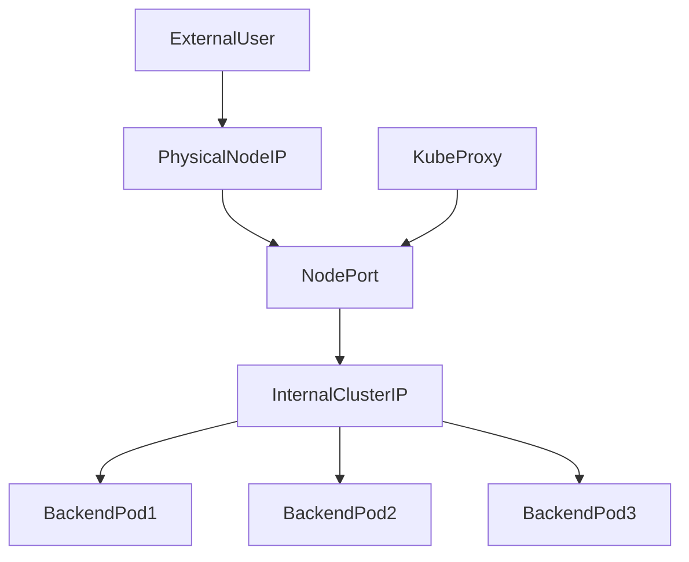

# NodePort Service Fundamentals

## 1. Topic Overview

A **NodePort Service** is a Kubernetes networking primitive that exposes an application to external traffic by opening a specific, static port (in the default range of 30000-32767) on **every worker node** in the cluster.

When external traffic hits `<NodeIP>:<NodePort>`, `kube-proxy` intercepts the request and routes it to the underlying ClusterIP, which then load-balances the traffic to the healthy backend Pods.

In production environments, direct NodePort access is considered a security risk. Instead, NodePorts serve as the fundamental building blocks for external load balancing. Cloud providers (deploying in regions like `us-central1`) point their external LoadBalancers directly at these NodePorts. Understanding NodePort is critical for SREs because it forms the bridge between the node's physical Linux network interfaces and the cluster's software-defined networking.

---

## 2. Architecture / Flow Diagram



---

## 3. Prerequisites

Before starting this hands-on lab, ensure your Minikube environment is completely clean and ready for operational networking tasks. Execute these commands sequentially.

```bash
# 1. Verify Minikube is active
minikube status

# 2. Verify kubectl is communicating with the correct cluster
kubectl cluster-info

# 3. Create an isolated namespace for NodePort testing
kubectl create namespace nodeport-lab

# 4. Set the default context to the new namespace
kubectl config set-context --current --namespace=nodeport-lab

```

---

## 4. Hands-On Lab

### Step 1: Deploying the Frontend Web Application

**Short explanation:**
We are creating the backend Pods that will be exposed externally. We deploy a highly available Nginx frontend. This YAML includes production-grade configurations: resource limits, readiness probes, and precise label selectors to ensure the Service routes traffic only to healthy instances.

**YAML:** `frontend-deployment.yaml`

```yaml
apiVersion: apps/v1
kind: Deployment
metadata:
  name: frontend-webapp
  namespace: nodeport-lab
  labels:
    app: frontend-webapp
spec:
  replicas: 3
  selector:
    matchLabels:
      app: frontend-webapp
  template:
    metadata:
      labels:
        app: frontend-webapp
    spec:
      containers:
      - name: nginx
        image: nginx:1.24.0-alpine
        ports:
        - containerPort: 80
        resources:
          requests:
            cpu: "50m"
            memory: "64Mi"
          limits:
            cpu: "100m"
            memory: "128Mi"
        readinessProbe:
          httpGet:
            path: /
            port: 80
          initialDelaySeconds: 2
          periodSeconds: 5

```

**Command:**

```bash
# Apply the deployment
kubectl apply -f frontend-deployment.yaml

```

**Verification:**

```bash
# Block terminal until the deployment is fully rolled out and ready
kubectl rollout status deployment/frontend-webapp

# Verify the Pods and inspect their auto-generated labels
kubectl get pods --show-labels

```

**Expected Outcome:**
The Deployment controller provisions 3 Pods. Once the `readinessProbe` succeeds, they enter the `Running` state. The label `app=frontend-webapp` is successfully applied to all Pods.

---

### Step 2: Creating the NodePort Service

**Short explanation:**
We create the NodePort Service to expose the frontend. We explicitly define `nodePort: 30080`. If omitted, Kubernetes would randomly assign a port between 30000-32767. Explicit definition is standard practice for predictable infrastructure.

**YAML:** `frontend-nodeport-svc.yaml`

```yaml
apiVersion: v1
kind: Service
metadata:
  name: frontend-nodeport
  namespace: nodeport-lab
  labels:
    app: frontend-webapp
spec:
  type: NodePort
  selector:
    app: frontend-webapp
  ports:
  - protocol: TCP
    port: 80
    targetPort: 80
    nodePort: 30080

```

**Command:**

```bash
# Apply the NodePort Service
kubectl apply -f frontend-nodeport-svc.yaml

```

**Verification:**

```bash
# Verify the Service was created with the correct Type and Ports
kubectl get svc frontend-nodeport

# Inspect the deep configuration and auto-generated Endpoints
kubectl describe svc frontend-nodeport

```

**Expected Outcome:**
Kubernetes creates the Service. The `PORT(S)` column outputs `80:30080/TCP`. The `Endpoints` field in the describe output lists the internal IPs of your 3 healthy frontend Pods.

---

### Step 3: Verifying Node-Level Network Binding

**Short explanation:**
A NodePort physically binds to the network interface of the worker node. We will ssh into the Minikube Linux node and use Linux system internals to verify that the port is actively listening.

**Command:**

```bash
# SSH into the Minikube node
minikube ssh

# INSIDE THE NODE: Check listening network sockets for our NodePort
ss -tuln | grep 30080

# INSIDE THE NODE: Exit back to your local machine
exit

```

**Verification:**

```bash
# Retrieve the exact IP address of the Minikube node
minikube ip

```

**Expected Outcome:**
The `ss` command reveals that the Linux kernel is actively listening on `0.0.0.0:30080`, proving that `kube-proxy` successfully configured the node's networking stack to accept external traffic on that port.

---

### Step 4: External Access and Load Distribution

**Short explanation:**
We will simulate external users accessing the application. By querying the node's IP and the NodePort, we bypass the internal cluster network. We will execute multiple requests to observe the Service load-balancing traffic across the backend ReplicaSet.

**Command:**

```bash
# Save the Minikube IP to an environment variable
NODE_IP=$(minikube ip)

# Execute 5 sequential curl requests to the external NodePort
for i in {1..5}; do curl -s -I http://$NODE_IP:30080 | grep HTTP; done

```

**Verification:**

```bash
# Check the logs of the frontend pods to see the incoming requests being distributed
kubectl logs -l app=frontend-webapp --tail=2

```

**Expected Outcome:**
The terminal returns five `HTTP/1.1 200 OK` responses. Checking the logs reveals that the incoming HTTP requests were load-balanced across the different Nginx Pods by `kube-proxy`.

---

### Step 5: Failure Simulation and Self-Healing

**Short explanation:**
Nodes fail and Pods crash. We will forcefully delete a Pod to observe how the Service dynamically updates its traffic routing to prevent external users from experiencing downtime.

**Command:**

```bash
# Open a watch on the endpoints in a background process (or split terminal)
watch kubectl get endpoints frontend-nodeport

# Delete one of the active frontend Pods
kubectl delete pod -l app=frontend-webapp | head -n 1 | xargs kubectl delete pod

```

**Verification:**

```bash
# Check the event timeline to see the controller's exact response sequence
kubectl get events --sort-by=.metadata.creationTimestamp | tail -n 8

```

**Expected Outcome:**
The instant the Pod is deleted, its IP is removed from the `Endpoints` list. External traffic hitting `30080` is safely routed to the remaining 2 Pods. The ReplicaSet immediately spins up a new Pod, which is added back to the Endpoints list once its readiness probe passes.

---

### Step 6: Advanced JSONPath Operational Queries

**Short explanation:**
In automated deployment scripts, SREs cannot rely on visually parsing `kubectl get svc` outputs. We must programmatically extract the dynamically or statically assigned NodePort.

**Command:**

```bash
# Extract the exact NodePort value using JSONPath
kubectl get svc frontend-nodeport -o jsonpath='{.spec.ports[0].nodePort}{"\n"}'

# Extract all active Endpoint IPs currently serving traffic
kubectl get endpoints frontend-nodeport -o jsonpath='{.subsets[0].addresses[*].ip}{"\n"}'

```

**Verification:**

```bash
# Scale the deployment to see the endpoints dynamically expand
kubectl scale deployment frontend-webapp --replicas=5

```

**Expected Outcome:**
The JSONPath query accurately returns `30080` and the list of active Pod IPs. As you scale the deployment, rerunning the endpoint extraction command will instantly show the newly added IP addresses.

---

## 5. Core Commands Cheat Sheet

### Node & Networking Commands

| Action | Command | Purpose |
| --- | --- | --- |
| Get Node IP | `minikube ip` | Retrieve the physical node IP for external access |
| Get Node Info | `kubectl get nodes -o wide` | View internal/external IPs of all cluster nodes |
| Verify Sockets | `minikube ssh -- ss -tuln` | Check active ports binding at the Linux OS level |

### Service & Endpoint Commands

| Action | Command | Purpose |
| --- | --- | --- |
| Create Service | `kubectl expose deploy <name> --type=NodePort --port=80` | Imperative service creation |
| List NodePorts | `kubectl get svc -o wide` | View all exposed ports |
| Inspect Mapping | `kubectl describe svc <name>` | Verify `NodePort` -> `TargetPort` routing |
| Verify Endpoints | `kubectl get endpoints <name>` | Confirm healthy backend Pod IPs are attached |

### Troubleshooting Commands

| Action | Command | Purpose |
| --- | --- | --- |
| Filter Events | `kubectl get events --field-selector type=Warning` | Isolate critical cluster errors |
| Check Selectors | `kubectl get pods --show-labels` | Ensure Pod labels match Service spec |
| Pod Exec | `kubectl exec -it <pod-name> -- /bin/sh` | Enter container for internal debugging |

---

## 6. Advanced Operations

* **IP Address Management (`ip addr`):** While NodePort binds to `0.0.0.0` by default (all interfaces), highly secure clusters restrict NodePorts to specific host network interfaces. SREs frequently use `ip addr` or `ip link` on the worker nodes to ensure traffic is only accepted on internal management VPC interfaces rather than public-facing NICs.
* **Preserving Client Source IP:** By default, NodePort SNATs (Source Network Address Translation) incoming traffic, meaning the Pod sees the Node's IP, not the user's IP. Setting `externalTrafficPolicy: Local` in the Service spec bypasses SNAT, preserving the original client IP. However, this restricts the Service to only route to Pods existing on the *same* node receiving the traffic.
* **Port Range Modification:** The default `30000-32767` range can be modified by altering the API Server startup flag `--service-node-port-range`. This is common in enterprise environments with strict firewall policies.

---

## 7. Real-Time Industry Usage

* **Cloud LoadBalancer Integration:** When you create a Service of type `LoadBalancer` in AWS (EKS) or GCP (GKE), Kubernetes actually provisions a `NodePort` under the hood. The cloud provider then creates a physical Load Balancer (like an AWS ALB) and configures its target groups to forward internet traffic to those specific NodePorts across your worker nodes.
* **Hybrid Cloud Migrations:** During legacy data center migrations, physical F5 hardware load balancers are often configured to route on-premise traffic directly to Kubernetes worker node IPs on their exposed NodePorts.
* **Temporary Debugging:** SREs use NodePorts as a "break-glass" mechanism. If an Ingress controller fails entirely, an engineer can imperatively expose a critical internal dashboard via NodePort to bypass the broken Ingress layer and restore administrative visibility.

---

## 8. Troubleshooting Scenarios

### Scenario 1: The Broken Selector (Empty Endpoints)

* **Symptoms:** `curl` to the NodePort returns a "Connection Refused" or timeout. Running `kubectl get endpoints frontend-nodeport` shows `<none>`.
* **Root Cause:** A typo exists in the Service's `selector` block (e.g., `app: frontend-webap`). Because no Pods carry this exact label, the Service cannot construct an Endpoints list, rendering the NodePort a dead end.
* **Debug Commands:**
```bash
kubectl get svc frontend-nodeport -o yaml | grep -A 2 selector
kubectl get pods --show-labels

```


```
* **Resolution:** Correct the Service YAML selector to perfectly match the Deployment's template labels and apply the change.
* **Operational Learning:** NodePorts do not fail gracefully. If the selector is wrong, the port opens on the node but silently drops all traffic into a black hole.

### Scenario 2: TargetPort Misconfiguration
* **Symptoms:** Endpoints are populated correctly. External requests connect but immediately receive an HTTP 502 Bad Gateway or connection reset error.
* **Root Cause:** The `targetPort` in the Service YAML is sending traffic to a port the container isn't listening on (e.g., Service sends to `8080`, but Nginx is listening on `80`).
* **Debug Commands:**
  ```bash
  kubectl describe svc frontend-nodeport | grep TargetPort
  kubectl describe pod -l app=frontend-webapp | grep Port

```

* **Resolution:** Update the Service YAML so `targetPort: 80` matches the `containerPort: 80` defined in the Deployment.
* **Operational Learning:** `nodePort` is the external door. `port` is the internal cluster door. `targetPort` is the final application door. Misaligning the final door breaks the entire chain.

### Scenario 3: Cloud Firewall (Security Group) Blocks

* **Symptoms:** In Minikube, it works perfectly. You deploy to an EKS cluster in `us-central1`, retrieve the public Node IP, but `curl` hangs and times out.
* **Root Cause:** AWS EC2 Security Groups (or GCP Firewall rules) implicitly deny inbound traffic by default. The port `30080` is open on the Kubernetes node OS, but the cloud provider's physical network is dropping the packets before they reach the node.
* **Debug Commands:** (Executed via AWS CLI / GCP Console)
```bash
aws ec2 describe-security-groups --filters Name=group-id,Values=<node-sg-id>

```


```
* **Resolution:** Modify the cloud Security Group to allow Inbound TCP traffic on port `30080` from your IP address.
* **Operational Learning:** Kubernetes networking exists inside the boundary of cloud networking. You must satisfy both layers for external exposure to function.

---

## 9. Cleanup Activity

Execute these commands to remove all exposed services and reclaim cluster resources safely.

```bash
# 1. Delete the NodePort Service
kubectl delete svc frontend-nodeport

# 2. Delete the frontend Deployment
kubectl delete deployment frontend-webapp

# 3. Delete the isolated networking namespace
kubectl delete namespace nodeport-lab

# 4. Switch context back to default
kubectl config set-context --current --namespace=default

```

---

## 10. Key Takeaways

* **Universal Exposure:** NodePort opens the exact same port on *every* eligible worker node in the cluster, regardless of whether a backend Pod is currently running on that specific node.
* **The Foundation of External Access:** NodePort is the foundational layer. A `LoadBalancer` service is simply a NodePort service with cloud-provider automation built on top of it.
* **Security Limitations:** Operating raw NodePorts in production is insecure and difficult to manage (no SSL termination, high port numbers, raw IPs). Always place them behind an Ingress or external Load Balancer.
* **Local Traffic Policy:** Use `externalTrafficPolicy: Local` to preserve client source IPs, but understand it sacrifices cluster-wide load balancing.

---

## 11. Lab Challenges

### Beginner Exercises

1. **Imperative Exposure:** Delete your `frontend-nodeport` Service. Recreate it imperatively without a YAML file using `kubectl expose deployment frontend-webapp --type=NodePort --port=80 --name=frontend-nodeport`.
2. **Dynamic Assignment:** Edit the Service YAML and remove the `nodePort: 30080` line entirely. Apply the file. Use JSONPath to discover which random port Kubernetes assigned to your service.
3. **Internal vs External:** Execute a temporary BusyBox Pod. From *inside* the cluster, `curl` the internal ClusterIP of your NodePort service. Does it respond? (Hint: NodePort services automatically provision a ClusterIP as well).

### Intermediate Exercises

4. **Deploy a Stateful Backend:** Deploy a `MongoDB` backend using the `mongo:6.0` image. Expose it internally via a standard ClusterIP Service on port 27017. Ensure it is NOT exposed via NodePort.
5. **Connecting the Tiers:** Modify your frontend Nginx deployment to inject an environment variable `MONGO_URI` pointing to the internal MongoDB ClusterIP DNS name. Verify the environment variable exists inside the frontend container via `kubectl exec`.
6. **Source IP Preservation:** Patch your existing NodePort service to include `externalTrafficPolicy: Local`. Delete a pod to force uneven distribution across nodes. Check if you can still access the application from the Minikube IP.

### Troubleshooting Exercises

7. **The Phantom Port:** Attempt to create a new NodePort service requesting `nodePort: 80`. Apply the YAML. Read the API server validation error and document exactly why it was rejected.
8. **The Broken Selector Trap:** Use `kubectl label pod <name> app=rogue-app --overwrite` on all your frontend Pods. Try to hit your NodePort from your browser. What happens? Fix the issue without editing the Service YAML.

### Production Challenge

9. **The Zero-Downtime NodePort Update:** You have an application exposed on NodePort `30500`. Your security team mandates it must be moved to `31500`.
* Formulate a deployment strategy using a second overlapping NodePort Service to perform this migration with strictly zero dropped connections for active external clients.
* Prove it works by running a continuous `curl` loop in your terminal while performing the migration.