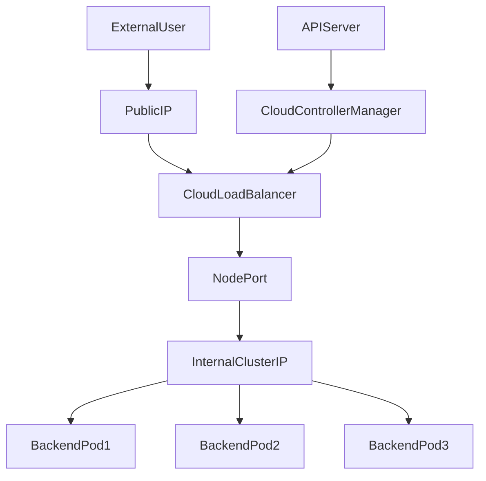

# LoadBalancer Service Fundamentals

## 1. Topic Overview

A **LoadBalancer Service** is the standard method for exposing a Kubernetes application to the public internet. While a `ClusterIP` provides internal networking and a `NodePort` opens a port on physical worker nodes, a `LoadBalancer` takes it a step further by natively integrating with the underlying Cloud Provider's API (e.g., AWS, GCP, Azure).

When you create this Service in a production cluster, the Kubernetes Cloud Controller Manager automatically provisions a physical or software-defined L4 load balancer (like an AWS Network Load Balancer), assigns it a public IP address, and configures it to route external traffic seamlessly into your cluster's backend Pods. In local development environments like Minikube, this cloud integration doesn't exist natively, so we simulate the external IP allocation using the `minikube tunnel` command.

---

## 2. Architecture / Flow Diagram



---

## 3. Prerequisites

Prepare your Minikube environment to handle external network simulation. Execute these commands sequentially.

```bash
# 1. Verify Minikube is active
minikube status

# 2. Verify kubectl is communicating with the correct cluster
kubectl cluster-info

# 3. Create an isolated namespace for external networking operations
kubectl create namespace lb-lab

# 4. Set the default context to the new namespace
kubectl config set-context --current --namespace=lb-lab

# 5. Open a SECOND terminal window and start the Minikube tunnel
# Keep this running in the background to simulate the Cloud Provider
minikube tunnel

```

---

## 4. Hands-On Lab

### Step 1: Deploying the Public-Facing Web App

**Short explanation:**
We must first provision the backend compute workloads. We will deploy a `public-frontend` using Nginx. To make this production-ready, we include resource constraints and HTTP readiness probes to ensure the LoadBalancer only sends traffic to healthy Pods.

**YAML:** `public-frontend-deploy.yaml`

```yaml
apiVersion: apps/v1
kind: Deployment
metadata:
  name: public-frontend
  namespace: lb-lab
  labels:
    app: public-frontend
spec:
  replicas: 3
  selector:
    matchLabels:
      app: public-frontend
  template:
    metadata:
      labels:
        app: public-frontend
    spec:
      containers:
      - name: web
        image: nginx:1.24.0-alpine
        ports:
        - containerPort: 80
        resources:
          requests:
            cpu: "50m"
            memory: "64Mi"
          limits:
            cpu: "100m"
            memory: "128Mi"
        readinessProbe:
          httpGet:
            path: /
            port: 80
          initialDelaySeconds: 2
          periodSeconds: 5

```

**Command:**

```bash
# Apply the deployment
kubectl apply -f public-frontend-deploy.yaml

```

**Verification:**

```bash
# Verify the Pods are running and have passed their readiness probes
kubectl get pods -w

# Inspect the applied labels
kubectl get pods --show-labels

```

**Expected Outcome:**
The Deployment controller spins up 3 Pods. They transition from `Pending` to `Running` to `READY 1/1` once the probe succeeds. The labels `app=public-frontend` are successfully attached to all Pods.

---

### Step 2: Provisioning the LoadBalancer Service

**Short explanation:**
We create the LoadBalancer Service. By defining `type: LoadBalancer`, we are explicitly requesting an external IP address from the environment. The `minikube tunnel` process running in your second terminal acts as the mock Cloud Provider to fulfill this request.

**YAML:** `public-frontend-lb.yaml`

```yaml
apiVersion: v1
kind: Service
metadata:
  name: frontend-lb-svc
  namespace: lb-lab
  labels:
    app: public-frontend
spec:
  type: LoadBalancer
  selector:
    app: public-frontend
  ports:
  - protocol: TCP
    port: 80
    targetPort: 80

```

**Command:**

```bash
# Apply the LoadBalancer service
kubectl apply -f public-frontend-lb.yaml

```

**Verification:**

```bash
# Watch the service to see the External IP transition from <pending> to an IP
kubectl get svc frontend-lb-svc -w

```

**Expected Outcome:**
Initially, the `EXTERNAL-IP` field will say `<pending>`. Within a few seconds (thanks to the tunnel), it will populate with an actual IP address (e.g., `127.0.0.1` or a bridge IP).

---

### Step 3: Verifying Endpoint Binding

**Short explanation:**
Even though the Service has an external IP, it is useless if it doesn't know where to route the traffic internally. We must verify that the Service's selector successfully mapped to our backend Pod IPs.

**Command:**

```bash
# Inspect the Endpoints object attached to the LoadBalancer
kubectl get endpoints frontend-lb-svc

```

**Verification:**

```bash
# Correlate the endpoints with the active Pod IPs
kubectl get pods -l app=public-frontend -o wide

# Describe the service to verify the targetPort and selector logic
kubectl describe svc frontend-lb-svc

```

**Expected Outcome:**
The Endpoints list will accurately reflect the 3 internal IP addresses of your healthy `public-frontend` Pods.

---

### Step 4: External Traffic Generation and Load Distribution

**Short explanation:**
We will simulate external users accessing your application from the "internet" (your host machine). We'll programmatically extract the External IP and fire a continuous loop of HTTP requests to prove the LoadBalancer is successfully distributing traffic across the ReplicaSet.

**Command:**

```bash
# Extract the External IP using JSONPath
EXTERNAL_IP=$(kubectl get svc frontend-lb-svc -o jsonpath='{.status.loadBalancer.ingress[0].ip}')

# Loop 5 HTTP requests to the External IP
for i in {1..5}; do curl -s -I http://$EXTERNAL_IP | grep HTTP; done

```

**Verification:**

```bash
# Aggregate logs from all backend pods to see the distributed traffic
kubectl logs -l app=public-frontend --tail=2

```

**Expected Outcome:**
The `curl` loop will return five `HTTP/1.1 200 OK` statuses. The aggregated logs will confirm that the incoming requests were routed to different backend Pods, confirming load balancing is fully operational.

---

### Step 5: Failure Simulation and Autonomous Recovery

**Short explanation:**
High Availability (HA) relies on the LoadBalancer dynamically adjusting its target pools. We will simulate an infrastructure failure by deleting a Pod, observing the LoadBalancer's autonomous recovery without dropping external traffic availability.

**Command:**

```bash
# In your primary terminal, delete an active backend pod
kubectl delete pod -l app=public-frontend | head -n 1 | xargs kubectl delete pod

```

**Verification:**

```bash
# Immediately check the endpoints to see the dead IP removed
kubectl get endpoints frontend-lb-svc

# Watch the ReplicaSet automatically heal the missing pod
kubectl get pods -w

```

**Expected Outcome:**
The Service instantly removes the terminated Pod from its Endpoints pool, protecting external users from `502 Bad Gateway` errors. The ReplicaSet launches a replacement Pod, which is added back to the Endpoints pool once it passes readiness checks.

---

## 5. Core Commands Cheat Sheet

### Service & Networking Commands

| Action | Command | Purpose |
| --- | --- | --- |
| List Services | `kubectl get svc` | View ClusterIP, NodePort, and LoadBalancer IPs |
| Watch IP Allocation | `kubectl get svc -w` | Monitor `<pending>` to `Allocated` state transitions |
| Describe Service | `kubectl describe svc <name>` | View precise selector mapping and port definitions |
| View Endpoints | `kubectl get endpoints <name>` | See the backend target pool dynamically |

### Extraction & Debugging Commands

| Action | Command | Purpose |
| --- | --- | --- |
| Extract External IP | `kubectl get svc <name> -o jsonpath='{.status.loadBalancer.ingress[0].ip}'` | Automation integration |
| Minikube Tunnel | `minikube tunnel` | Mock the Cloud Controller Manager |
| Test Internal Port | `kubectl port-forward svc/<name> 8080:80` | Bypass the LoadBalancer for direct testing |
| Aggregate Logs | `kubectl logs -l app=<label>` | View traffic logs across an entire Deployment |

---

## 6. Advanced Operations

* **`externalTrafficPolicy` (Cluster vs Local):** By default, a LoadBalancer routes traffic to any healthy node in the cluster, which SNATs (changes) the client's source IP address. If you require the application to see the *true* user IP (for geolocation or IP banning), SREs set `externalTrafficPolicy: Local`. This forces traffic to stay on the node that received it, preserving the source IP, though it can lead to imbalanced load distribution.
* **Cloud Annotations:** In AWS, creating a `LoadBalancer` Service creates a Classic Load Balancer by default. SREs use annotations like `service.beta.kubernetes.io/aws-load-balancer-type: "nlb"` in the Service YAML metadata to instruct the cloud provider to provision a modern Network Load Balancer instead.
* **Cost Management:** Every `type: LoadBalancer` Service provisions a dedicated, physical cloud load balancer, costing roughly $15-$20/month base price. Having 50 microservices means 50 LBs. SREs use Ingress Controllers (which utilize a single LoadBalancer) to share one external IP across multiple services via HTTP path routing.

---

## 7. Real-Time Industry Usage

* **Public APIs and Gateways:** A dedicated LoadBalancer Service is typically placed in front of an API Gateway (like Kong or Ambassador) or an Ingress Controller (like Nginx Ingress). All external internet traffic hits this single LoadBalancer, which is then dynamically routed deeper into the cluster.
* **Gaming and UDP Workloads:** While Ingress handles HTTP/HTTPS traffic well, multiplayer gaming servers or VoIP applications require raw UDP/TCP streams. A LoadBalancer Service natively supports L4 routing (`protocol: UDP`), making it mandatory for these workloads.
* **On-Premise Environments:** In bare-metal clusters without AWS or GCP, a LoadBalancer Service will remain stuck in `<pending>` forever unless the team installs a local controller like **MetalLB**, which uses ARP or BGP protocols to announce external IP addresses directly to the physical data center routers.

---

## 8. Troubleshooting Scenarios

### Scenario 1: The Infinite `<pending>` State

* **Symptoms:** You apply the Service YAML. Hours later, `kubectl get svc` still shows `EXTERNAL-IP: <pending>`.
* **Root Cause:** The cluster lacks a Cloud Controller Manager capable of provisioning the IP. In Minikube, the tunnel process is not running. In the cloud, the cloud-provider IAM role lacks permissions to create load balancers, or your VPC IP quota is exhausted.
* **Debug Commands:**
```bash
kubectl describe svc <service-name> | grep -i events -A 10

```


```
* **Resolution:** Ensure `minikube tunnel` is actively running in a separate terminal. In production, check cloud IAM policies and API limits.
* **Operational Learning:** Kubernetes does not create external IPs out of thin air; it requests them from the surrounding environment.

### Scenario 2: Traffic Black Hole (Empty Endpoints)
* **Symptoms:** The LoadBalancer has an IP address, but attempting to `curl` it results in connection timeouts or generic load balancer 5xx errors.
* **Root Cause:** The Service's `selector` labels do not exactly match the Pod's labels. The external LoadBalancer exists, but it has no backend targets to route traffic to.
* **Debug Commands:**
  ```bash
  kubectl get endpoints <service-name>
  kubectl get pods --show-labels

```

* **Resolution:** Correct the typo in either the Deployment template or the Service selector so they form a perfect mathematical intersection.
* **Operational Learning:** External IP allocation and internal endpoint mapping are two entirely separate operational steps. Both must succeed.

### Scenario 3: TargetPort Misalignment

* **Symptoms:** Endpoints are populated, but external traffic receives "Connection Refused."
* **Root Cause:** The LoadBalancer is sending traffic to a port the container is not listening on (e.g., `targetPort: 80`, but the Java app runs on `8080`).
* **Debug Commands:**
```bash
kubectl describe pod -l app=<label> | grep -i port
kubectl describe svc <service-name> | grep -i targetport

```


```
* **Resolution:** Update the Service YAML so that `targetPort` accurately reflects the container's listening port.
* **Operational Learning:** `port` is what the internet accesses. `targetPort` is the application's actual process port. They must be accurately mapped.

---

## 9. Cleanup Activity

Execute these commands to remove all exposed services, delete workloads, and safely kill the tunneling process.

```bash
# 1. Delete the LoadBalancer Service
kubectl delete svc frontend-lb-svc

# 2. Delete the Deployment
kubectl delete deployment public-frontend

# 3. Delete the isolated namespace
kubectl delete namespace lb-lab

# 4. Switch context back to the default namespace
kubectl config set-context --current --namespace=default

# 5. Stop the Minikube Tunnel
# Go to your second terminal window and press CTRL + C to terminate the tunnel.

```

---

## 10. Key Takeaways

* **Cloud Integration First:** LoadBalancer Services bridge the gap between Kubernetes software networking and physical cloud infrastructure.
* **L4 Routing:** LoadBalancers route based on IP addresses and TCP/UDP ports, not HTTP paths (that is the job of Ingress).
* **The Tunnel Dependency:** Minikube requires `minikube tunnel` to simulate cloud IP provisioning; without it, external networking fails.
* **Probes Protect the Public:** A LoadBalancer relies on `readinessProbes` to determine which Pods should receive external internet traffic, preventing users from seeing crashing instances.

---

## 11. Lab Challenges

### Beginner Exercises

1. **The Re-Port:** Edit the `frontend-lb-svc` YAML to expose the application to the internet on port `8080` instead of `80`, while still routing to the container's port `80`. Apply it and test the new port in your browser.
2. **Imperative Exposure:** Delete your Service. Use a single command to imperatively create a LoadBalancer Service pointing to your Deployment (Hint: `kubectl expose --help`).
3. **Log Mining:** Find a one-liner command to extract the exact error message from the cluster events when a LoadBalancer fails to find matching Endpoints.

### Intermediate Exercises

4. **Automated Extraction:** Write a bash script `test-lb.sh` that uses JSONPath to wait for the External IP to populate, extracts it, and performs a `curl` test automatically.
5. **Simultaneous Exposures:** Create a second Service of type `ClusterIP` pointing to the exact same Deployment. Verify that the Pods can be reached both internally and externally via different IPs simultaneously.
6. **Deploy an Echo Server:** Deploy the `ealen/echo-server` image. Expose it via LoadBalancer. `curl` the IP and observe the HTTP headers returned. Which internal Kubernetes IPs are leaked in the headers?

### Troubleshooting Exercises

7. **The Silent Drop:** Shut down your `minikube tunnel` process. Create a new LoadBalancer Service. Document the specific operational state and Event warnings the Service displays after 2 minutes.
8. **The Mixed Protocol:** Deploy a DNS server (`coredns` or `bind`) and attempt to expose it via a LoadBalancer requesting `protocol: UDP` on port `53`. Does Minikube's tunnel support UDP load balancing? Investigate.

### Production Challenge

9. **The Three-Tier Public Architecture:**
* Deploy a `redis-cache` instance (ClusterIP only, port 6379).
* Deploy an `inventory-api` (ClusterIP only, port 8080) that connects internally to Redis.
* Deploy a `storefront-ui` (LoadBalancer, port 80).
* Use an `initContainer` in the `storefront-ui` deployment that uses `nc` or `curl` to prove it can reach the `inventory-api` ClusterIP *before* the UI container is allowed to boot and accept external internet traffic.