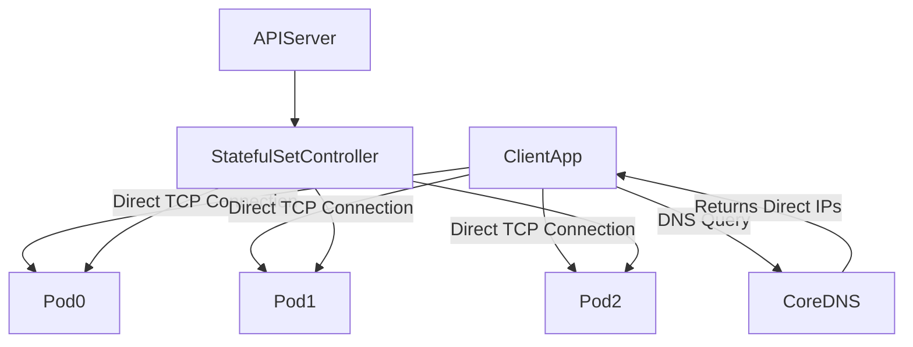

# Headless Service in Kubernetes Networking

## 1. Topic Overview

A **Headless Service** is a specialized Kubernetes Service designed for stateful, distributed applications that must manage their own load balancing, clustering, and data replication.

By explicitly setting `clusterIP: None` in the Service manifest, you instruct Kubernetes to bypass the `kube-proxy` virtual IP load balancer entirely. Instead of returning a single Virtual IP, the internal CoreDNS server returns multiple `A` records containing the direct IP addresses of every healthy Pod backing the Service.

When paired with a **StatefulSet**, a Headless Service unlocks **Stable Network Identity**. It provisions a permanent, predictable DNS hostname for every single Pod (e.g., `pod-0.service.namespace.svc.cluster.local`). In production DevOps and SRE environments, Headless Services are the absolute prerequisite for deploying distributed databases (MongoDB, Cassandra), message brokers (Kafka), and search engines (Elasticsearch), allowing these nodes to discover their peers and form data quorums without intermediate network abstraction.

---

## 2. Architecture / Flow Diagram



---

## 3. Prerequisites

Before executing this lab, ensure your Minikube environment is clean and provisioned. Execute these commands sequentially.

```bash
# 1. Verify Minikube cluster health
minikube status

# 2. Verify kubectl is communicating with the correct cluster
kubectl cluster-info

# 3. Enable metrics-server for resource observability
minikube addons enable metrics-server

# 4. Create an isolated namespace for stateful networking operations
kubectl create namespace headless-lab

# 5. Set the default context to the new namespace
kubectl config set-context --current --namespace=headless-lab

```

---

## 4. Hands-On Lab

### Step 1: Provisioning the Headless Service

**Short explanation:**
We must create the Headless Service *before* deploying the StatefulSet. The defining characteristic of this YAML is `clusterIP: None`. This instructs Kubernetes to create the DNS domain but omit the Virtual IP load-balancing layer.

**YAML:** `nginx-headless-svc.yaml`

```yaml
apiVersion: v1
kind: Service
metadata:
  name: nginx-headless
  namespace: headless-lab
  labels:
    app: nginx-stateful
spec:
  clusterIP: None
  selector:
    app: nginx-stateful
  ports:
  - port: 80
    targetPort: 80
    name: web

```

**Command:**

```bash
# Apply the Headless Service
kubectl apply -f nginx-headless-svc.yaml

```

**Verification:**

```bash
# Verify the Service configuration
kubectl get svc nginx-headless

# Inspect the deep configuration to confirm IP allocation is bypassed
kubectl describe svc nginx-headless

```

**Expected Outcome:**
The `CLUSTER-IP` column will explicitly show `None`. Because no backend Pods exist yet, the Endpoints list will be empty.

---

### Step 2: Deploying the StatefulSet

**Short explanation:**
We deploy a StatefulSet that binds to the Headless Service using the `serviceName` directive. We include a `volumeClaimTemplates` block to simulate a true production database, ensuring each Pod receives dedicated, isolated persistent storage alongside its stable DNS identity.

**YAML:** `nginx-statefulset.yaml`

```yaml
apiVersion: apps/v1
kind: StatefulSet
metadata:
  name: web-store
  namespace: headless-lab
spec:
  serviceName: "nginx-headless"
  replicas: 3
  selector:
    matchLabels:
      app: nginx-stateful
  template:
    metadata:
      labels:
        app: nginx-stateful
    spec:
      containers:
      - name: nginx
        image: nginx:1.24.0-alpine
        ports:
        - containerPort: 80
          name: web
        resources:
          requests:
            cpu: "50m"
            memory: "64Mi"
          limits:
            cpu: "100m"
            memory: "128Mi"
        volumeMounts:
        - name: data-disk
          mountPath: /usr/share/nginx/html
        readinessProbe:
          httpGet:
            path: /
            port: 80
          initialDelaySeconds: 5
          periodSeconds: 5
  volumeClaimTemplates:
  - metadata:
      name: data-disk
    spec:
      accessModes: [ "ReadWriteOnce" ]
      resources:
        requests:
          storage: 1Gi

```

**Command:**

```bash
# Apply the StatefulSet
kubectl apply -f nginx-statefulset.yaml

```

**Verification:**

```bash
# Watch the strict, ordered sequential creation of Pods and PVCs
watch kubectl get pods,pvc

```

**Expected Outcome:**
Unlike Deployments, StatefulSets create Pods strictly in order: `web-store-0`, then `web-store-1`, then `web-store-2`. Each Pod provisions a uniquely named PersistentVolumeClaim (e.g., `data-disk-web-store-0`).

---

### Step 3: Inspecting Direct Endpoints Registration

**Short explanation:**
Now that the Pods are running, we must verify that the Headless Service has successfully mapped their direct ephemeral IP addresses.

**Command:**

```bash
# View the dynamically registered Endpoints
kubectl get endpoints nginx-headless

```

**Verification:**

```bash
# Compare the Endpoints payload to the raw Pod IPs
kubectl get pods -l app=nginx-stateful -o wide

```

**Expected Outcome:**
The `ENDPOINTS` column will list a comma-separated array of the three raw Pod IP addresses. There is no intermediary IP acting as a proxy.

---

### Step 4: Proving Multi-A Record DNS Resolution

**Short explanation:**
In a standard Service, a DNS query returns one Virtual IP. In a Headless Service, a DNS query returns all active Pod IPs. We will deploy an ephemeral debugging shell to query the cluster's internal CoreDNS server.

**Command:**

```bash
# Launch a temporary Alpine Pod and open an interactive shell
kubectl run dns-troubleshooter --image=alpine:3.18 -it --rm --restart=Never -- sh

```

**Verification:**

```bash
# INSIDE THE POD: Install DNS utilities
apk add bind-tools

# INSIDE THE POD: Query the Headless Service root domain
nslookup nginx-headless.headless-lab.svc.cluster.local

```

**Expected Outcome:**
The `nslookup` command will return three distinct `A` records (or `AAAA` records) representing the three raw IP addresses of `web-store-0`, `web-store-1`, and `web-store-2`. A client application like a Kafka producer would use this list to load-balance traffic client-side.

---

### Step 5: Proving Stable Network Identity (Predictable DNS)

**Short explanation:**
The true power of a Headless Service combined with a StatefulSet is the generation of permanent, predictable subdomains for each Pod, facilitating primary-replica database configurations.

**Command:**

```bash
# INSIDE THE TEST POD: Query the specific DNS name of the first Pod
nslookup web-store-0.nginx-headless.headless-lab.svc.cluster.local

# INSIDE THE TEST POD: Query the specific DNS name of the third Pod
nslookup web-store-2.nginx-headless.headless-lab.svc.cluster.local

# Exit the debug pod
exit

```

**Expected Outcome:**
The DNS queries resolve directly to the specific IP addresses of the individual Pods. If `web-store-0` is the primary database node, the other nodes can permanently hardcode `web-store-0.nginx-headless` in their replication configuration files.

---

### Step 6: Failure Simulation and Identity Preservation

**Short explanation:**
Hardware fails. When a StatefulSet Pod dies, its IP address changes. We will prove that while the IP changes, its DNS identity and storage identity remain permanently fixed.

**Command:**

```bash
# Delete the middle node in the StatefulSet
kubectl delete pod web-store-1

# Immediately watch the recreation and note the NEW IP address
kubectl get pods -o wide -w

```

**Verification:**

```bash
# Wait for web-store-1 to become Ready, then launch a new debug shell to test DNS
kubectl run dns-troubleshooter --image=alpine:3.18 -it --rm --restart=Never -- sh

# INSIDE THE POD: Install tools and query the specific DNS identity again
apk add bind-tools
nslookup web-store-1.nginx-headless.headless-lab.svc.cluster.local

# Exit
exit

```

**Expected Outcome:**
`web-store-1` was recreated. It received a brand new, ephemeral IP address. However, CoreDNS immediately updated the DNS record. Applications continuously querying `web-store-1.nginx-headless` will seamlessly reconnect to the new IP without configuration changes.

---

## 5. Core Commands Cheat Sheet

### StatefulSet & Headless Commands

| Action | Command | Purpose |
| --- | --- | --- |
| Get StatefulSets | `kubectl get sts` | View desired vs ready capacity |
| Inspect Service | `kubectl describe svc <name>` | Verify `ClusterIP: None` configuration |
| View Endpoints | `kubectl get endpoints <name>` | See all raw Pod IPs backing the domain |
| Ordered Scaling | `kubectl scale sts <name> --replicas=5` | Adds Pods strictly as `pod-3`, then `pod-4` |

### DNS & Troubleshooting Commands

| Action | Command | Purpose |
| --- | --- | --- |
| Pod Shell | `kubectl exec -it <pod-name> -- /bin/sh` | Enter the container file system |
| Check Hostname | `kubectl exec <pod-name> -- hostname` | Verify the internal OS identity of the Pod |
| DNS Query | `nslookup <service-name>` | Test multi-record resolution |
| Dynamic Extract | `kubectl get pods -o jsonpath='{range .items[*]}{.metadata.name}{"\t"}{.status.podIP}{"\n"}{end}'` | Programmatic IP extraction |

---

## 6. Advanced Operations

* **Peer Discovery via SRV Records:** When distributed systems like Zookeeper form a cluster, they don't hardcode `pod-0`, `pod-1`. Instead, they query the `SRV` (Service) records of the Headless Service. A query like `nslookup -q=srv nginx-headless` returns the port and hostname mapping for every active peer, allowing the cluster to auto-discover its members dynamically.
* **Parallel Pod Management:** By default, StatefulSets use `OrderedReady` pod management (0, then 1, then 2). If your distributed application handles its own quorum logic and doesn't need sequential boot times, you can set `podManagementPolicy: Parallel` in the StatefulSet YAML. This speeds up deployment drastically while retaining the Headless DNS benefits.
* **Publish Not Ready Addresses:** By default, if a Pod fails its readiness probe, it is removed from the Headless Service DNS. In database clustering, this can cause split-brain scenarios where a booting node can't find its peers. SREs can set `publishNotReadyAddresses: true` in the Headless Service spec, ensuring the DNS record is broadcast even if the Pod is still initializing.

---

## 7. Real-Time Industry Usage

* **Elasticsearch Clustering:** Elasticsearch nodes must discover each other to form a cluster and elect a master node. By using a Headless Service, the `discovery.seed_hosts` configuration simply points to the Headless Service name. Elasticsearch queries the DNS, receives all the IPs, and establishes direct TCP connections to form the cluster ring.
* **Cassandra Data Replication:** Cassandra uses a ring architecture where every node needs to talk to every other node directly to replicate data based on consistent hashing. A standard LoadBalancer would ruin this by proxying traffic randomly. A Headless Service ensures node-to-node direct communication.
* **Client-Side Load Balancing (gRPC):** High-performance gRPC architectures often avoid server-side proxies (like Envoy or Nginx) to reduce latency hops. Instead, the gRPC client queries a Headless Service, receives all backend IPs, and performs intelligent, round-robin load balancing directly in the application code.

---

## 8. Troubleshooting Scenarios

### Scenario 1: DNS Fails to Resolve Headless Domain

* **Symptoms:** Running `nslookup <headless-service-name>` from a client Pod returns `NXDOMAIN` or `Server can't find <name>`.
* **Root Cause:** CoreDNS relies on the kubelet and network plugin (CNI). If the `kube-dns` pods in the `kube-system` namespace are in a `CrashLoopBackOff`, all internal name resolution fails.
* **Debug Commands:**
```bash
kubectl get pods -n kube-system -l k8s-app=kube-dns
kubectl logs -n kube-system -l k8s-app=kube-dns

```


```
* **Resolution:** Restart the CoreDNS deployment to flush its cache and force pod recreation: `kubectl rollout restart deployment coredns -n kube-system`.
* **Operational Learning:** Headless Services depend entirely on the health of the cluster's internal DNS infrastructure. If DNS dies, stateful clustering dies.

### Scenario 2: Service Exists But Returns No IPs
* **Symptoms:** `nslookup` resolves the Service name, but it returns zero IP addresses. `kubectl get endpoints` shows `<none>`.
* **Root Cause:** The `selector` block in the Headless Service YAML does not mathematically match the labels injected by the StatefulSet's Pod template.
* **Debug Commands:**
  ```bash
  kubectl get svc nginx-headless -o yaml | grep -A 2 selector
  kubectl get pods --show-labels

```

* **Resolution:** Edit the Headless Service YAML to correct the typo in the selector so it matches the Pod labels perfectly.
* **Operational Learning:** Headless Services use the exact same endpoint selection mechanics as ClusterIPs. Without matching labels, the DNS record is generated, but it remains empty.

### Scenario 3: Missing Predictable Hostnames

* **Symptoms:** You deployed an application, and the Headless Service returns IPs, but querying `pod-0.service.namespace` fails completely.
* **Root Cause:** The engineering team accidentally deployed the application using a `Deployment` instead of a `StatefulSet`. Deployments generate random, non-deterministic hostnames (e.g., `app-6b7984c85f-x9jkl`) and do not hook into the Headless Service's stable subdomain generator.
* **Debug Commands:**
```bash
kubectl get statefulsets
kubectl get deployments
kubectl exec -it <pod-name> -- hostname

```


```
* **Resolution:** You must rewrite the deployment manifests to use `kind: StatefulSet` and include the `serviceName: <headless-svc-name>` directive.
* **Operational Learning:** A Headless Service alone does not create stable network identities. It must be paired specifically with a StatefulSet.

---

## 9. Cleanup Activity

Execute these commands to remove all stateful configurations, persistent volumes, and reclaim local disk space.

```bash
# 1. Delete the StatefulSet (This terminates Pods 2, then 1, then 0)
kubectl delete statefulset web-store

# 2. Delete the Headless Service
kubectl delete svc nginx-headless

# 3. CRITICAL: Delete the Persistent Volume Claims (StatefulSets leave PVCs behind by design)
kubectl delete pvc -l app=nginx-stateful

# 4. Delete the isolated networking namespace
kubectl delete namespace headless-lab

# 5. Switch context back to default
kubectl config set-context --current --namespace=default

```

---

## 10. Key Takeaways

* **No Intermediaries:** `clusterIP: None` strips away the virtual IP and kube-proxy load balancing, providing direct network access to individual Pod IPs.
* **DNS is the Database:** Headless Services shift the responsibility of service discovery from a network proxy directly to the internal CoreDNS resolver.
* **The Stateful Pairing:** Headless Services and StatefulSets are an inseparable pair in production. Together, they create the stable hostnames (`pod-0.service.namespace`) required by distributed systems.
* **Client-Side Responsibility:** Because there is no LoadBalancer, the application client querying the Headless Service must implement its own logic to handle connection retries, timeouts, and round-robin balancing across the returned IPs.

---

## 11. Lab Challenges

### Beginner Exercises

1. **The FQDN Test:** Exec into a busybox pod in the `default` namespace. Use `nslookup` to resolve your Headless Service located in the `headless-lab` namespace using its Fully Qualified Domain Name (FQDN).
2. **Parallel Scaling:** Modify the `nginx-statefulset.yaml` to include `podManagementPolicy: Parallel`. Apply the change, scale the StatefulSet to 6 replicas, and observe the creation order.
3. **Endpoint Inspection:** Run a single CLI command using `kubectl get endpoints` to extract the comma-separated list of IPs without visually parsing the default table output.

### Intermediate Exercises

4. **Deploy a Local Redis Cluster:** Deploy a Redis StatefulSet (3 replicas) and a Headless Service. Write a custom `command` in the Pod spec that uses the Headless Service's predictable DNS to configure `redis-1` and `redis-2` as read-only replicas of `redis-0`.
5. **SRV Record Extraction:** Launch a debug Pod with `bind-tools`. Execute an `nslookup` query targeting the `SRV` records of your Headless Service. Document the output format containing the port, weight, and target hostnames.
6. **The Unready Broadcast:** Modify the Headless Service to include `publishNotReadyAddresses: true`. Deploy a StatefulSet where the `readinessProbe` intentionally fails. Verify via `nslookup` that the Pod IPs are still broadcasted to the network.

### Troubleshooting Exercises

7. **The Rogue Identity:** Delete your Headless Service completely. Restart your StatefulSet. Exec into `web-store-0` and check its hostname. Attempt an `nslookup` on that hostname. Document how the absence of the Headless Service breaks the internal OS identity mapping.
8. **Storage Deadlock:** Update your StatefulSet YAML to increase the `volumeClaimTemplates` storage request from `1Gi` to `5Gi`. Apply it. Read the API validation error. Explain why Kubernetes prevents this operational action.

### Production Challenge

9. **The gRPC Client-Side Balancer:**
* Build or deploy a simple gRPC server application as a StatefulSet (3 replicas) behind a Headless Service.
* Deploy a gRPC client application in a separate Pod.
* Configure the gRPC client code (or Envoy proxy sidecar) to utilize `dns:///service-name:port` as its target.
* Generate traffic and prove via logs that the client is actively performing round-robin client-side load balancing across all three Pod IPs returned by the Headless Service, without a ClusterIP intermediary.