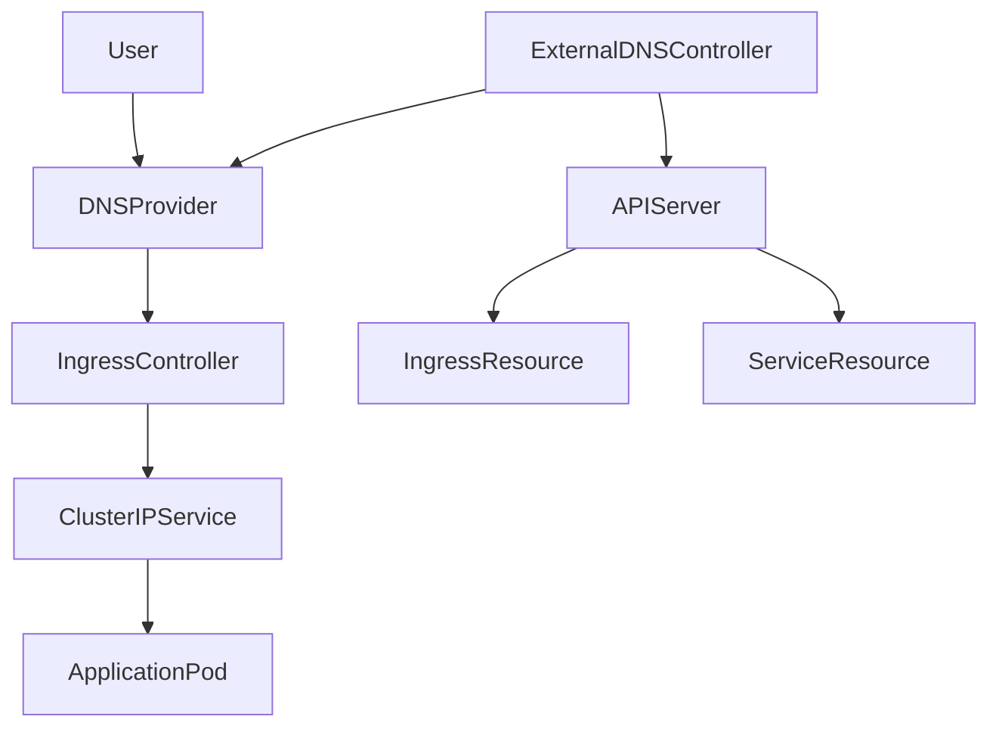

# ExternalDNS in Kubernetes Networking

## 1. Topic Overview

**ExternalDNS** is a powerful Kubernetes infrastructure controller that bridges the gap between your cluster's internal networking and external DNS providers (like AWS Route53, Cloudflare, Google Cloud DNS, or Azure DNS).

In traditional environments, an engineer provisions an Ingress or LoadBalancer, waits for the cloud provider to assign a public IP, and then manually logs into a DNS console to map `api.company.com` to that IP. ExternalDNS completely automates this lifecycle. It continuously monitors the Kubernetes API for `Services` and `Ingress` resources. When it detects specific annotations or host rules, it dynamically talks to the cloud provider's API to create, update, or delete the corresponding DNS `A`, `CNAME`, and `TXT` records.

In modern DevOps and GitOps architectures, ExternalDNS is mandatory for achieving fully automated, zero-touch application provisioning.

---

## 2. Architecture / Flow Diagram



---

## 3. Prerequisites

Before we begin, prepare your Minikube cluster. We will enable the NGINX Ingress controller, which is required to assign an IP address to the Ingress resource (ExternalDNS needs an IP to create the DNS record).

```bash
# 1. Verify Minikube is active
minikube status

# 2. Verify kubectl connectivity
kubectl cluster-info

# 3. Enable the Minikube Ingress addon
minikube addons enable ingress

# 4. Create an isolated namespace for DNS automation
kubectl create namespace externaldns-lab

# 5. Set the default context to the new namespace
kubectl config set-context --current --namespace=externaldns-lab

# 6. Verify the Ingress controller is running (Wait for it to be Ready)
kubectl get pods -n ingress-nginx -w

```

---

## 4. Hands-On Lab

### Step 1: Deploy the Backend Application

**Short explanation:**
We must first provision the workload. We deploy a highly available Nginx web server. We include production standards like resource requests and readiness probes to ensure the backend is healthy before receiving DNS traffic.

**YAML:** `app-deployment.yaml`

```yaml
apiVersion: apps/v1
kind: Deployment
metadata:
  name: nginx-web
  namespace: externaldns-lab
  labels:
    app: nginx-web
spec:
  replicas: 3
  selector:
    matchLabels:
      app: nginx-web
  template:
    metadata:
      labels:
        app: nginx-web
    spec:
      containers:
      - name: web
        image: nginx:1.24.0-alpine
        ports:
        - containerPort: 80
        resources:
          requests:
            cpu: "50m"
            memory: "64Mi"
          limits:
            cpu: "100m"
            memory: "128Mi"
        readinessProbe:
          httpGet:
            path: /
            port: 80
          initialDelaySeconds: 2
          periodSeconds: 5

```

**Command:**

```bash
# Apply the deployment
kubectl apply -f app-deployment.yaml

```

**Verification:**

```bash
# Watch the pods spin up
kubectl get pods -w

# Verify the deployment rollout status
kubectl rollout status deployment/nginx-web

```

**Expected Outcome:**
The ReplicaSet provisions 3 Pods. Once the readiness probes pass, they enter the `Running` and `READY 1/1` state.

---

### Step 2: Create the ClusterIP Service

**Short explanation:**
The Ingress controller needs an internal Service to route external traffic to the Pods. We create a standard ClusterIP Service.

**YAML:** `app-service.yaml`

```yaml
apiVersion: v1
kind: Service
metadata:
  name: nginx-service
  namespace: externaldns-lab
  labels:
    app: nginx-web
spec:
  type: ClusterIP
  selector:
    app: nginx-web
  ports:
  - protocol: TCP
    port: 80
    targetPort: 80

```

**Command:**

```bash
# Apply the ClusterIP service
kubectl apply -f app-service.yaml

```

**Verification:**

```bash
# Verify the service creation
kubectl get svc nginx-service

# Verify the endpoints are correctly mapped to the pods
kubectl get endpoints nginx-service

```

**Expected Outcome:**
The Service receives an internal ClusterIP. The Endpoints list correctly maps to the 3 healthy Pod IP addresses.

---

### Step 3: Create the Ingress Resource

**Short explanation:**
We create an Ingress resource defining the hostname `nginx.example.com`. We explicitly add the ExternalDNS annotation. This annotation is the trigger that tells the ExternalDNS controller: "Manage a DNS record for this specific hostname."

**YAML:** `app-ingress.yaml`

```yaml
apiVersion: networking.k8s.io/v1
kind: Ingress
metadata:
  name: nginx-ingress
  namespace: externaldns-lab
  annotations:
    external-dns.alpha.kubernetes.io/hostname: nginx.example.com
    # In production, you might also specify TTL:
    external-dns.alpha.kubernetes.io/ttl: "60"
spec:
  ingressClassName: nginx
  rules:
  - host: nginx.example.com
    http:
      paths:
      - path: /
        pathType: Prefix
        backend:
          service:
            name: nginx-service
            port:
              number: 80

```

**Command:**

```bash
# Apply the ingress resource
kubectl apply -f app-ingress.yaml

```

**Verification:**

```bash
# Wait for the NGINX ingress controller to assign an ADDRESS (IP) to this ingress
kubectl get ingress nginx-ingress -w

```

**Expected Outcome:**
The Ingress is created. After a few seconds, the `ADDRESS` column populates with the Minikube IP. **ExternalDNS will not create a DNS record until this ADDRESS field is populated.**

---

### Step 4: Deploy the ExternalDNS Controller

**Short explanation:**
We deploy the ExternalDNS controller. Since we don't have AWS Route53 credentials in this lab, we will use `--provider=inmemory`. This safely simulates DNS provider API calls and prints the exact records it *would* create in AWS to the logs, allowing us to learn safely.

**YAML:** `externaldns-controller.yaml`

```yaml
apiVersion: apps/v1
kind: Deployment
metadata:
  name: external-dns
  namespace: externaldns-lab
spec:
  replicas: 1
  selector:
    matchLabels:
      app: external-dns
  template:
    metadata:
      labels:
        app: external-dns
    spec:
      serviceAccountName: default
      containers:
      - name: external-dns
        image: registry.k8s.io/external-dns/external-dns:v0.14.0
        args:
        - --source=service
        - --source=ingress
        - --provider=inmemory       # Use 'aws' or 'cloudflare' in production
        - --registry=txt            # Prevents conflicts between multiple clusters
        - --txt-owner-id=minikube-lab
        - --log-level=info
        resources:
          requests:
            cpu: "50m"
            memory: "64Mi"

```

**Command:**

```bash
# Deploy ExternalDNS
kubectl apply -f externaldns-controller.yaml

```

**Verification:**

```bash
# Ensure the controller starts successfully
kubectl get pods -l app=external-dns -w

```

**Expected Outcome:**
The ExternalDNS Pod spins up. It immediately begins communicating with the Kubernetes API to discover Services and Ingresses.

---

### Step 5: Verify DNS Synchronization Logs

**Short explanation:**
ExternalDNS runs silently in the background. SREs verify its operational success by tailing its logs to observe the dynamic creation of DNS `A` and `TXT` records.

**Command:**

```bash
# Follow the logs of the ExternalDNS controller
kubectl logs deployment/external-dns -f

```

**Verification:**

```bash
# In a separate terminal, verify cluster events to ensure no RBAC/API errors occurred
kubectl get events --sort-by=.metadata.creationTimestamp | tail -n 10

```

**Expected Outcome:**
In the logs, you will see output indicating that ExternalDNS discovered `nginx-ingress`, identified the target IP, and executed a `CREATE` operation for the `nginx.example.com` `A` record and its accompanying ownership `TXT` record.

---

### Step 6: Dynamic DNS Modification via Annotations

**Short explanation:**
A developer wants to change the application URL from `nginx.example.com` to `app.example.com`. Instead of logging into Route53, we simply patch the Kubernetes manifest using JSONPath.

**Command:**

```bash
# Patch the Ingress to change the host and annotation
kubectl patch ingress nginx-ingress --type='json' -p='[{"op": "replace", "path": "/spec/rules/0/host", "value":"app.example.com"},{"op": "replace", "path": "/metadata/annotations/external-dns.alpha.kubernetes.io~1hostname", "value":"app.example.com"}]'

```

**Verification:**

```bash
# Extract the new hostname programmatically using JSONPath
kubectl get ingress nginx-ingress -o jsonpath='{.metadata.annotations.external-dns\.alpha\.kubernetes\.io/hostname}{"\n"}'

# Check the ExternalDNS logs again
kubectl logs deployment/external-dns --tail=20

```

**Expected Outcome:**
The ExternalDNS controller instantly detects the change. The logs will show an `UPSERT` or `DELETE/CREATE` operation, removing `nginx.example.com` and registering `app.example.com` with the DNS provider.

---

### Step 7: Automated Cleanup on Deletion

**Short explanation:**
When tearing down an ephemeral environment, stale DNS records cause security risks (subdomain takeovers). ExternalDNS automatically cleans up when resources are deleted.

**Command:**

```bash
# Delete the Ingress resource
kubectl delete ingress nginx-ingress

```

**Verification:**

```bash
# Watch the ExternalDNS logs react to the deletion
kubectl logs deployment/external-dns --tail=10

```

**Expected Outcome:**
The logs will explicitly state `DELETE: app.example.com`. The DNS record is wiped from the provider automatically, ensuring pristine infrastructure state.

---

## 5. Core Commands Cheat Sheet

### Ingress & Service Commands

| Action | Command | Purpose |
| --- | --- | --- |
| Get Ingress | `kubectl get ingress` | View hosts and assigned LoadBalancer IPs |
| Inspect Annotations | `kubectl describe ingress <name>` | Verify `external-dns` triggers are present |
| Extract Host | `kubectl get ingress <name> -o jsonpath='{.spec.rules[0].host}'` | Scripting integration |

### ExternalDNS Controller Commands

| Action | Command | Purpose |
| --- | --- | --- |
| Tail Logs | `kubectl logs deploy/external-dns -f` | Real-time monitoring of DNS API calls |
| View Config | `kubectl get deploy external-dns -o yaml | grep args -A 5` | Check provider and TXT registry settings |
| Restart Controller | `kubectl rollout restart deploy/external-dns` | Force an immediate full-state synchronization |

---

## 6. Advanced Operations

* **The TXT Registry Concept:** If you have multiple Kubernetes clusters (e.g., `dev` and `prod`) managing the same Route53 Hosted Zone, they will fight over DNS records. ExternalDNS solves this using a `TXT` registry. For every `A` record it creates, it creates an accompanying `TXT` record containing an `owner-id`. It will refuse to modify or delete a DNS record owned by another cluster.
* **Sync Policies (`--policy`):** By default, ExternalDNS uses `--policy=sync`, meaning it creates, updates, and *deletes* records. In highly critical production zones, SREs sometimes set `--policy=upsert-only`. This prevents ExternalDNS from ever deleting a record, preventing catastrophic outages if an Ingress is accidentally deleted.
* **Service Exposure:** ExternalDNS doesn't just watch Ingresses. If configured with `--source=service`, it will watch for Services of `type: LoadBalancer` that possess the `external-dns.alpha.kubernetes.io/hostname` annotation and map their cloud-provisioned External IP to the requested DNS name.

---

## 7. Real-Time Industry Usage

* **Ephemeral QA Environments:** In modern CI/CD, creating a Pull Request spins up a completely isolated replica of the application in Kubernetes. ExternalDNS automatically assigns it a URL like `pr-123.dev.company.com`. When the PR is merged and the namespace is deleted, ExternalDNS scrubs the DNS records.
* **Cross-Cluster Failover:** Enterprises running multiple EKS clusters in different AWS regions use ExternalDNS combined with Route53 routing policies. They annotate Ingresses with `external-dns.alpha.kubernetes.io/set-identifier: "us-east-1"` and `external-dns.alpha.kubernetes.io/aws-weight: "100"` to automate global traffic shaping via GitOps.
* **Subdomain Takeover Prevention:** Manual DNS management inevitably leaves "dangling" DNS records pointing to Load Balancer IPs that no longer exist. Attackers can claim those IPs and hijack your traffic. ExternalDNS strictly ties the DNS lifecycle to the Kubernetes resource lifecycle, virtually eliminating this attack vector.

---

## 8. Troubleshooting Scenarios

### Scenario 1: DNS Record Never Created

* **Symptoms:** ExternalDNS logs show no errors, but the DNS record doesn't exist.
* **Root Cause:** The Ingress resource lacks an assigned IP address. ExternalDNS will categorically ignore any Ingress or LoadBalancer Service that is in a `<pending>` state or missing an `ADDRESS`.
* **Debug Commands:**
```bash
kubectl get ingress
kubectl describe ingress <name> | grep Address

```


```
* **Resolution:** Ensure your Ingress Controller (e.g., ingress-nginx) is running and has successfully acquired an IP.
* **Operational Learning:** DNS automation is dependent on successful L4/L7 networking provisioning first.

### Scenario 2: Provider API Rate Limiting / Permission Denied
* **Symptoms:** ExternalDNS logs are flooded with `AccessDenied` or `RateLimitExceeded` from AWS/GCP.
* **Root Cause:** The Pod lacks the correct Cloud IAM roles (e.g., AWS IRSA or GCP Workload Identity) required to modify Route53/CloudDNS, or the cluster is updating too many records too fast.
* **Debug Commands:**
  ```bash
  kubectl logs deploy/external-dns | grep -i error

```

* **Resolution:** Correct the Cloud IAM policy attached to the `ServiceAccount`. For rate limits, increase the `--interval` argument in the ExternalDNS deployment to check less frequently (e.g., `--interval=1m`).
* **Operational Learning:** External controllers require strict, least-privilege IAM configuration bridging the K8s API and the Cloud API.

### Scenario 3: TXT Owner ID Collision

* **Symptoms:** You added the annotation, the Ingress has an IP, but ExternalDNS logs show `Skipping record <name> because owner id does not match`.
* **Root Cause:** A different Kubernetes cluster (or a manual human action) created that DNS record. ExternalDNS checks the `TXT` record, sees an ID mismatch (or no ID), and safely refuses to hijack the domain.
* **Debug Commands:**
```bash
kubectl logs deploy/external-dns | grep "owner id"

```


```
* **Resolution:** If you genuinely want this cluster to take over the domain, you must manually log into the DNS provider and delete the old `TXT` record, or use the annotation `external-dns.alpha.kubernetes.io/aws-assume-role` if dealing with cross-account takeovers.
* **Operational Learning:** The TXT registry is a critical safety net protecting your production domains from accidental overwrites.

---

## 9. Cleanup Activity

Execute these commands to remove the simulation and reclaim cluster resources safely.

```bash
# 1. Delete the ExternalDNS controller
kubectl delete deployment external-dns

# 2. Delete the application deployment and service
kubectl delete deployment nginx-web
kubectl delete svc nginx-service

# 3. Delete the isolated namespace
kubectl delete namespace externaldns-lab

# 4. Switch context back to default
kubectl config set-context --current --namespace=default

# 5. Disable the Minikube ingress addon (Optional)
minikube addons disable ingress

```

---

## 10. Key Takeaways

* **Infrastructure as Code:** ExternalDNS turns DNS configuration into Kubernetes YAML, allowing it to be version-controlled via GitOps.
* **Annotation Driven:** The entire controller is driven by simple annotations (`external-dns.alpha.kubernetes.io/hostname`) attached to Services or Ingresses.
* **The TXT Safety Net:** ExternalDNS tracks ownership of records using `TXT` records, ensuring multi-cluster environments do not clobber each other's routing.
* **Automation Eliminates Drift:** By letting ExternalDNS manage the lifecycle, you eliminate orphaned DNS records and the resulting security vulnerabilities.

---

## 11. Lab Challenges

### Beginner Exercises

1. **Annotation Discovery:** Run `kubectl explain ingress.metadata.annotations`. While Kubernetes natively accepts any string here, research three other annotations supported by ExternalDNS (e.g., TTL, routing policies).
2. **Imperative Labeling:** Use `kubectl annotate` to add the hostname annotation to an existing Ingress resource via the CLI without modifying the YAML.
3. **Log Filtering:** Write a command to tail the ExternalDNS logs and specifically `grep` only for `UPSERT` operations.

### Intermediate Exercises

4. **Multiple Hosts:** Modify your Ingress YAML to route two separate hosts (`app1.example.com` and `app2.example.com`). Apply the changes and verify in the ExternalDNS logs that it processes both hostnames.
5. **LoadBalancer Sourcing:** Update the ExternalDNS deployment to include `--source=service`. Deploy a new Service of `type: LoadBalancer`. Add the hostname annotation directly to the Service. Observe the logs to verify detection.
6. **Provider Familiarization:** Modify the ExternalDNS deployment args to use `--provider=aws` instead of `inmemory`. Observe the Pod logs crashing or failing, and document the specific IAM/Authentication error it returns.

### Troubleshooting Exercises

7. **The Rogue Manual Edit:** In a real cluster, if a human manually changes the IP address of an `A` record in Route53 that is managed by ExternalDNS, what will ExternalDNS do during its next sync loop? (Hint: consider the sync policy).
8. **Broken Controller:** Purposely misspell the `--txt-owner-id` argument in the ExternalDNS deployment. What happens to the controller Pod? How do you diagnose it?

### Production Challenge

9. **The Multi-Tenant Guardrail:**
* You manage a multi-tenant cluster where Team A owns `team-a.company.com` and Team B owns `team-b.company.com`.
* Configure an ExternalDNS deployment that is strictly locked down using the `--domain-filter` argument so it can *only* manage records for `team-a.company.com`.
* Deploy an Ingress requesting `team-b.company.com` and prove via the ExternalDNS logs that the controller explicitly ignores the unauthorized request.