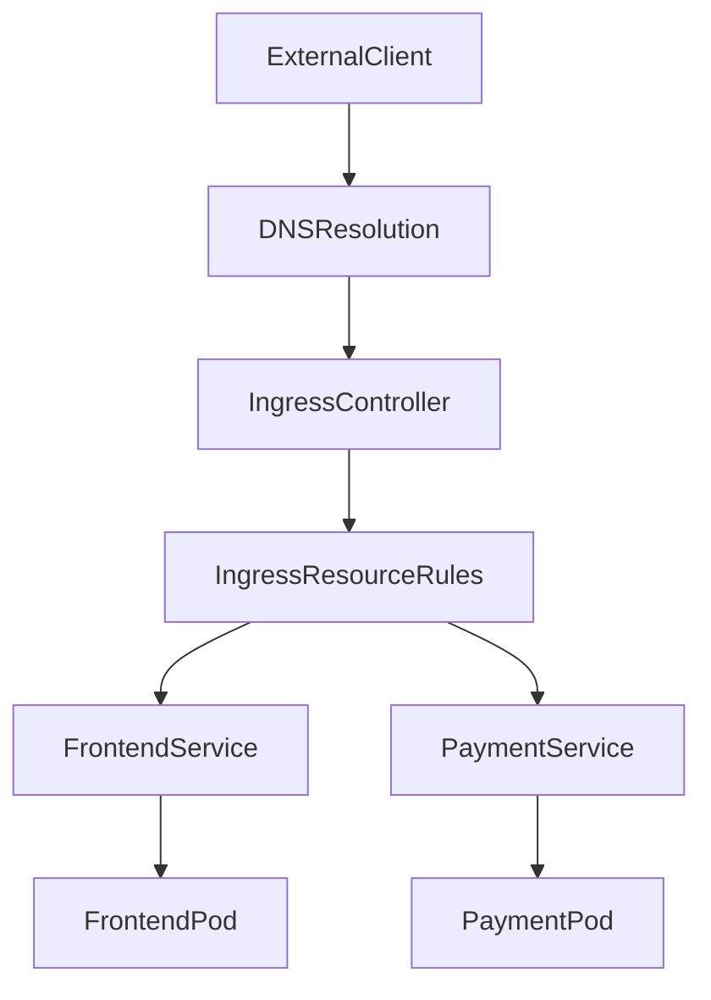

# Ingress and Ingress Controller in Kubernetes

## 1. Topic Overview

An **Ingress** is an advanced Kubernetes API object that manages external HTTP and HTTPS access to internal services. While a `LoadBalancer` Service provisions a 1-to-1 cloud load balancer per application, an Ingress provides **centralized traffic management**, allowing dozens of microservices to share a single external IP address and port (80/443).

An Ingress resource is purely a configuration blueprint. It does absolutely nothing without an **Ingress Controller**—a specialized reverse proxy (like NGINX, Traefik, or AWS ALB) running continuously inside the cluster. The Controller watches the API server for Ingress resources and dynamically updates its own underlying routing rules. In enterprise production environments, Ingress is the foundational layer for API gateways, SSL/TLS termination, host-based virtual hosting, and URL path-based routing.

---

## 2. Architecture / Flow Diagram



---

## 3. Prerequisites

Before starting, ensure your Minikube environment is completely clean and the Ingress addon is actively running.

```bash
# 1. Verify Minikube is active
minikube status

# 2. Enable the NGINX Ingress Controller addon
minikube addons enable ingress

# 3. Verify the Ingress Controller pods are running in the ingress-nginx namespace
kubectl get pods -n ingress-nginx -w

# 4. Create an isolated namespace for routing operations
kubectl create namespace ingress-lab

# 5. Set the default context to the new namespace
kubectl config set-context --current --namespace=ingress-lab

```

*(Press `Ctrl+C` to exit the watch command once the ingress controller pod is `Running` and `READY 1/1`)*.

---

## 4. Hands-On Lab

### Step 1: Deploying the Frontend UI

**Short explanation:**
We will deploy a mock e-commerce frontend. This represents the root application serving static web assets.

**Command:**

```bash
# Imperatively create the frontend deployment
kubectl create deployment ecommerce-ui --image=nginx:1.24.0-alpine --replicas=2

```

**Verification:**

```bash
# Verify the pods are running
kubectl get pods -l app=ecommerce-ui -o wide

```

**Expected Outcome:**
Two frontend pods are successfully scheduled, pulling the `nginx` image, and entering the `Running` state.

---

### Step 2: Deploying the Backend API

**Short explanation:**
We deploy a secondary backend microservice using `httpd` (Apache) to visually distinguish the responses. This represents a distinct backend team's workload.

**Command:**

```bash
# Imperatively create the backend deployment
kubectl create deployment payment-api --image=httpd:2.4-alpine --replicas=2

```

**Verification:**

```bash
# Verify the backend pods are running
kubectl get pods -l app=payment-api -o wide

```

**Expected Outcome:**
Two backend pods are created and running successfully alongside the frontend pods.

---

### Step 3: Creating the Internal Routing Targets (Services)

**Short explanation:**
The Ingress Controller cannot route traffic directly to Pods; it routes traffic to Services, which then load balance to the Pods. We must create internal `ClusterIP` Services for both deployments.

**YAML:** `internal-services.yaml`

```yaml
apiVersion: v1
kind: Service
metadata:
  name: frontend-svc
  namespace: ingress-lab
spec:
  selector:
    app: ecommerce-ui
  ports:
  - port: 80
    targetPort: 80
---
apiVersion: v1
kind: Service
metadata:
  name: payment-api-svc
  namespace: ingress-lab
spec:
  selector:
    app: payment-api
  ports:
  - port: 80
    targetPort: 80

```

**Command:**

```bash
# Apply both services
kubectl apply -f internal-services.yaml

```

**Verification:**

```bash
# Verify the services and their auto-discovered endpoints
kubectl get svc
kubectl get endpoints

```

**Expected Outcome:**
Both `ClusterIP` Services are created. The Endpoints list correctly maps to the internal IP addresses of the respective Pods.

---

### Step 4: Creating the Ingress Resource (Path-Based Routing)

**Short explanation:**
We define the routing rules. Traffic hitting `shop.local/` goes to the frontend. Traffic hitting `shop.local/api` goes to the backend. We include a critical `rewrite-target` annotation so the backend `httpd` server receives requests at `/` instead of `/api` (which would cause a 404 Not Found error).

**YAML:** `ecommerce-ingress.yaml`

```yaml
apiVersion: networking.k8s.io/v1
kind: Ingress
metadata:
  name: ecommerce-gateway
  namespace: ingress-lab
  annotations:
    nginx.ingress.kubernetes.io/rewrite-target: /
spec:
  ingressClassName: nginx
  rules:
  - host: shop.local
    http:
      paths:
      - path: /
        pathType: Prefix
        backend:
          service:
            name: frontend-svc
            port:
              number: 80
      - path: /api
        pathType: Prefix
        backend:
          service:
            name: payment-api-svc
            port:
              number: 80

```

**Command:**

```bash
# Apply the Ingress resource
kubectl apply -f ecommerce-ingress.yaml

```

**Verification:**

```bash
# Describe the Ingress to ensure the controller parsed the rules
kubectl describe ingress ecommerce-gateway

```

**Expected Outcome:**
The API server accepts the YAML. The `describe` output clearly maps `shop.local/` to `frontend-svc:80` and `shop.local/api` to `payment-api-svc:80`.

---

### Step 5: Local DNS Configuration

**Short explanation:**
Since `shop.local` is a fake domain, we must trick our local computer into routing that domain to the Minikube Ingress Controller's IP address.

**Command:**

```bash
# 1. Retrieve the Minikube IP
minikube ip

# 2. Add the mapping to your local /etc/hosts file (requires sudo/admin)
# Replace <MINIKUBE-IP> with the actual IP output from above
echo "<MINIKUBE-IP> shop.local" | sudo tee -a /etc/hosts

```

*(Note: On Windows, run Notepad as Administrator and edit `C:\Windows\System32\drivers\etc\hosts`)*.

**Verification:**

```bash
# Ping the domain to ensure it resolves to the Minikube IP
ping -c 2 shop.local

```

**Expected Outcome:**
The domain `shop.local` successfully resolves to your cluster's IP.

---

### Step 6: Validating the Centralized Routing

**Short explanation:**
We will generate HTTP traffic to prove the NGINX Ingress Controller is successfully intercepting requests and routing them based on the URL path.

**Command:**

```bash
# Test the root path (Frontend)
curl -s http://shop.local/ | grep -i "Welcome to nginx"

# Test the API path (Backend)
curl -s http://shop.local/api | grep -i "It works!"

```

**Verification:**

```bash
# Tail the logs of the actual Ingress Controller to see the traffic hits
kubectl logs -n ingress-nginx -l app.kubernetes.io/name=ingress-nginx --tail=5

```

**Expected Outcome:**
The first `curl` returns the Nginx default page. The second `curl` returns the Apache (`httpd`) default "It works!" page. The centralized routing is functioning perfectly over a single IP.

---

### Step 7: Controller Internal Inspection

**Short explanation:**
When SREs debug complex routing, they do not just look at the Kubernetes YAML; they look at the generated configuration inside the proxy itself.

**Command:**

```bash
# Identify the Ingress Controller pod name
INGRESS_POD=$(kubectl get pods -n ingress-nginx -l app.kubernetes.io/name=ingress-nginx -o jsonpath='{.items[0].metadata.name}')

# Exec into the controller and read the raw NGINX configuration
kubectl exec -it -n ingress-nginx $INGRESS_POD -- cat /etc/nginx/nginx.conf | grep "shop.local" -A 15

```

**Verification:**

```bash
# Use advanced JSONPath to extract our configured ingress rules directly from the K8s API
kubectl get ingress ecommerce-gateway -o jsonpath='{range .spec.rules[*]}{"Host: "}{.host}{"\n"}{range .http.paths[*]}{"  Path: "}{.path}{" --> "}{.backend.service.name}{"\n"}{end}{end}'

```

**Expected Outcome:**
The `exec` command reveals that the Ingress Controller took your Kubernetes YAML and dynamically generated a massive, raw `nginx.conf` file containing standard `server {}` and `location {}` blocks.

---

### Step 8: Failure Simulation & Recovery

**Short explanation:**
We will simulate an API outage by scaling the backend to zero. We will observe how the Ingress Controller responds to missing internal endpoints.

**Command:**

```bash
# Scale the backend API to 0
kubectl scale deployment payment-api --replicas=0

# Attempt to curl the API path
curl -I http://shop.local/api

```

**Verification:**

```bash
# Check the event timeline for the deployment scale down
kubectl get events --sort-by=.metadata.creationTimestamp | tail -n 5

# Restore the application
kubectl scale deployment payment-api --replicas=2

```

**Expected Outcome:**
The `curl` command instantly returns a `503 Service Temporarily Unavailable` because the Ingress Controller detects that the `payment-api-svc` has no healthy endpoints. Once scaled back up, routing recovers automatically.

---

## 5. Core Commands Cheat Sheet

### Ingress & Routing Commands

| Action | Command | Purpose |
| --- | --- | --- |
| List Ingresses | `kubectl get ingress` | View hosts, rules, and assigned IP addresses |
| Describe Routing | `kubectl describe ingress <name>` | See precise path-to-service mapping and annotations |
| Edit Rules | `kubectl edit ingress <name>` | Modify paths, hosts, or TLS config on the fly |

### Controller Debugging Commands

| Action | Command | Purpose |
| --- | --- | --- |
| Controller Pods | `kubectl get pods -n ingress-nginx` | Verify proxy operational health |
| Controller Logs | `kubectl logs -n ingress-nginx -l app.kubernetes.io/name=ingress-nginx -f` | Real-time traffic and error logs |
| Validate Config | `kubectl exec -n ingress-nginx <pod> -- nginx -t` | Check if proxy config is syntactically valid |

### General Verification Commands

| Action | Command | Purpose |
| --- | --- | --- |
| List Endpoints | `kubectl get endpoints` | Confirm Services have active backend targets |
| Internal Test | `kubectl exec -it <pod> -- curl <service>` | Bypass Ingress to test direct Service health |

---

## 6. Advanced Operations

* **TLS/SSL Termination:** In production, you never expose raw HTTP. You store an SSL certificate in a Kubernetes `Secret` and reference it in the Ingress YAML under the `tls:` block. The Ingress Controller handles the cryptographic decryption, offloading CPU overhead from your backend Pods.
* **WAF Integration:** Enterprise controllers like NGINX Plus or AWS ALB Controller allow you to attach Web Application Firewalls (WAF) directly to the Ingress. Using annotations, you can block SQL injections or specific IP ranges before they ever reach your application code.
* **Canary Deployments via Annotations:** NGINX Ingress supports Canary releases natively. By creating a second Ingress resource with `nginx.ingress.kubernetes.io/canary: "true"` and `nginx.ingress.kubernetes.io/canary-weight: "10"`, the proxy will intelligently route 10% of traffic to a new `v2-service`.

---

## 7. Real-Time Industry Usage

* **AWS ALB Ingress Controller:** In Amazon EKS, creating an Ingress resource provisions a physical Application Load Balancer. Path rules in your YAML are instantly translated into ALB Listener Rules in the AWS Console.
* **cert-manager Automation:** DevOps engineers deploy `cert-manager` alongside their Ingress Controller. When a new Ingress is created requesting a domain, `cert-manager` automatically talks to Let's Encrypt, provisions a free SSL certificate, and injects it into the Ingress, providing zero-touch HTTPS.
* **Micro-Frontend Architecture:** Large web applications use Ingress to stitch together different codebases. `[domain.com/cart](https://domain.com/cart)` routes to a React application maintained by Team A, while `[domain.com/profile](https://domain.com/profile)` routes to a Vue.js app maintained by Team B, all appearing as a seamless single website to the user.

---

## 8. Troubleshooting Scenarios

### Scenario 1: The 404 Not Found Trap

* **Symptoms:** `curl [http://shop.local/](http://shop.local/)` works, but `curl [http://shop.local/api](http://shop.local/api)` returns `404 Not Found` generated by your backend application.
* **Root Cause:** The Ingress passed the URI `/api` exactly as-is to the backend. The backend API is not configured to serve routes starting with `/api` (it only knows `/`).
* **Debug Commands:**
```bash

```


kubectl describe ingress ecommerce-gateway
kubectl logs -l app=payment-api

```
* **Resolution:** Ensure the `nginx.ingress.kubernetes.io/rewrite-target: /` annotation is applied. This strips the `/api` prefix and sends traffic to the root of the backend service.
* **Operational Learning:** Path routing changes the URL payload. You must either design your backend applications to expect the prefix, or rewrite it at the proxy layer.

### Scenario 2: 502 Bad Gateway
* **Symptoms:** Traffic hits the domain, but the browser displays a proxy-generated `502 Bad Gateway` error.
* **Root Cause:** The Ingress Controller successfully evaluated the rule and tried to proxy to the internal `ClusterIP` Service, but the Service has no healthy endpoints, or the container crashed.
* **Debug Commands:**
  ```bash
kubectl get endpoints
kubectl get pods --field-selector status.phase!=Running

```

* **Resolution:** Investigate the backend Pods. Check their `readinessProbes` and application logs. Once the Pods are `READY 1/1`, the Endpoints will populate and the 502 will resolve.
* **Operational Learning:** A 502 means the Ingress layer is healthy, but the downstream microservice layer is failing.

### Scenario 3: ADDRESS Remains `<pending>` indefinitely

* **Symptoms:** You apply the Ingress YAML. `kubectl get ingress` shows the `ADDRESS` field empty or `<pending>` for over 5 minutes.
* **Root Cause:** No Ingress Controller is running in the cluster, or the `ingressClassName: nginx` in your YAML does not match the class of the deployed controller. An Ingress resource does nothing on its own.
* **Debug Commands:**
```bash

```


kubectl get pods --all-namespaces | grep ingress
kubectl get ingressclasses

```
* **Resolution:** Install an Ingress Controller (e.g., `minikube addons enable ingress` or via Helm in a real cluster) and ensure the `ingressClassName` strictly matches.
* **Operational Learning:** Infrastructure APIs require active control planes to execute their intent.

---

## 9. Cleanup Activity

Execute these commands to securely tear down the lab environment and reclaim resources.

```bash
# 1. Delete the Ingress resource
kubectl delete ingress ecommerce-gateway

# 2. Delete the internal Services
kubectl delete svc frontend-svc payment-api-svc

# 3. Delete the Deployments
kubectl delete deployment ecommerce-ui payment-api

# 4. Delete the routing namespace
kubectl delete namespace ingress-lab

# 5. Switch context back to default
kubectl config set-context --current --namespace=default

# 6. Disable the Minikube Ingress addon (optional)
minikube addons disable ingress

```

---

## 10. Key Takeaways

* **Controller Dependency:** The `Ingress` object is just a ruleset. The `Ingress Controller` is the actual engine doing the heavy lifting (Nginx, Traefik, HAProxy).
* **Cost Efficiency:** By routing `/app1` and `/app2` through a single Ingress Controller, you pay for one external cloud load balancer instead of two.
* **Path vs. Host Routing:** You can route based on domains (`app1.com` vs `app2.com`) or paths (`[domain.com/app1](https://domain.com/app1)` vs `[domain.com/app2](https://domain.com/app2)`), providing immense architectural flexibility.
* **Decoupled Security:** TLS termination and WAF protection are handled at the cluster edge (Ingress), meaning backend developers don't need to manage SSL certificates inside their application code.

---

## 11. Lab Challenges

### Beginner Exercises

1. **Host-Based Routing:** Modify the `ecommerce-ingress` YAML. Change the rule so that `frontend.local` routes to the UI, and `api.local` routes to the backend API, removing the paths entirely.
2. **Imperative Port Forwarding:** Bypass the Ingress completely. Run `kubectl port-forward svc/payment-api-svc 8080:80` and `curl localhost:8080` to verify internal service health directly.
3. **Log Sifting:** Write a command to `grep` the NGINX Ingress Controller logs specifically for HTTP 503 errors.

### Intermediate Exercises

4. **Deploy a Default Backend:** What happens if a user accesses `shop.local/unknown`? It returns the standard NGINX 404. Modify your Ingress to include a `defaultBackend` that routes all unmatched traffic to a custom deployment running an HTML "Page Not Found" image.
5. **Rate Limiting:** Add the annotations `nginx.ingress.kubernetes.io/limit-rps: "1"` and `nginx.ingress.kubernetes.io/limit-burst-multiplier: "1"` to your ingress. Run a fast `while` loop `curl` command to prove the proxy starts returning HTTP 503 for rate limit breaches.
6. **Class Inspection:** Run `kubectl get ingressclass nginx -o yaml`. Identify the specific controller string (e.g., `k8s.io/ingress-nginx`) responsible for implementing this class.

### Troubleshooting Exercises

7. **The Silent Drop:** Delete the `payment-api-svc` Service but leave the deployment and ingress running. `curl` the API path. What exact HTTP status code does the Ingress Controller return when a referenced Service is missing? Document the event.
8. **The Broken Controller:** Scale the `ingress-nginx-controller` deployment in the `ingress-nginx` namespace to 0. Attempt to `curl shop.local`. Explain why the connection behavior differs from a 502 or 503 error.

### Production Challenge

9. **The TLS Secure Gateway:**
* Generate a self-signed TLS certificate locally using `openssl`.
* Store it in the cluster using `kubectl create secret tls ecommerce-tls --cert=cert.crt --key=cert.key`.
* Update the Ingress YAML to include a `tls:` block referencing the secret for the `shop.local` host.
* Verify that attempting to `curl [http://shop.local](http://shop.local)` automatically executes a 308 Permanent Redirect to `[https://shop.local](https://shop.local)` enforced strictly by the Ingress Controller.