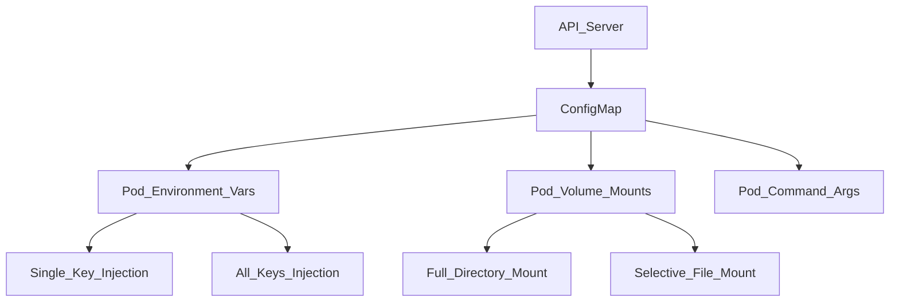

# ConfigMap Usage Patterns

## 1. Topic Overview

A **ConfigMap** is a core Kubernetes API object used to decouple non-sensitive configuration data from container images. By strictly separating configuration from code, ConfigMaps enable the **12-Factor App methodology**, allowing the same container image to be promoted seamlessly across Development, Staging, and Production environments simply by swapping the underlying ConfigMap.

In production SRE and DevOps workflows, ConfigMaps are utilized to inject environment variables, pass command-line arguments, mount application configuration files (like `nginx.conf` or `application.properties`), and dynamically tune application behavior without requiring a CI/CD image rebuild.

*Crucial Operational Note:* ConfigMaps are **not encrypted**. They have a strict **1MiB size limit** and should never be used to store passwords, API tokens, or TLS certificates (use Kubernetes `Secrets` for those).

---

## 2. Architecture / Flow Diagram



---

## 3. Prerequisites

Prepare your Minikube environment to isolate these configuration workloads. Execute the following commands sequentially.

```bash
# 1. Verify Minikube is active
minikube status

# 2. Verify kubectl is communicating with the correct cluster
kubectl cluster-info

# 3. Enable metrics-server for resource observability
minikube addons enable metrics-server

# 4. Create an isolated namespace for configmap operations
kubectl create namespace config-lab

# 5. Set the default context to the new namespace
kubectl config set-context --current --namespace=config-lab

```

---

## 4. Hands-On Lab

### Step 1: Creating a Multi-Purpose ConfigMap

**Short explanation:**
We will create a comprehensive ConfigMap containing key-value pairs (for environment variables), a full text file block (for volume mounting), and binary data. This represents a realistic scenario where an application requires multiple configuration formats.

**YAML:** `enterprise-config.yaml`

```yaml
apiVersion: v1
kind: ConfigMap
metadata:
  name: ecommerce-config
  namespace: config-lab
data:
  APP_ENV: "production"
  LOG_LEVEL: "warn"
  START_DELAY: "5"
  nginx.conf: |
    server {
        listen 80;
        server_name internal.ecommerce.local;
        location / {
            return 200 "ConfigMap Volume Mount Successful\n";
        }
    }
binaryData:
  feature-flag.bin: "dHJ1ZQ==" # Base64 encoded "true"

```

**Command:**

```bash
# Apply the comprehensive ConfigMap
kubectl apply -f enterprise-config.yaml

```

**Verification:**

```bash
# Verify the ConfigMap exists and inspect its size/keys
kubectl get configmap ecommerce-config

# Describe the ConfigMap to view its raw payload
kubectl describe configmap ecommerce-config

```

**Expected Outcome:**
The ConfigMap is created successfully, exposing 5 distinct data keys across standard `data` and `binaryData` fields.

---

### Step 2: Injecting Environment Variables

**Short explanation:**
We will deploy an API backend that requires environmental context. We will inject `APP_ENV` individually (Single Key) and import the entire ConfigMap (All Keys) into a secondary container to demonstrate both operational patterns.

**YAML:** `api-env-deployment.yaml`

```yaml
apiVersion: apps/v1
kind: Deployment
metadata:
  name: inventory-api
  namespace: config-lab
spec:
  replicas: 2
  selector:
    matchLabels:
      app: inventory-api
  template:
    metadata:
      labels:
        app: inventory-api
    spec:
      containers:
      - name: api-worker
        image: alpine:3.18
        command: ["/bin/sh", "-c", "while true; do sleep 3600; done"]
        env:
        - name: CURRENT_ENV
          valueFrom:
            configMapKeyRef:
              name: ecommerce-config
              key: APP_ENV
        resources:
          requests:
            cpu: "50m"
            memory: "32Mi"
      - name: metrics-sidecar
        image: alpine:3.18
        command: ["/bin/sh", "-c", "while true; do sleep 3600; done"]
        envFrom:
        - configMapRef:
            name: ecommerce-config
        resources:
          requests:
            cpu: "25m"
            memory: "16Mi"

```

**Command:**

```bash
# Apply the deployment
kubectl apply -f api-env-deployment.yaml

```

**Verification:**

```bash
# Wait for pods to become ready
kubectl wait --for=condition=ready pod -l app=inventory-api --timeout=30s

# Get the name of one of the pods
POD_NAME=$(kubectl get pods -l app=inventory-api -o jsonpath='{.items[0].metadata.name}')

# Exec into the api-worker to verify the single injected key
kubectl exec -it $POD_NAME -c api-worker -- env | grep CURRENT_ENV

# Exec into the metrics-sidecar to verify all keys were injected
kubectl exec -it $POD_NAME -c metrics-sidecar -- env | grep LOG_LEVEL

```

**Expected Outcome:**
The `api-worker` successfully mapped `APP_ENV` to `CURRENT_ENV`. The `metrics-sidecar` automatically absorbed `LOG_LEVEL` and `START_DELAY` directly into its environment.

---

### Step 3: Mounting Configuration Files (Volume Mounts)

**Short explanation:**
Applications like Nginx, Prometheus, and HAProxy require physical configuration files. We will mount the `nginx.conf` key from our ConfigMap directly into an Nginx container's filesystem.

**YAML:** `nginx-volume-deployment.yaml`

```yaml
apiVersion: apps/v1
kind: Deployment
metadata:
  name: web-proxy
  namespace: config-lab
spec:
  replicas: 1
  selector:
    matchLabels:
      app: web-proxy
  template:
    metadata:
      labels:
        app: web-proxy
    spec:
      containers:
      - name: nginx
        image: nginx:1.24.0-alpine
        ports:
        - containerPort: 80
        volumeMounts:
        - name: config-volume
          mountPath: /etc/nginx/conf.d/
        readinessProbe:
          httpGet:
            path: /
            port: 80
          initialDelaySeconds: 2
          periodSeconds: 5
      volumes:
      - name: config-volume
        configMap:
          name: ecommerce-config
          items:
          - key: nginx.conf
            path: custom-site.conf

```

**Command:**

```bash
# Apply the volume-mounted deployment
kubectl apply -f nginx-volume-deployment.yaml

```

**Verification:**

```bash
# Ensure the pod is running
kubectl get pods -l app=web-proxy

# Execute a curl inside the pod to prove Nginx is using our mounted configuration
NGINX_POD=$(kubectl get pods -l app=web-proxy -o jsonpath='{.items[0].metadata.name}')
kubectl exec -it $NGINX_POD -- curl -s http://localhost

```

**Expected Outcome:**
The `curl` command returns `ConfigMap Volume Mount Successful`. The `nginx.conf` key was selectively mounted and renamed to `custom-site.conf` inside the container.

---

### Step 4: Injecting Command Arguments

**Short explanation:**
You can use ConfigMaps to alter the startup command parameters of a container. We will use the `START_DELAY` key to alter the sleep command of a batch processing pod.

**YAML:** `args-pod.yaml`

```yaml
apiVersion: v1
kind: Pod
metadata:
  name: batch-processor
  namespace: config-lab
spec:
  restartPolicy: Never
  containers:
  - name: processor
    image: busybox:1.36
    command: ["/bin/sh", "-c"]
    args:
    - echo "Initializing batch process..."; sleep $(DELAY_SECONDS); echo "Process complete."
    env:
    - name: DELAY_SECONDS
      valueFrom:
        configMapKeyRef:
          name: ecommerce-config
          key: START_DELAY

```

**Command:**

```bash
# Apply the batch processing pod
kubectl apply -f args-pod.yaml

```

**Verification:**

```bash
# Watch the pod execute and complete
kubectl get pod batch-processor -w

# Check the logs to verify the command arguments executed correctly
kubectl logs batch-processor

```

**Expected Outcome:**
The Pod utilizes the ConfigMap value to set the environment variable, which the `args` array evaluates natively during the container entrypoint execution.

---

### Step 5: Failure Simulation (Missing Configurations)

**Short explanation:**
What happens if an engineer deletes a ConfigMap that a Pod requires? We will simulate a deployment referencing a non-existent ConfigMap to observe the failure state and diagnostic process.

**YAML:** `broken-deployment.yaml`

```yaml
apiVersion: apps/v1
kind: Deployment
metadata:
  name: missing-config-app
  namespace: config-lab
spec:
  replicas: 1
  selector:
    matchLabels:
      app: missing-config
  template:
    metadata:
      labels:
        app: missing-config
    spec:
      containers:
      - name: app
        image: alpine:3.18
        command: ["/bin/sh", "-c", "sleep 3600"]
        envFrom:
        - configMapRef:
            name: non-existent-config

```

**Command:**

```bash
# Apply the broken deployment
kubectl apply -f broken-deployment.yaml

```

**Verification:**

```bash
# Observe the failure state
kubectl get pods -l app=missing-config

# Diagnose the specific Kubernetes error
BROKEN_POD=$(kubectl get pods -l app=missing-config -o jsonpath='{.items[0].metadata.name}')
kubectl describe pod $BROKEN_POD | grep -A 5 "Events:"

```

**Expected Outcome:**
The Pod is stuck in `CreateContainerConfigError`. The events explicitly state: `configmap "non-existent-config" not found`. The kubelet refuses to start the container because a mandatory dependency is missing.

---

### Step 6: Workload Recovery (Optional References)

**Short explanation:**
To prevent the previous failure, SREs use `optional: true` for non-critical configurations (like feature toggles or experimental tracing settings), allowing the Pod to boot even if the ConfigMap is absent.

**Command:**

```bash
# Patch the deployment to make the ConfigMap reference optional
kubectl patch deployment missing-config-app -p '{"spec":{"template":{"spec":{"containers":[{"name":"app","envFrom":[{"configMapRef":{"name":"non-existent-config","optional":true}}]}]}}}}'

```

**Verification:**

```bash
# Watch the ReplicaSet automatically recover the pod
kubectl get pods -l app=missing-config -w

```

**Expected Outcome:**
The Deployment controller spins up a new Pod. Because the missing ConfigMap is now marked `optional: true`, the kubelet ignores the absence and successfully transitions the Pod to `Running`.

---

## 5. Core Commands Cheat Sheet

### Cluster & Namespace Commands

| Action | Command | Purpose |
| --- | --- | --- |
| Set Context | `kubectl config set-context --current --namespace=XYZ` | Pin CLI execution to a namespace |
| View Events | `kubectl get events --sort-by=.metadata.creationTimestamp` | Trace operational timelines |

### ConfigMap Commands

| Action | Command | Purpose |
| --- | --- | --- |
| Create from File | `kubectl create configmap <name> --from-file=config.txt` | Generate CM from local files |
| Create from Env | `kubectl create configmap <name> --from-env-file=.env` | Generate CM from .env format |
| View Keys | `kubectl get cm <name> -o yaml` | Export CM payload for review |
| Describe CM | `kubectl describe cm <name>` | View size and detailed data payload |

### Pod & Debugging Commands

| Action | Command | Purpose |
| --- | --- | --- |
| View Environment | `kubectl exec -it <pod> -- env` | Verify injected variables |
| View Mounts | `kubectl exec -it <pod> -- cat /path/to/mount` | Verify file injection |
| Diagnose Config | `kubectl describe pod <pod> | grep -i Error` | Find `CreateContainerConfigError` |

---

## 6. Advanced Operations

* **Live Reloading (Volumes vs. Env):** When you edit a ConfigMap (`kubectl edit cm`), Kubernetes automatically updates Volume Mounts inside running Pods (usually within 1-2 minutes depending on kubelet sync frequency). However, **Environment Variables are NEVER updated dynamically**. A Pod must be restarted to absorb new environment variables.
* **The subPath Limitation:** If you use `subPath` to mount a specific file from a ConfigMap into a directory without overwriting the existing contents of that directory, Kubernetes **disables live reloading** for that file.
* **Hot Reload Automation:** Because standard ConfigMaps require Pod restarts to absorb env var changes, SREs frequently deploy controllers like **Reloader** (by Stakater). By annotating a Deployment (`[reloader.stakater.com/auto](https://reloader.stakater.com/auto): "true"`), the controller watches for ConfigMap edits and automatically triggers a RollingUpdate of the Deployment.

---

## 7. Real-Time Industry Usage

* **Prometheus Configuration:** Prometheus monitoring stacks rely heavily on ConfigMaps. The massive `prometheus.yml` routing and scraping configuration is stored as a ConfigMap, mounted into the Prometheus Pod. When new endpoints are added, the ConfigMap is updated, and a webhook triggers Prometheus to reload its config from disk.
* **Multi-Environment GitOps:** In CI/CD pipelines (ArgoCD/Flux), the Deployment YAML remains identical across all clusters. The pipeline simply overlays a different ConfigMap (`config-dev.yaml`, `config-prod.yaml`) per namespace, dictating whether the application connects to a test database or a production database.
* **Fluentd / Logstash Routing:** Infrastructure logging daemons run as DaemonSets and use ConfigMaps mounted as volumes to define regex parsing rules and output destinations (e.g., Splunk vs. Elasticsearch).

---

## 8. Troubleshooting Scenarios

### Scenario 1: `CreateContainerConfigError`

* **Symptoms:** Pod is stuck. `kubectl get pods` shows `CreateContainerConfigError`.
* **Root Cause:** The Pod spec references a ConfigMap (or a specific key within a ConfigMap) that does not exist in the current namespace.
* **Debug Commands:**
```bash
kubectl describe pod <pod-name>
kubectl get configmap <missing-cm-name>

```


```
* **Resolution:** Create the missing ConfigMap or correct the typo in the Deployment YAML.
* **Operational Learning:** Kubernetes validates configuration references strictly before attempting to start the container process.

### Scenario 2: Read-Only File System Error
* **Symptoms:** The application crashes during startup. Logs indicate an inability to write to a specific configuration directory.
* **Root Cause:** When you mount a ConfigMap to a directory (e.g., `/etc/app/config`), Kubernetes mounts it as a **read-only file system**. If the application attempts to overwrite or modify the configuration file dynamically, the OS blocks it.
* **Debug Commands:**
  ```bash
  kubectl logs <crashing-pod-name>
  kubectl exec -it <crashing-pod-name> -- sh -c "echo 'test' > /etc/app/config/file"

```

* **Resolution:** Applications must be engineered to treat mounted configuration as immutable. If dynamic writes are required, mount the ConfigMap to an `emptyDir` using an InitContainer and copy the contents.
* **Operational Learning:** ConfigMap volume mounts are strictly read-only by design.

### Scenario 3: Stale Application Configuration

* **Symptoms:** You edited the ConfigMap, but the application is still exhibiting old behavior.
* **Root Cause:** The application consumes the ConfigMap via Environment Variables, or the application caches the configuration file in RAM on startup and does not watch the filesystem for changes.
* **Debug Commands:**
```bash
kubectl exec -it <pod-name> -- env | grep <EXPECTED_KEY>

```


```
* **Resolution:** Perform a manual rollout restart to kill the old Pods and force them to read the new environment variables/files.
  ```bash
kubectl rollout restart deployment/<deployment-name>

```

* **Operational Learning:** Always know how your application consumes configuration (RAM vs Disk) to understand if a restart is mandatory.

---

## 9. Cleanup Activity

Execute these commands to remove all simulated configurations and reclaim cluster resources safely.

```bash
# 1. Delete all Deployments and Pods
kubectl delete deployment inventory-api web-proxy missing-config-app
kubectl delete pod batch-processor

# 2. Delete the ConfigMaps
kubectl delete configmap ecommerce-config

# 3. Delete the isolated namespace
kubectl delete namespace config-lab

# 4. Switch context back to default
kubectl config set-context --current --namespace=default

```

---

## 10. Key Takeaways

* **Immutable Images:** ConfigMaps are the mechanism that allows a Docker image to remain completely agnostic of the environment it runs in.
* **Env vs Volume:** Environment variables are static and require a Pod restart to update. Volume mounts are dynamic and update silently in the background.
* **Namespaced:** ConfigMaps are bound to the namespace they are created in. You cannot mount a ConfigMap from `dev-namespace` into a Pod in `prod-namespace`.
* **Not for Secrets:** ConfigMaps are plaintext. Anyone with `kubectl get pod` or `kubectl describe cm` permissions can read the data.

---

## 11. Lab Challenges

### Beginner Exercises

1. **Imperative Creation:** Use a single CLI command to create a ConfigMap named `ui-theme` with the key `PRIMARY_COLOR` set to `blue`. (Hint: `kubectl create configmap --help`).
2. **Extraction:** Write a JSONPath command to extract the Base64 encoded value of the `feature-flag.bin` key from the `ecommerce-config` ConfigMap.
3. **Debugging Missing Keys:** Modify a working Deployment to reference a `configMapKeyRef` where the ConfigMap exists, but the *key* does not. Observe the exact Pod status.

### Intermediate Exercises

4. **The File Creator:** Create a local file named `redis.conf`. Use `kubectl create configmap` with the `--from-file` flag to import it. Describe the resulting ConfigMap to verify the file name became the key.
5. **Selective Overrides:** Deploy an Nginx pod. Mount a ConfigMap specifically to `/etc/nginx/nginx.conf` using the `subPath` directive so that you overwrite *only* that specific file without destroying the rest of the `/etc/nginx/` directory.
6. **Live Reload Verification:** Mount a ConfigMap as a volume in a busybox pod. Write a bash loop that `cat`s the mounted file every 5 seconds. Edit the ConfigMap in another terminal. Document exactly how long it takes for the bash loop to reflect the new text.

### Troubleshooting Exercises

7. **The Size Limit:** Generate a 2MB text file locally (`dd if=/dev/urandom of=large.txt bs=1M count=2`). Attempt to create a ConfigMap from this file. Document the specific API server rejection error.
8. **The Naming Trap:** Attempt to create a ConfigMap where one of the keys contains an underscore and a capital letter (e.g., `MY_INVALID@KEY`). What does the API validation say about DNS subdomain requirements?

### Production Challenge

9. **The Idempotent Config Loader:**
* Create a ConfigMap containing a SQL database initialization script (`init.sql`).
* Deploy a MySQL database Pod.
* Write an `initContainer` in the Pod spec that mounts the ConfigMap and copies the `init.sql` file into a persistent `emptyDir` volume.
* Configure the main MySQL container to read and execute the SQL script from that `emptyDir` upon startup.