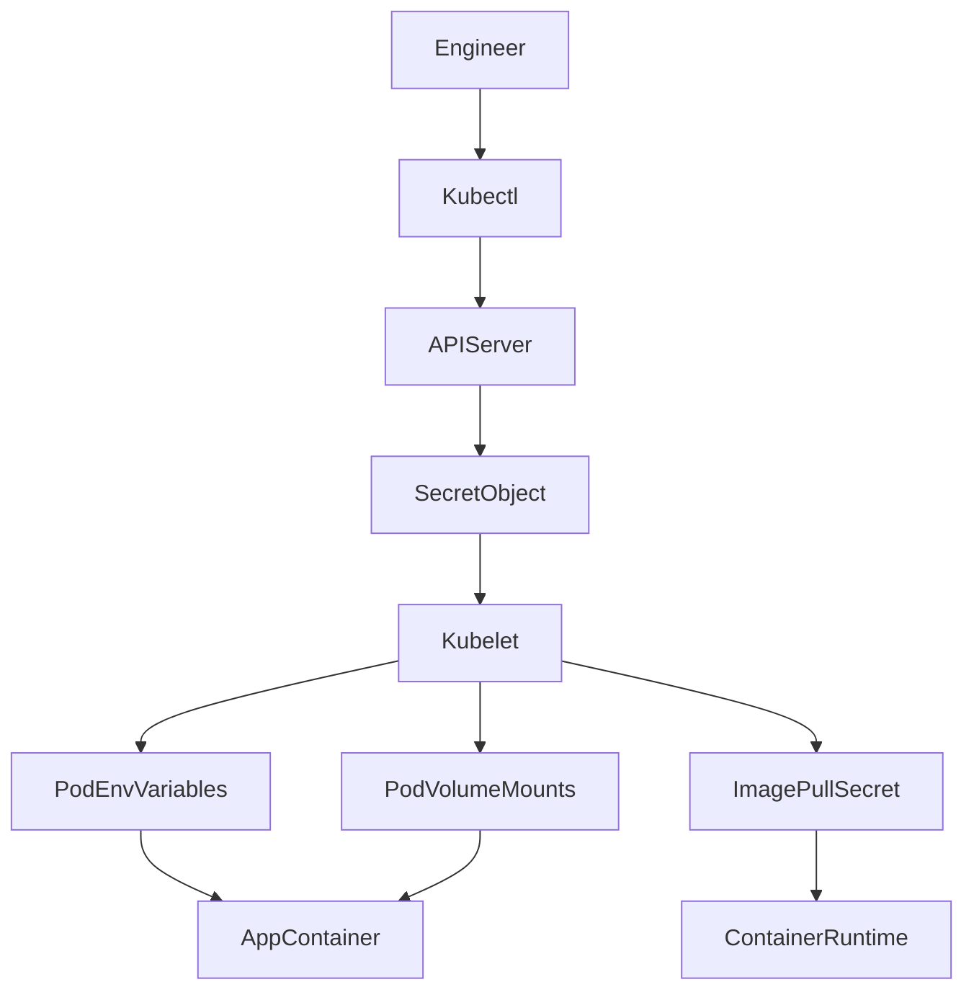

# Kubernetes Secrets Fundamentals

## 1. Topic Overview

**Kubernetes Secrets** are declarative API objects designed to store and manage sensitive infrastructure and application data—such as database passwords, OAuth tokens, SSH keys, and TLS certificates.

Unlike ConfigMaps, which are designed for plain-text configuration, Secrets are intended for confidential data. By default, Kubernetes stores Secrets as base64-encoded strings. While base64 is **not encryption**, wrapping this data in a Secret object allows SRE and DevOps teams to tightly control access using Kubernetes RBAC (Role-Based Access Control), ensuring that a fresher or junior developer can deploy an application without ever needing to see the raw production database passwords. Secrets can be injected into Pods as environment variables, mounted as read-only files in a volume, or used by the Kubelet to pull images from private container registries.

---

## 2. Architecture / Flow Diagram



---

## 3. Prerequisites

Prepare your Minikube environment to safely practice secret management. Execute these commands sequentially in your terminal.

```bash
# 1. Verify Minikube is operational
minikube status

# 2. Verify kubectl is communicating with the correct cluster
kubectl cluster-info

# 3. Create an isolated namespace for secret management
kubectl create namespace secrets-lab

# 4. Set the default context to the new namespace
kubectl config set-context --current --namespace=secrets-lab

```

---

## 4. Hands-On Lab

### Step 1: Creating an Opaque Secret Imperatively

**Short explanation:**
We will create a standard (Opaque) Secret to hold MongoDB database credentials. Creating secrets imperatively via the CLI prevents sensitive passwords from being accidentally committed to version control in a YAML file.

**Command:**

```bash
# Create the secret directly from the command line
kubectl create secret generic mongodb-credentials \
  --from-literal=DB_USERNAME=admin \
  --from-literal=DB_PASSWORD=supersecurepassword123

```

**Verification:**

```bash
# Verify the secret exists
kubectl get secrets

# Describe the secret to see the keys (but not the values)
kubectl describe secret mongodb-credentials

```

**Expected Outcome:**
The Secret `mongodb-credentials` is created. The `describe` command reveals the keys `DB_USERNAME` and `DB_PASSWORD`, showing their size in bytes, but safely hides the actual password values from the terminal output.

---

### Step 2: Extracting and Decoding Secret Data

**Short explanation:**
During an incident, SREs sometimes need to verify exactly what password was injected into the cluster. We will use JSONPath to extract the base64-encoded string and decode it back to plain text.

**Command:**

```bash
# Extract the base64 encoded password
kubectl get secret mongodb-credentials -o jsonpath='{.data.DB_PASSWORD}'

# Extract and decode the password in one pipeline
kubectl get secret mongodb-credentials -o jsonpath='{.data.DB_PASSWORD}' | base64 --decode ; echo

```

**Verification:**

```bash
# View the entire Secret in YAML format to see how Kubernetes stores it
kubectl get secret mongodb-credentials -o yaml

```

**Expected Outcome:**
The first command outputs `c3VwZXJzZWN1cmVwYXNzd29yZDEyMw==`. The second command decodes it back to `supersecurepassword123`. This proves that default Secrets are only encoded, not encrypted.

---

### Step 3: Injecting Secrets as Environment Variables

**Short explanation:**
We will deploy a mock `payment-service` that requires database credentials to boot. We will inject the MongoDB credentials securely from the Secret into the container's environment variables.

**YAML:** `payment-service.yaml`

```yaml
apiVersion: apps/v1
kind: Deployment
metadata:
  name: payment-service
  namespace: secrets-lab
spec:
  replicas: 1
  selector:
    matchLabels:
      app: payment
  template:
    metadata:
      labels:
        app: payment
    spec:
      containers:
      - name: api
        image: alpine:3.18
        command: ["/bin/sh", "-c", "while true; do sleep 3600; done"]
        env:
        - name: MONGO_USER
          valueFrom:
            secretKeyRef:
              name: mongodb-credentials
              key: DB_USERNAME
        - name: MONGO_PASS
          valueFrom:
            secretKeyRef:
              name: mongodb-credentials
              key: DB_PASSWORD

```

**Command:**

```bash
# Apply the deployment
kubectl apply -f payment-service.yaml

```

**Verification:**

```bash
# Wait for the pod to be running
kubectl get pods -l app=payment -w

# Exec into the pod to verify the environment variables are present
POD_NAME=$(kubectl get pods -l app=payment -o jsonpath='{.items[0].metadata.name}')
kubectl exec -it $POD_NAME -- env | grep MONGO_

```

**Expected Outcome:**
The `exec` command returns `MONGO_USER=admin` and `MONGO_PASS=supersecurepassword123`. The application now has access to the database credentials without them ever being hardcoded in the Docker image.

---

### Step 4: Mounting Secrets as a Read-Only Volume

**Short explanation:**
Many applications (like NGINX or HashiCorp Vault) expect credentials or TLS certificates to exist as physical files on disk. We will mount a Secret into a Pod as a volume.

**YAML:** `tls-simulator.yaml`

```yaml
apiVersion: v1
kind: Pod
metadata:
  name: tls-simulator
  namespace: secrets-lab
spec:
  containers:
  - name: web
    image: nginx:1.24.0-alpine
    volumeMounts:
    - name: db-creds-volume
      mountPath: "/etc/mongodb-secrets"
      readOnly: true
  volumes:
  - name: db-creds-volume
    secret:
      secretName: mongodb-credentials

```

**Command:**

```bash
# Apply the pod with the volume mount
kubectl apply -f tls-simulator.yaml

```

**Verification:**

```bash
# Verify the files exist inside the container
kubectl exec -it tls-simulator -- ls -l /etc/mongodb-secrets

# Read the contents of the password file
kubectl exec -it tls-simulator -- cat /etc/mongodb-secrets/DB_PASSWORD

```

**Expected Outcome:**
Kubernetes creates a file for every key in the Secret. The `cat` command outputs the plain-text password `supersecurepassword123` directly from the mounted file.

---

### Step 5: Failure Simulation (Missing Secrets)

**Short explanation:**
If a Deployment references a Secret that doesn't exist, the Kubelet protects the application by refusing to start the container. We will intentionally break a deployment to observe this.

**YAML:** `broken-app.yaml`

```yaml
apiVersion: apps/v1
kind: Deployment
metadata:
  name: reporting-job
  namespace: secrets-lab
spec:
  replicas: 1
  selector:
    matchLabels:
      app: reporting
  template:
    metadata:
      labels:
        app: reporting
    spec:
      containers:
      - name: worker
        image: busybox
        command: ["/bin/sh", "-c", "echo 'Connecting to API'; sleep 3600"]
        envFrom:
        - secretRef:
            name: non-existent-api-key

```

**Command:**

```bash
# Apply the broken deployment
kubectl apply -f broken-app.yaml

```

**Verification:**

```bash
# Observe the failure state
kubectl get pods -l app=reporting

# Diagnose the specific error preventing startup
kubectl describe pod -l app=reporting | grep -A 5 "Events:"

```

**Expected Outcome:**
The Pod enters `CreateContainerConfigError`. The events log will explicitly state: `Secret "non-existent-api-key" not found`.

---

### Step 6: Operational Recovery (Optional Secrets)

**Short explanation:**
To recover the failing workload without creating dummy Secrets, we can modify the deployment to make the Secret reference `optional: true`. This is a common pattern for features that are disabled by default.

**Command:**

```bash
# Patch the deployment to mark the secret reference as optional
kubectl patch deployment reporting-job -p '{"spec":{"template":{"spec":{"containers":[{"name":"worker","envFrom":[{"secretRef":{"name":"non-existent-api-key","optional":true}}]}]}}}}'

```

**Verification:**

```bash
# Watch the ReplicaSet automatically recover the pod
kubectl get pods -l app=reporting -w

```

**Expected Outcome:**
The Deployment Controller provisions a new Pod. Because the missing Secret is now optional, the Kubelet skips the injection, and the Pod successfully transitions to `Running`.

---

## 5. Core Commands Cheat Sheet

### Secret Creation & Inspection

| Action | Command | Purpose |
| --- | --- | --- |
| Create from Literal | `kubectl create secret generic <name> --from-literal=k=v` | Safely create secrets without YAML |
| Create from File | `kubectl create secret generic <name> --from-file=cert.pem` | Import TLS certs or config files |
| View Metadata | `kubectl describe secret <name>` | Check key names and payload sizes |
| View Raw Base64 | `kubectl get secret <name> -o yaml` | Export the raw encoded secret payload |

### Debugging & Extraction

| Action | Command | Purpose |
| --- | --- | --- |
| Decode Single Key | `kubectl get secret <name> -o jsonpath='{.data.key}' | base64 -d` | Reveal plain text for troubleshooting |
| Inspect Pod Env | `kubectl exec -it <pod> -- env` | Verify the secret was injected properly |
| Check Volume | `kubectl exec -it <pod> -- cat /path/to/mount/key` | Verify file-based secret injection |
| Diagnose Failure | `kubectl get events --field-selector type=Warning` | Find missing secret errors across the cluster |

---

## 6. Advanced Operations

* **Encryption at Rest:** By default, Secrets are base64-encoded but stored as plain text inside the `etcd` database. In enterprise environments, you must configure **EncryptionConfiguration** on the Kubernetes API server so that Secrets are cryptographically encrypted before being written to disk, protecting them if the physical node is compromised.
* **StringData Field:** When writing Secret YAML files manually, encoding everything in base64 is tedious. You can use the `stringData` field instead of `data`. Kubernetes will automatically base64-encode the plain-text values in `stringData` when applying the manifest to the cluster.
* **External Secrets Operator (ESO):** Modern DevOps teams do not store Secrets in Kubernetes natively. They use ESO to automatically synchronize secrets from external, centralized vaults like AWS Secrets Manager, Azure Key Vault, or HashiCorp Vault directly into Kubernetes Secret objects.

---

## 7. Real-Time Industry Usage

* **Image Pull Secrets:** When your company uses a private Docker registry (like JFrog Artifactory or AWS ECR), the Kubelet needs authentication to pull the image. You create a `kubernetes.io/dockerconfigjson` Secret and reference it in the Pod spec using `imagePullSecrets`.
* **GitOps & Sealed Secrets:** Storing base64-encoded Secrets in a Git repository is a massive security violation. Teams using GitOps (ArgoCD/Flux) use tools like **Bitnami Sealed Secrets** or **SOPS**. These tools use asymmetric encryption to encrypt the Secret so it can be safely committed to Git, and a controller inside the cluster decrypts it back into a standard Kubernetes Secret.
* **TLS Termination:** Ingress controllers heavily rely on `kubernetes.io/tls` Secrets. You store your `tls.crt` and `tls.key` in a Secret, and reference it in your Ingress YAML. The Ingress controller dynamically loads the certificate into NGINX or HAProxy to serve HTTPS traffic.

---

## 8. Troubleshooting Scenarios

### Scenario 1: The Base64 Double-Encode Trap

* **Symptoms:** The application crashes with an "Authentication Failed" error, even though you verified the password string is correct.
* **Root Cause:** A developer used an echo command to base64 encode the password: `echo "password" | base64`. However, `echo` adds a hidden newline character (`\n`) at the end of the string. The application is trying to authenticate using `password\n` instead of `password`.
* **Debug Commands:**
```bash
kubectl get secret <name> -o jsonpath='{.data.PASSWORD}' | base64 --decode | xxd

```


```
* **Resolution:** Always use the `-n` flag with echo to omit the trailing newline: `echo -n "password" | base64`, and update the Secret.
* **Operational Learning:** White space and newlines are the leading cause of secret-based authentication failures in Kubernetes.

### Scenario 2: Read-Only Volume Panics
* **Symptoms:** An application boots up but immediately exits with a `Read-only file system` error.
* **Root Cause:** The application is designed to dynamically update or write to its configuration directory. However, when you mount a Secret as a volume, Kubernetes mounts it as a strictly read-only `tmpfs` filesystem.
* **Debug Commands:**
  ```bash
  kubectl logs <crashing-pod-name>
  kubectl exec -it <crashing-pod-name> -- touch /path/to/secret/mount/test.txt

```

* **Resolution:** Application architecture must treat credential files as immutable. If writes are strictly required, mount the Secret to an `emptyDir` using an `initContainer` and copy the files over.
* **Operational Learning:** Never attempt to modify the contents of a Secret volume mount directly from within the container.

### Scenario 3: Secret Changes Not Reflecting

* **Symptoms:** You updated the database password in the Secret, but the application is still failing to connect to the database.
* **Root Cause:** Environment variables are injected exactly once during the container boot sequence. Unlike Volume Mounts (which Kubelet periodically syncs), updated Secrets will **never** propagate to environment variables on running Pods.
* **Debug Commands:**
```bash
kubectl exec -it <pod-name> -- env | grep DB_PASS

```


```
* **Resolution:** You must manually trigger a rolling update of the Deployment to force the creation of new Pods that will absorb the updated Secret.
  ```bash
kubectl rollout restart deployment/<deployment-name>

```

* **Operational Learning:** Treat environment-variable Secrets as immutable for the lifespan of the Pod.

---

## 9. Cleanup Activity

Execute these commands to securely tear down the lab and ensure no sensitive artifacts remain in the cluster.

```bash
# 1. Delete the Deployments and Pods
kubectl delete deployment payment-service reporting-job
kubectl delete pod tls-simulator

# 2. Delete the MongoDB Credentials Secret
kubectl delete secret mongodb-credentials

# 3. Delete the isolated namespace
kubectl delete namespace secrets-lab

# 4. Switch context back to default
kubectl config set-context --current --namespace=default

```

---

## 10. Key Takeaways

* **Base64 is Not Security:** Encoding is just data formatting to safely transport special characters. Without RBAC and Encryption-at-Rest, Secrets are just ConfigMaps.
* **Immutability of Environment Variables:** If a Secret changes, any Pod consuming it via environment variables must be restarted.
* **Volume Mounts are Dynamic:** Pods consuming Secrets via Volume Mounts will see the updated file contents dynamically (usually within 1-2 minutes).
* **Decoupling is Key:** By keeping MongoDB URIs and passwords in Secrets, your core application Deployment YAML remains identical across Dev, QA, and Production environments.

---

## 11. Lab Challenges

### Beginner Exercises

1. **The StringData Shortcut:** Write a YAML file for a Secret named `api-tokens` using the `stringData` field instead of `data`. Include the key `TOKEN=12345`. Apply it, then retrieve it using `-o yaml` to prove Kubernetes automatically base64-encoded it.
2. **Imperative TLS:** You have two local files: `server.crt` and `server.key`. Look up the exact `kubectl create secret tls` command needed to generate a TLS secret from these files.
3. **Extraction Mastery:** Write a single, pipeline command that extracts the value of `DB_USERNAME` from `mongodb-credentials` and outputs the decoded plaintext directly to your terminal.

### Intermediate Exercises

4. **The All-Keys Injection:** Deploy a BusyBox pod. Instead of using `valueFrom` for a single key, use `envFrom` to inject *every* key from the `mongodb-credentials` Secret simultaneously. Exec in and verify.
5. **Specific File Paths:** Mount the `mongodb-credentials` Secret into an NGINX Pod's volume. Use the `items` array under the volume definition to mount *only* the `DB_PASSWORD` key, and rename the file to `db-auth.txt` inside the container.
6. **Docker Registry Auth:** Generate a `docker-registry` Secret imperatively using dummy credentials (`--docker-username=test --docker-password=test --docker-email=test@test.com`). Describe the secret to see the resulting `.dockerconfigjson` format.

### Troubleshooting Exercises

7. **The Invalid Name:** Attempt to create a Secret with the key name `DB_PASSWORD!`. Read the API validation error. What specific characters are allowed in Kubernetes Secret keys?
8. **Size Limits:** Generate a 2MB dummy file locally (`dd if=/dev/urandom of=large.key bs=1M count=2`). Attempt to create a Secret from this file. Document the specific API rejection error.

### Production Challenge

9. **The Secure Database Initialization:**
* Create a Secret containing a MongoDB root password.
* Create a ConfigMap containing an initialization script (`init-db.sh`) that reads the password from an environment variable and executes a mock setup.
* Write a Pod specification for MongoDB that securely injects the Secret as an environment variable AND mounts the ConfigMap as a volume.
* Ensure the initialization script runs successfully upon container boot using the secure credentials.