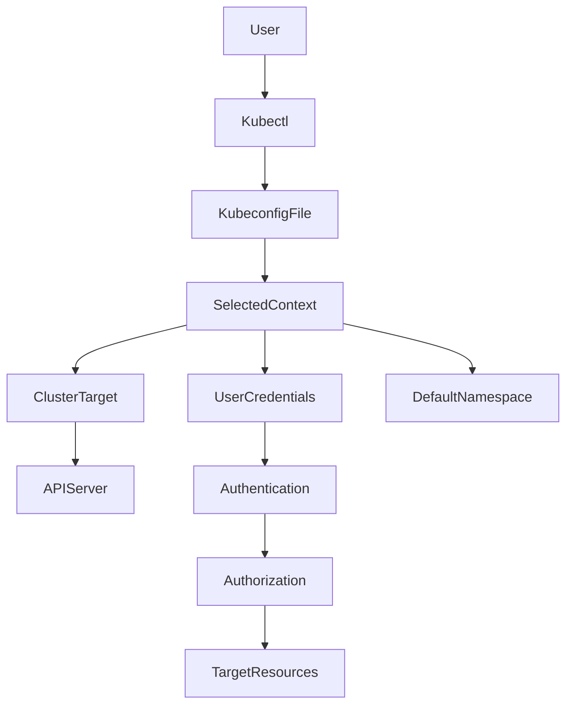

# Organizing Cluster Access Using kubeconfig Files

## 1. Topic Overview

A `kubeconfig` file is a structured YAML configuration that coordinates access to one or more Kubernetes clusters. It acts as the centralized directory that `kubectl` reads to authenticate API requests, map credentials, and target specific logical boundaries (namespaces) within a cluster.

In production environments, a DevOps Architect or SRE rarely manages a single cluster. You will routinely jump between local development tools like Minikube, staging environments, and multi-region production grids (e.g., EKS, GKE, or bare-metal clusters). Instead of managing separate access binaries, `kubeconfig` uses an abstraction called a **Context**—a logical pairing of a **Cluster** (where the API server lives), a **User** (how you authenticate), and a **Namespace** (your default operational workspace).

Proper mastery of `kubeconfig` topology is a fundamental requirement for building secure CI/CD pipelines, automating infrastructure administration, enforcing multi-tenancy access control, and mitigating catastrophic accidental commands (like running a destructive delete command on production thinking it was development).

---

## 2. Architecture / Flow Diagram



---

## 3. Prerequisites

Before starting this operational lab, establish a clean environment and verify your management utilities are functional.

```bash
# 1. Start your Minikube local engine
minikube start

# 2. Verify your active connection to the local API server
kubectl cluster-info

# 3. Create mock business application namespaces to simulate multi-tenancy environments
kubectl create namespace payment-dev
kubectl create namespace payment-prod

# 4. Deploy a verification workload inside the payment-dev namespace
kubectl create deployment nginx-web --image=nginx:1.25-alpine -n payment-dev
kubectl scale deployment nginx-web --replicas=2 -n payment-dev

# 5. Backup your existing default kubeconfig file before performing modification operations
cp ~/.kube/config ~/.kube/config.bak

```

---

## 4. Hands-On Lab

### Step 1: Inspecting the Active Kubeconfig Anatomy

**Explanation:**
Before changing configurations, you must understand how your local client maps cluster parameters. We will view the minified current config configuration to map out existing entries without leaking private keys.

**Command:**

```bash
kubectl config view --minify=true

```

**Verification:**

```bash
# Verify the current active context target name
kubectl config current-context

```

**Expected Outcome:**
The terminal outputs a clean YAML schema showing `clusters`, `contexts`, and `users`. The active context is displayed as `minikube`, pointing to the minikube cluster endpoint with your administrator certificates masked.

---

### Step 2: Extracting Live Cluster Metadata Using JSONPath

**Explanation:**
SRE pipelines require automated script parsing to extract endpoints and certificate authorities. We will run an advanced JSONPath lookup to selectively output cluster data fields.

**Command:**

```bash
kubectl config view -o jsonpath='{.clusters[?(@.name=="minikube")].cluster.server}'

```

**Verification:**

```bash
# Validate that this endpoint responds directly to curl checks ignoring TLS verification
curl -k $(kubectl config view -o jsonpath='{.clusters[?(@.name=="minikube")].cluster.server}')/version

```

**Expected Outcome:**
The JSONPath query isolates the IP address and port string (e.g., `[https://192.168.49.2:8443](https://192.168.49.2:8443)`). The subsequent curl check returns the raw JSON containing the Kubernetes API server build version details.

---

### Step 3: Engineering a Dedicated Development Context

**Explanation:**
To prevent typing `-n payment-dev` on every execution, we will programmatically construct a custom context inside our configuration file that permanently binds our current user identity to the `payment-dev` namespace.

**Command:**

```bash
kubectl config set-context engineer-dev \
  --cluster=minikube \
  --user=minikube \
  --namespace=payment-dev

```

**Verification:**

```bash
# Fetch the list of configured contexts to verify the new entry exists
kubectl config get-contexts

```

**Expected Outcome:**
The table output displays both `minikube` and your newly created context `engineer-dev`. The namespace column for `engineer-dev` explicitly reflects `payment-dev`.

---

### Step 4: Context Switching and Scoped Workload Inspection

**Explanation:**
We will transition our active execution context to the newly created profile and verify that resource visibility changes automatically without explicit namespace flags.

**Command:**

```bash
# Switch your active execution context
kubectl config use-context engineer-dev

```

**Verification:**

```bash
# Check running pods without using the explicit namespace flag
kubectl get pods

# Verify the lifecycle events tracking context accuracy
kubectl get events --sort-by=.metadata.creationTimestamp

```

**Expected Outcome:**
The `kubectl get pods` execution lists the `nginx-web` containers running inside the `payment-dev` namespace directly. You no longer require the namespace flag to isolate these workloads.

---

### Step 5: Executing Diagnostics inside the Active Context

**Explanation:**
Now operating within the isolated development workspace, we will inspect rollout health, view logs, and exec into running app instances to confirm deep operational connectivity.

**Command:**

```bash
# Track rollout status of the targeted web platform
kubectl rollout status deployment/nginx-web

# Isolate a pod name using label selectors and execute an internal diagnostic check
TARGET_POD=$(kubectl get pods -l app=nginx-web -o jsonpath='{.items[0].metadata.name}')
kubectl describe pod $TARGET_POD

```

**Verification:**

```bash
# View recent system output logs from the selected workload instance
kubectl logs $TARGET_POD --tail=10

# Execute an interactive loop check inside the container filesystem
kubectl exec $TARGET_POD -- nginx -v

```

**Expected Outcome:**
All commands succeed seamlessly without namespace interventions. The rollout tracker returns a successful completion message, and the container outputs its engine compilation version directly.

---

### Step 6: Engineering a Separate Production Context Boundary

**Explanation:**
To support operational parity, we will build an isolated context mapping to our `payment-prod` environment using the same cluster resource references.

**Command:**

```bash
kubectl config set-context engineer-prod \
  --cluster=minikube \
  --user=minikube \
  --namespace=payment-prod

```

**Verification:**

```bash
# Switch to the new production workspace configuration
kubectl config use-context engineer-prod

# Query available workloads in this logical zone
kubectl get pods

```

**Expected Outcome:**
The context switches successfully to `engineer-prod`. Running `kubectl get pods` returns a message stating `No resources found in payment-prod namespace`, proving complete lifecycle separation from development.

---

### Step 7: Failure Simulation - The Faulty Context Trap

**Explanation:**
A frequent production mistake occurs when engineers mistype an infrastructure cluster reference or an API gateway name during cluster migrations. We will simulate a catastrophic connection failure by fabricating an unmapped context profile.

**Command:**

```bash
# Inject a broken context pointing to a non-existent cluster reference
kubectl config set-context broken-context \
  --cluster=non-existent-cluster-dns \
  --user=minikube \
  --namespace=payment-dev

# Switch active connection targeting to the broken profile
kubectl config use-context broken-context

```

**Verification:**

```bash
# Attempt to request any active resource states from the API plane
kubectl get nodes --request-timeout='5s'

```

**Expected Outcome:**
The command hangs or immediately terminates, showing a severe client-side execution failure: `error: context "broken-context" has no associated cluster metadata`.

---

### Step 8: Operational Recovery - Re-Mapping Broken Context Profiles

**Explanation:**
When a context profile breaks, you must resolve the infrastructure layout metadata by either updating the context pointers or removing the invalid records completely. We will repair the broken context path.

**Command:**

```bash
# Update the cluster key on the broken-context profile to point back to valid local minikube physical infrastructure
kubectl config set-context broken-context --cluster=minikube

# Re-execute the target query check
kubectl get nodes

```

**Verification:**

```bash
# Purge the test failure profile entirely from your cluster configurations
kubectl config delete-context broken-context

```

**Expected Outcome:**
The node query executes correctly, showing the active local Minikube primary plane engine. The deletion command removes the placeholder configuration without affecting your cluster workloads.

---

## 5. Core Commands Cheat Sheet

### Context Management Commands

| Action | Command | Purpose |
| --- | --- | --- |
| **View Active Context** | `kubectl config current-context` | Identifies where active commands will execute |
| **List Contexts** | `kubectl config get-contexts` | Displays all known context configurations |
| **Switch Context Profile** | `kubectl config use-context <name>` | Hot-swaps the current targeted cluster profile |
| **Remove Context Entry** | `kubectl config delete-context <name>` | Removes obsolete or broken reference objects |

### Configuration Modification Commands

| Action | Command | Purpose |
| --- | --- | --- |
| **Inject/Update Context** | `kubectl config set-context <name> --cluster=<c> --user=<u>` | Programmatically creates or amends context parameters |
| **Change Namespace** | `kubectl config set-context --current --namespace=<ns>` | Sets the default active namespace for your current profile |
| **Clean Output View** | `kubectl config view --flatten --minify` | Outputs a valid, clean configuration format stripping unmatched records |

---

## 6. Advanced Operations

### Merging and Managing Multiple Kubeconfig Files

In real enterprise environments, cloud providers deliver distinct, separate `kubeconfig` files for different environments. Rather than manually copying text blocks, you can leverage the `KUBECONFIG` environment variable to read multiple configs simultaneously and merge them into a single file.

```bash
# Create an isolated mock custom configuration layout file
cat <<EOF > ~/.kube/custom-project-config
apiVersion: v1
kind: Config
clusters:
- cluster:
    server: https://127.0.0.1:8443
  name: loopback-cluster
contexts:
- context:
    cluster: loopback-cluster
    user: developer-token
  name: loopback-context
current-context: loopback-context
users:
- name: developer-token
  user:
    token: secret-token-string
EOF

# Multi-load the configuration profiles into your active terminal runtime session memory
export KUBECONFIG=~/.kube/config:~/.kube/custom-project-config

# Verify that both profiles are accessible inside your terminal context management system
kubectl config get-contexts

```

### Compiling and Exporting a Minified Config for CI/CD Pipelines

To securely share cluster access with automated deployment tools like Jenkins or GitLab CI runners, you should only export the specific context and credentials they require. Exporting your entire configuration file leaks access to other cluster planes.

```bash
# Switch back to a verified baseline profile
kubectl config use-context engineer-dev

# Generate a standalone, minified, fully functional deployment configuration asset
kubectl config view --minify=true --flatten=true > ~/.kube/deployment-pipeline-config.yaml

# Verify the exported pipeline configuration contains only relevant context fields
cat ~/.kube/deployment-pipeline-config.yaml

```

---

## 7. Real-Time Industry Usage

* **Continuous Integration Isolation:** Production engineering teams use automated agents to generate isolated, scoped configurations for specialized tools. For example, a Prometheus monitoring server's access token configuration file should contain zero credentials mapping to administrative clusters or application databases.
* **Enterprise OIDC Authentication Mapping:** Modern corporate networks do not hardcode long-lived client certificates inside developer configurations. Instead, they leverage OpenID Connect (OIDC) authentication flows (e.g., Okta, Ping Identity, Azure AD). The `user` section in their configuration executes local plugins that request short-lived identity tokens, securing access without local certificate risks:
```yaml
user:
  exec:
    apiVersion: client.authentication.k8s.io/v1beta1
    command: kubelogin
    args:
    - oidc-login

```


```
*   **Production Best Practices:**
    *   **Never track raw access files in source code repos:** Treating cluster configuration YAML files as code assets can leak authorization tokens or client certificates.
    *   **Context Indicator Prompts:** SRE teams usually alter their local shell prompts (using utilities like `kube-ps1` or `starship`) to dynamically print the active context and namespace inside the terminal window, preventing catastrophic target execution mistakes.

---

## 8. Troubleshooting Scenarios

### Scenario 1: Cryptic Authorization and Expired Certificate Traces
**Symptoms:** Running cluster commands suddenly generates connection denials: `error: You must be logged in to the server (Unauthorized)` or `x509: certificate has expired or is not yet valid`.
**Root Cause:** The active user profile mapped within your context uses client access certificates that have expired, or token leases issued by external identity single-sign-on authenticators have hit their absolute validation timeout.
**Debug Commands:**
```bash
# View user entry configurations and check certificate paths
kubectl config view --minify

# Check for explicit validity bounds on configured external certificate assets
openssl x509 -in ~/.minikube/profiles/minikube/client.crt -text -noout | grep "Not After"

```

**Resolution:** Re-authenticate with your primary cluster access identity provider. On local environments like Minikube, execute a certificate refresh operations loop by running `minikube update-context`.
**Operational Learning:** Authentication definitions are separate from cluster routing controls. Keep an eye on credential lease expirations when designing pipeline runbooks.

### Scenario 2: The "Silent Namespace Vacuum" Problem

**Symptoms:** You execute `kubectl get pods` or look for an enterprise deployment instance and find nothing returned. No error messages appear, but your monitoring tools show everything running normally.
**Root Cause:** Your current context target points to a wrong or completely empty default namespace. The cluster has no issues processing the query, but it is filtering for workloads in a workspace where nothing has been deployed.
**Debug Commands:**

```bash
# Determine exactly what namespace your current profile context defaults toward
kubectl config get-contexts $(kubectl config current-context)

```

**Resolution:** Update the active context configuration definition parameter to align with the target application plane:

```bash
kubectl config set-context --current --namespace=payment-dev

```

**Operational Learning:** Explicitly monitor namespace bindings when switching between multi-tenant configuration profiles.

### Scenario 3: Broken Overrides via Hidden Terminal Configurations

**Symptoms:** You explicitly run `kubectl config use-context engineer-prod` but running commands continue to list development assets. The terminal ignores your context modification inputs entirely.
**Root Cause:** A hardcoded `KUBECONFIG` environment variable path override exists within your active shell session, which locks the file path configuration read priority and blocks standard config update commands.
**Debug Commands:**

```bash
# Audit your terminal system environment variables layout state
echo $KUBECONFIG

```

**Resolution:** Clear the active shell environment variable assignment string to force the client back to default file processing behaviors:

```bash
unset KUBECONFIG

```

**Operational Learning:** Environment variable declarations always override default file locations when processing client configurations.

---

## 9. Cleanup Activity

Follow these ordered cleanup steps to safely remove the test profiles and configuration modifications generated during this lab.

```bash
# 1. Revert your configuration profile back to the standard minikube management profile
kubectl config use-context minikube

# 2. Purge the custom lab context setups created earlier
kubectl config delete-context engineer-dev
kubectl config delete-context engineer-prod

# 3. Purge the isolated business application test namespaces
kubectl delete namespace payment-dev --wait=false
kubectl delete namespace payment-prod --wait=false

# 4. Remove temporary custom configuration file exports from your local system filesystem
rm -f ~/.kube/custom-project-config
rm -f ~/.kube/deployment-pipeline-config.yaml

# 5. Verify your local kubeconfig file returns cleanly to baseline status
kubectl config get-contexts

```

---

## 10. Key Takeaways

* **Context Abstraction:** `kubeconfig` decouples infrastructure layout from user identity by combining a Cluster, User, and Namespace into an easily selectable Context profile.
* **Operational Safety:** Scoping contexts to specific namespaces prevents accidental operations and streamlines multi-tenant cluster management.
* **Security Discipline:** Production-grade management demands strict separation of access configurations, isolated profiles for automated pipelines, and token-driven authentication layers.

---

## 11. Lab Challenges

### Beginner Exercises

1. Build a custom context called `system-monitor` that maps to the existing `minikube` cluster cluster but defaults targeting access controls inside the `kube-system` core infrastructure namespace.
2. Output your current active configuration state in pure JSON format instead of YAML using only `kubectl` output formatting structures.
3. Use a single command string to alter your active configuration's default operational namespace to match `kube-public`.

### Intermediate Exercises

1. Write an automated shell script line that extracts the authentication access certificate parameters from your config file using advanced JSONPath query operations.
2. Manually generate a separate valid standalone `kubeconfig` file in an alternate folder directory, and use the `KUBECONFIG` path concatenation pattern to control workloads via both configurations simultaneously.
3. Use `kubectl config set-credentials` to inject a placeholder fake service user account profile named `pipeline-deployer` with a static access token string into your configurations registry.

### Troubleshooting Exercises

1. Inject a context mapping definition targeting a cluster API server endpoint IP address that does not exist. Run a diagnostic check, measure the connection failure response times, and analyze the resulting client error trace messages.
2. Fabricate a configuration file structural format breakdown error by deliberately corrupting formatting values inside a mock test file copy. Observe the parsing failure messages output by your client utility.

### Production Challenge

Design an automated shell script that scans an active configuration file, strips out all context metadata fields completely unrelated to a specific application namespace, and exports a minified, production-safe pipeline file distribution format. Ensure no private credential paths from other contexts are leaked into the exported configuration file asset.