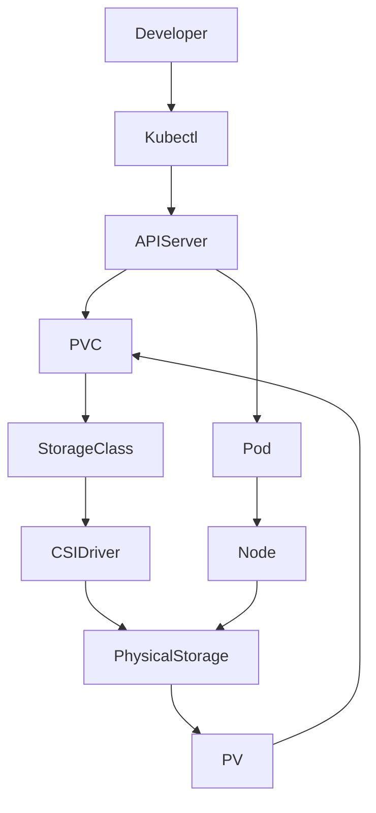

# Kubernetes Storage – Production Operations

## 1. Topic Overview

Kubernetes storage decouples the data lifecycle from the ephemeral container lifecycle. In production, applications require storage that survives pod restarts, crashes, and node migrations.

By default, containers are stateless; any data written to the container's filesystem is lost when the container dies. Kubernetes solves this via an abstracted storage architecture:

* **PersistentVolume (PV):** The actual physical infrastructure (AWS EBS, NFS, SAN) provisioned by administrators or dynamically.
* **PersistentVolumeClaim (PVC):** The developer's request for storage (e.g., "I need 10Gi of ReadWriteOnce storage").
* **StorageClass (SC):** The automated provisioner that listens for PVCs and creates PVs on demand.
* **emptyDir:** Ephemeral scratch space tied to the pod lifecycle, used for caching or sidecar data sharing.

In DevOps and SRE workflows, proper storage configuration is critical for stateful workloads (databases, message queues), avoiding split-brain scenarios, and ensuring high availability without data corruption.

---

## 2. Architecture / Flow Diagram



---

## 3. Prerequisites

Ensure your Minikube cluster is running and properly configured for dynamic storage provisioning.

```bash
# 1. Start minikube (if not already running)
minikube start

# 2. Verify cluster and kubectl compatibility
kubectl version --short

# 3. Verify standard StorageClass is enabled (default in Minikube)
kubectl get storageclass standard

# 4. Enable metrics-server for observability
minikube addons enable metrics-server

# 5. Create a dedicated namespace for this lab
kubectl create namespace storage-ops
kubectl config set-context --current --namespace=storage-ops

```

---

## 4. Hands-On Lab

### Step 1: Deploy a Pod with Ephemeral Storage (emptyDir)

**Explanation:**
We begin by deploying a pod that uses `emptyDir`. This simulates a real-world scenario where an application needs temporary cache space. The data lives on the node's disk but is strictly tied to the Pod's lifecycle.

**Command:**

```bash
cat <<EOF > emptydir-pod.yaml
apiVersion: v1
kind: Pod
metadata:
  name: cache-app
  namespace: storage-ops
  labels:
    app: cache
spec:
  containers:
  - name: app-container
    image: nginx:1.25-alpine
    resources:
      requests:
        cpu: "50m"
        memory: "64Mi"
      limits:
        cpu: "100m"
        memory: "128Mi"
    volumeMounts:
    - mountPath: /app/cache
      name: cache-volume
  volumes:
  - name: cache-volume
    emptyDir: {}
EOF

kubectl apply -f emptydir-pod.yaml

```

**Verification:**

```bash
kubectl wait --for=condition=ready pod cache-app --timeout=60s
kubectl get pods -l app=cache

```

**Expected Outcome:**
The pod starts successfully. An empty directory is mounted at `/app/cache` inside the container.

### Step 2: Write Data and Verify Ephemeral Loss

**Explanation:**
We will write data to the `emptyDir` mount, delete the pod, and prove that the data is permanently lost. This demonstrates why `emptyDir` cannot be used for databases.

**Command:**

```bash
# Write data into the cache directory
kubectl exec cache-app -- sh -c "echo 'temporary data' > /app/cache/data.txt"

# Verify it exists
kubectl exec cache-app -- cat /app/cache/data.txt

# Delete the pod to simulate a failure/reschedule
kubectl delete pod cache-app

# Recreate the pod
kubectl apply -f emptydir-pod.yaml
kubectl wait --for=condition=ready pod cache-app --timeout=60s

```

**Verification:**

```bash
# Attempt to read the file (this will fail)
kubectl exec cache-app -- cat /app/cache/data.txt

```

**Expected Outcome:**
The `cat` command returns `No such file or directory`. The new pod gets a completely fresh, empty directory.

### Step 3: Request Dynamic Persistent Storage (PVC)

**Explanation:**
To persist data safely, we create a `PersistentVolumeClaim`. Since we do not specify a `storageClassName`, Kubernetes uses the default StorageClass to dynamically provision a physical volume (PV).

**Command:**

```bash
cat <<EOF > data-pvc.yaml
apiVersion: v1
kind: PersistentVolumeClaim
metadata:
  name: web-data-pvc
  namespace: storage-ops
  labels:
    storage: persistent
spec:
  accessModes:
    - ReadWriteOnce
  resources:
    requests:
      storage: 1Gi
EOF

kubectl apply -f data-pvc.yaml

```

**Verification:**

```bash
kubectl get pvc web-data-pvc
kubectl get pv

```

**Expected Outcome:**
The PVC transitions quickly from `Pending` to `Bound`. A new PV is automatically created by the `standard` provisioner and bound to our PVC.

### Step 4: Deploy a Stateful Workload (Deployment with PVC)

**Explanation:**
We attach the PVC to an Nginx deployment. Deployments manage ReplicaSets, ensuring our pod is recreated if it dies. The PVC ensures our data survives those recreations.

**Command:**

```bash
cat <<EOF > nginx-deployment.yaml
apiVersion: apps/v1
kind: Deployment
metadata:
  name: nginx-web
  namespace: storage-ops
  labels:
    app: nginx-web
spec:
  replicas: 1
  selector:
    matchLabels:
      app: nginx-web
  template:
    metadata:
      labels:
        app: nginx-web
    spec:
      containers:
      - name: nginx
        image: nginx:1.25-alpine
        ports:
        - containerPort: 80
        volumeMounts:
        - mountPath: /usr/share/nginx/html
          name: web-storage
        resources:
          requests:
            cpu: "100m"
            memory: "128Mi"
          limits:
            cpu: "200m"
            memory: "256Mi"
      volumes:
      - name: web-storage
        persistentVolumeClaim:
          claimName: web-data-pvc
EOF

kubectl apply -f nginx-deployment.yaml

```

**Verification:**

```bash
kubectl rollout status deployment/nginx-web
kubectl get pods -l app=nginx-web

```

**Expected Outcome:**
The deployment rolls out successfully. The pod mounts the persistent volume to Nginx's document root.

### Step 5: Verify Data Persistence Across Pod Failures

**Explanation:**
We will modify the Nginx index page on the persistent volume, forcibly delete the pod, and verify the ReplicaSet recovers the pod with the data intact.

**Command:**

```bash
# Get the pod name dynamically
POD_NAME=$(kubectl get pods -l app=nginx-web -o jsonpath='{.items[0].metadata.name}')

# Write persistent data
kubectl exec $POD_NAME -- sh -c "echo '<h1>Persistent Data Survived!</h1>' > /usr/share/nginx/html/index.html"

# Verify the data locally
kubectl exec $POD_NAME -- cat /usr/share/nginx/html/index.html

# Forcibly crash the pod
kubectl delete pod $POD_NAME

```

**Verification:**

```bash
# Wait for ReplicaSet to bring up a new pod
kubectl rollout status deployment/nginx-web

# Get the NEW pod name
NEW_POD_NAME=$(kubectl get pods -l app=nginx-web -o jsonpath='{.items[0].metadata.name}')

# Verify data still exists
kubectl exec $NEW_POD_NAME -- cat /usr/share/nginx/html/index.html

```

**Expected Outcome:**
Despite the container being destroyed and recreated, the new pod mounts the same PV, and the custom `index.html` remains intact.

### Step 6: Failure Simulation - Pending PVC (Incorrect StorageClass)

**Explanation:**
In production, developers often misconfigure PVCs by requesting a non-existent StorageClass. We will simulate this and diagnose the pending state.

**Command:**

```bash
cat <<EOF > broken-pvc.yaml
apiVersion: v1
kind: PersistentVolumeClaim
metadata:
  name: broken-pvc
  namespace: storage-ops
spec:
  storageClassName: super-fast-ssd
  accessModes:
    - ReadWriteOnce
  resources:
    requests:
      storage: 5Gi
EOF

kubectl apply -f broken-pvc.yaml

```

**Verification:**

```bash
kubectl get pvc broken-pvc
kubectl describe pvc broken-pvc
kubectl get events --sort-by=.metadata.creationTimestamp | grep broken-pvc

```

**Expected Outcome:**
The PVC remains in `Pending` state indefinitely. The `describe` and `events` outputs will show `storageclass.storage.k8s.io "super-fast-ssd" not found`.

### Step 7: Operational Recovery - Fixing the PVC

**Explanation:**
PVC specifications are largely immutable. To fix a wrong StorageClass, the PVC must be recreated.

**Command:**

```bash
# Delete the broken PVC
kubectl delete -f broken-pvc.yaml

# Recreate with default StorageClass
sed 's/super-fast-ssd/standard/g' broken-pvc.yaml | kubectl apply -f -

```

**Verification:**

```bash
kubectl get pvc broken-pvc

```

**Expected Outcome:**
The corrected PVC immediately binds to a newly provisioned PV.

---

## 5. Core Commands Cheat Sheet

| Category | Command | Purpose |
| --- | --- | --- |
| **Cluster** | `kubectl get storageclass` | View available dynamic provisioners |
| **Namespace** | `kubectl config set-context --current --namespace=XYZ` | Set active working namespace |
| **PVC** | `kubectl get pvc` | List volume claims and their bind status |
| **PV** | `kubectl get pv --sort-by=.spec.capacity.storage` | List cluster-wide physical volumes by size |
| **Debugging** | `kubectl describe pvc <name>` | Find why a PVC is stuck in Pending |
| **Debugging** | `kubectl get events --field-selector involvedObject.kind=PersistentVolumeClaim` | View storage-specific cluster events |
| **Operations** | `kubectl get pv -o custom-columns=NAME:.metadata.name,CLAIM:.spec.claimRef.name` | Map PVs directly to the PVCs claiming them |
| **Execution** | `kubectl exec -it <pod> -- df -h` | View mounted filesystem sizes inside the container |

---

## 6. Advanced Operations

### Reclaim Policies

In production, what happens to the data when a PVC is deleted? This is controlled by the PV's Reclaim Policy:

* **Retain:** The PV is released but data is kept. Admin must manually clean up. (Standard for databases).
* **Delete:** The underlying cloud storage (EBS/Disk) is deleted alongside the PVC. (Standard for ephemeral environments).
* *Command:* `kubectl patch pv <pv-name> -p '{"spec":{"persistentVolumeReclaimPolicy":"Retain"}}'`

### Expanding Storage

Modern CSI drivers allow live volume expansion.

* Edit the PVC: `kubectl edit pvc web-data-pvc` -> increase `storage: 2Gi`.
* The underlying disk expands dynamically. The pod may require a restart to resize the filesystem depending on the CSI driver.

### JSONPath Data Extraction

Tracking down the exact PV dynamically provisioned for a PVC:

```bash
kubectl get pvc web-data-pvc -o jsonpath='{.spec.volumeName}{"\n"}'

```

---

## 7. Real-Time Industry Usage

* **StatefulSets over Deployments:** In real-world database deployments (e.g., MySQL, Cassandra), engineers use `StatefulSets` with `volumeClaimTemplates`. This ensures every pod gets its own unique, sticky PVC, preventing split-brain corruption.
* **Access Modes:** `ReadWriteOnce (RWO)` is used for block storage (EBS) where only one node can mount the disk. `ReadWriteMany (RWX)` requires networked file systems (EFS/NFS) allowing multiple pods across different nodes to write simultaneously (used for shared media uploads).
* **Cost Management:** Orphaned PVs with `Retain` policies are a leading cause of wasted cloud spend. SREs build automation to detect and snapshot unbound PVs before terminating the underlying cloud disks.

---

## 8. Troubleshooting Scenarios

### Scenario 1: PVC Stuck in Pending State

**Symptoms:** Developer applies a PVC and Pod, but the pod stays in `Pending` and PVC stays in `Pending`.
**Root Cause:** The requested `StorageClass` doesn't exist, or the requested capacity exceeds cluster quotas.
**Debug Commands:**

```bash
kubectl describe pvc <pvc-name>
kubectl get storageclass

```

**Resolution:** Recreate the PVC using a valid, available StorageClass, or verify cluster storage quotas.
**Operational Learning:** Always validate infrastructure dependencies before deploying workloads. Dynamic provisioning requires matching StorageClass labels exactly.

### Scenario 2: Pod Stuck in `ContainerCreating` (Multi-Attach Error)

**Symptoms:** During a Deployment rollout, the new pod is stuck in `ContainerCreating`. Events show `Multi-Attach error for volume "pvc-xyz" Volume is already exclusively attached to one node`.
**Root Cause:** The PVC uses `ReadWriteOnce` (block storage). The old pod is terminating slowly on Node A, while the new pod is scheduled on Node B. Node B cannot attach the volume until Node A completely releases it.
**Debug Commands:**

```bash
kubectl describe pod <new-pod-name>
kubectl get pods -o wide

```

**Resolution:** This self-resolves once the old pod dies. To fix permanently, use a `StatefulSet` or configure the Deployment strategy to `type: Recreate`.
**Operational Learning:** Understand the physical limitations of block storage. RWO means ONE node at a time.

### Scenario 3: Disk Full (No Space Left on Device)

**Symptoms:** Application starts crashing. Logs show `Write error: No space left on device`.
**Root Cause:** An `emptyDir` volume filled up the underlying Node's physical disk, triggering a Node `DiskPressure` taint and pod eviction.
**Debug Commands:**

```bash
kubectl exec -it <pod-name> -- df -h
kubectl describe node <node-name> | grep Taints

```

**Resolution:** Delete unnecessary files inside the container. To prevent this, apply size limits to `emptyDir` using `emptyDir: { sizeLimit: 500Mi }`.
**Operational Learning:** Ephemeral storage is not infinite. Unbounded emptyDirs are a high-severity risk to Node stability.

---

## 9. Cleanup Activity

Execute these commands carefully to tear down the lab resources.

```bash
# 1. Delete deployments and pods
kubectl delete deployment nginx-web -n storage-ops
kubectl delete pod cache-app -n storage-ops

# 2. Delete PVCs (This triggers the Delete reclaim policy on Minikube)
kubectl delete pvc web-data-pvc broken-pvc -n storage-ops

# 3. Verify PVs are terminating/deleted
kubectl get pv

# 4. Delete namespace
kubectl delete namespace storage-ops

# 5. Return context to default
kubectl config set-context --current --namespace=default

```

---

## 10. Key Takeaways

* **Storage Abstraction:** Kubernetes separates the *request* for storage (PVC) from the *infrastructure* (PV/StorageClass), enabling application portability across clouds.
* **Lifecycle Decoupling:** Persistent volumes ensure data survives pod crashes, node evictions, and deployment rollouts.
* **RWO Limitations:** Block storage (`ReadWriteOnce`) cannot be mounted by multiple nodes simultaneously, which directly impacts deployment strategies.
* **Debugging Mindset:** Storage issues are almost always diagnosed by tracing the binding chain backwards: Pod -> PVC -> PV -> StorageClass -> CSI Driver.

---

## 11. Lab Challenges

**Beginner:**

1. Create a pod that mounts an `emptyDir` to `/var/log/app` and writes a timestamp to a log file every 5 seconds.
2. Create a 2Gi PVC using the `standard` storage class. Verify its binding status.
3. Attach the 2Gi PVC to a standalone Redis pod.

**Intermediate:**

1. Deploy an Nginx pod with an `emptyDir` size limit of `100Mi`. Write `150Mi` of random data to it (`dd if=/dev/urandom...`) and observe Kubernetes evicting the pod.
2. Modify a Deployment to use a PVC, but set the update strategy to `RollingUpdate`. Observe the `Multi-Attach error` when scaling to 2 replicas (due to RWO limitations).
3. Fix the above issue by changing the Deployment strategy to `Recreate`.

**Troubleshooting:**

1. Intentionally create a PVC requesting `1000Ti` of storage. Inspect the events to see why the provisioner rejects it.
2. Create a Pod that references a PVC name that does not exist. Inspect the pod state and events.

**Production Challenge:**

1. Deploy a `StatefulSet` for a MySQL database using `volumeClaimTemplates`. Ensure it requests `1Gi` of storage. Scale the StatefulSet to 3 replicas. Verify that 3 distinct PVCs and PVs are dynamically provisioned and bound, one for each MySQL replica, ensuring no data overlap.